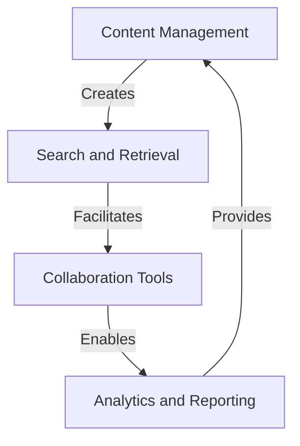
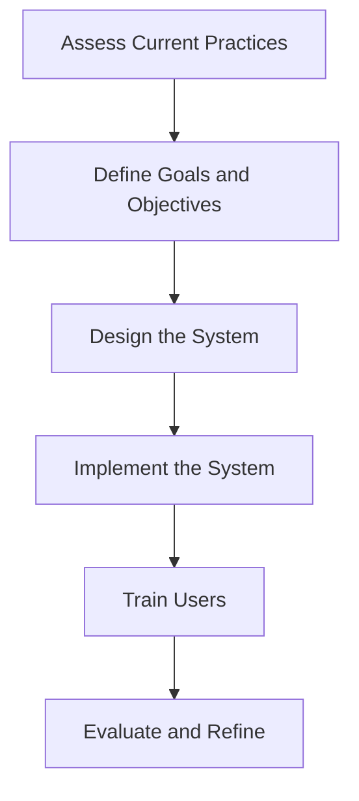

A well-structured knowledge management system is the backbone of any successful organization, enabling teams to make informed decisions, reduce errors, and increase productivity. In this comprehensive guide, we will delve into the world of organized knowledge management implementations, exploring the strategies, tools, and best practices necessary to create a seamless and efficient system.

## Table of Contents
1. [Introduction to Knowledge Management](#introduction-to-knowledge-management)
2. [Benefits of Organized Knowledge Management](#benefits-of-organized-knowledge-management)
3. [Key Components of a Knowledge Management System](#key-components-of-a-knowledge-management-system)
4. [Implementing a Knowledge Management System](#implementing-a-knowledge-management-system)
5. [Best Practices for Knowledge Management](#best-practices-for-knowledge-management)
6. [Visual Insights Gallery](#visual-insights-gallery)
7. [Conclusion](#conclusion)
8. [FAQ](#faq)

## Introduction to Knowledge Management
Knowledge management refers to the process of creating, sharing, using, and managing the knowledge and information of an organization to achieve its objectives. It involves the identification, acquisition, organization, storage, retrieval, sharing, and utilization of knowledge to improve organizational performance.


> **Note:** Effective knowledge management is critical in today's fast-paced business environment, where organizations must be able to respond quickly to changing market conditions and customer needs.

## Benefits of Organized Knowledge Management
Organized knowledge management offers numerous benefits, including:
* Improved decision-making: By providing access to accurate and up-to-date information, knowledge management systems enable teams to make informed decisions.
* Increased productivity: Knowledge management systems automate many tasks, reducing the time and effort required to complete them.
* Enhanced collaboration: Knowledge management systems facilitate collaboration and knowledge sharing among team members, regardless of their location.
* Better customer service: Knowledge management systems provide customer-facing teams with the information they need to respond to customer inquiries and resolve issues quickly.

```markdown
| Benefit | Description |
| --- | --- |
| Improved Decision-Making | Access to accurate and up-to-date information |
| Increased Productivity | Automation of tasks and reduction of manual effort |
| Enhanced Collaboration | Facilitation of knowledge sharing among team members |
| Better Customer Service | Quick response to customer inquiries and resolution of issues |
```

## Key Components of a Knowledge Management System
A knowledge management system typically consists of the following key components:
* **Content Management**: The process of creating, editing, and managing content within the system.
* **Search and Retrieval**: The ability to search for and retrieve specific information within the system.
* **Collaboration Tools**: Tools that facilitate collaboration and knowledge sharing among team members.
* **Analytics and Reporting**: The ability to track and analyze system usage and generate reports.



## Implementing a Knowledge Management System
Implementing a knowledge management system involves several steps, including:
1. **Assessing Current Knowledge Management Practices**: Evaluating the current state of knowledge management within the organization.
2. **Defining Knowledge Management Goals and Objectives**: Identifying the goals and objectives of the knowledge management system.
3. **Designing the Knowledge Management System**: Creating a detailed design for the system, including its components and functionality.
4. **Implementing the System**: Deploying the system and training users.



## Best Practices for Knowledge Management
To ensure the success of a knowledge management system, organizations should follow best practices, including:
* **Developing a Clear Knowledge Management Strategy**: Aligning the knowledge management system with organizational goals and objectives.
* **Providing Ongoing Training and Support**: Ensuring that users have the skills and knowledge needed to effectively use the system.
* **Encouraging Collaboration and Knowledge Sharing**: Fostering a culture of collaboration and knowledge sharing among team members.

> **Tip:** Regularly evaluating and refining the knowledge management system is critical to ensuring its continued effectiveness and relevance.

## Visual Insights Gallery
This section provides a visual representation of the key concepts and components of a knowledge management system.


## Conclusion
In conclusion, organized knowledge management implementations are critical to the success of any organization. By understanding the benefits, key components, and best practices of knowledge management, organizations can create a seamless and efficient system that enables teams to make informed decisions, reduce errors, and increase productivity.

## FAQ
1. **What is knowledge management?**
Knowledge management refers to the process of creating, sharing, using, and managing the knowledge and information of an organization to achieve its objectives.
2. **What are the benefits of organized knowledge management?**
The benefits of organized knowledge management include improved decision-making, increased productivity, enhanced collaboration, and better customer service.
3. **What are the key components of a knowledge management system?**
The key components of a knowledge management system include content management, search and retrieval, collaboration tools, and analytics and reporting.