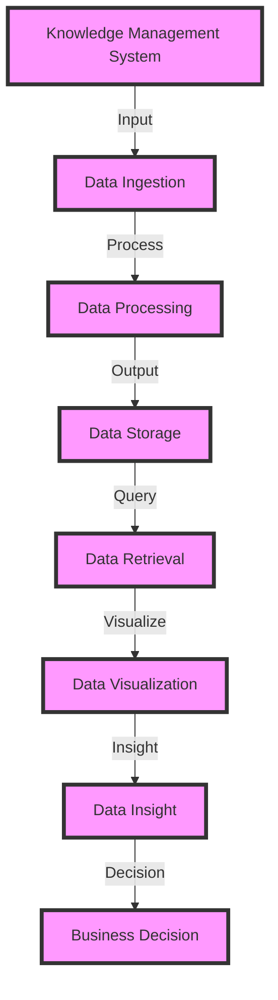

## Part 2: Advanced Knowledge Management Implementations
### Introduction to Advanced Knowledge Management
In the first part of this series, we explored the fundamentals of organized knowledge management implementations, including the benefits, key components, and best practices. In this article, we will delve deeper into advanced knowledge management implementations, discussing edge-cases, deeper architecture, and real-world case studies.

### Edge-Cases in Knowledge Management
Edge-cases in knowledge management refer to unique and unusual scenarios that may not be addressed by traditional knowledge management systems. These can include:

* **Handling sensitive or confidential information**: Organizations may need to implement additional security measures to protect sensitive or confidential information, such as encryption, access controls, and secure storage.
* **Managing knowledge across multiple locations**: Organizations with multiple locations may need to implement a knowledge management system that can handle different time zones, languages, and cultural differences.
* **Integrating with other systems**: Organizations may need to integrate their knowledge management system with other systems, such as customer relationship management (CRM) or enterprise resource planning (ERP) systems.

### Deeper Architecture
A deeper architecture for knowledge management involves designing a system that can handle complex and dynamic information flows. This can include:

* **Taxonomy and ontology**: Developing a taxonomy and ontology to categorize and organize knowledge, making it easier to search and retrieve.
* **Knowledge graphs**: Creating knowledge graphs to visualize and connect related pieces of information, enabling more efficient search and retrieval.
* **Artificial intelligence and machine learning**: Implementing artificial intelligence and machine learning algorithms to analyze and provide insights from large datasets.

### Real-World Case Studies
Several organizations have successfully implemented advanced knowledge management systems, including:

* **IBM**: IBM has implemented a knowledge management system that uses artificial intelligence and machine learning to analyze and provide insights from large datasets.
* **Microsoft**: Microsoft has implemented a knowledge management system that uses knowledge graphs to visualize and connect related pieces of information.
* **Google**: Google has implemented a knowledge management system that uses taxonomy and ontology to categorize and organize knowledge, making it easier to search and retrieve.

## Visual Insights Gallery
The following images provide a visual representation of the concepts discussed in this article:
* 
* 
* 

By exploring advanced edge-cases and deeper architecture, organizations can create a more comprehensive and effective knowledge management system that meets their unique needs and requirements.