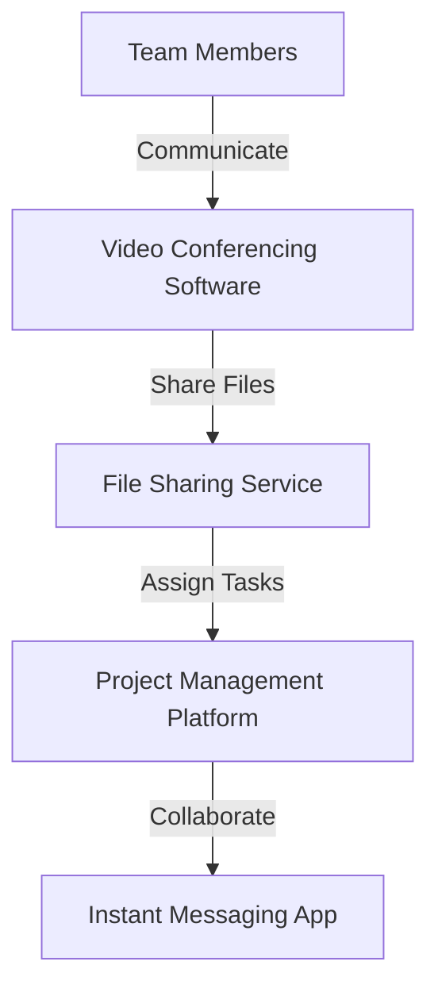
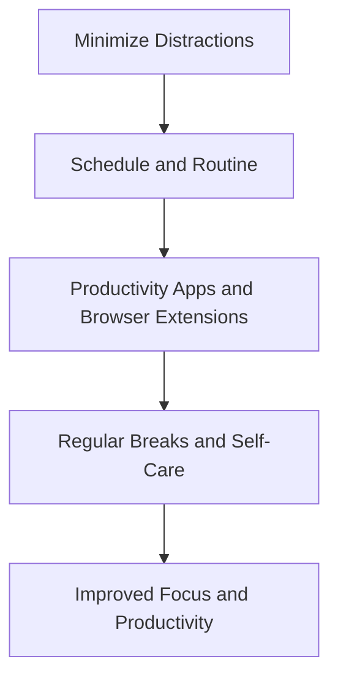

As the world shifts towards a more flexible and autonomous work environment, the concept of remote workspaces has become increasingly popular. With the advancement of technology and the rise of digital communication tools, it's now possible to stay connected and productive from anywhere in the world. However, creating a productive remote workspace requires more than just a laptop and a stable internet connection. In this guide, we'll explore the essential elements of a productive remote workspace and provide actionable tips for implementing them.

## Table of Contents
1. [Introduction to Remote Workspaces](#introduction-to-remote-workspaces)
2. [Key Elements of a Productive Remote Workspace](#key-elements-of-a-productive-remote-workspace)
3. [Setting Up Your Remote Workspace](#setting-up-your-remote-workspace)
4. [Effective Communication and Collaboration Tools](#effective-communication-and-collaboration-tools)
5. [Managing Distractions and Staying Focused](#managing-distractions-and-staying-focused)
6. [Visual Insights Gallery](#visual-insights-gallery)
7. [Conclusion and FAQ](#conclusion-and-faq)

## Introduction to Remote Workspaces

Remote workspaces offer a unique set of benefits, including increased flexibility, reduced commuting time, and improved work-life balance. However, they also present challenges, such as social isolation, distractions, and difficulty separating work and personal life. To overcome these challenges, it's essential to create a well-structured and productive remote workspace.

## Key Elements of a Productive Remote Workspace
A productive remote workspace consists of several key elements, including:
* A dedicated workspace with minimal distractions
* Reliable technology and internet connectivity
* Effective communication and collaboration tools
* A schedule and routine to maintain productivity and work-life balance
* Opportunities for social interaction and community engagement

```markdown
| Element | Description |
| --- | --- |
| Dedicated Workspace | A quiet, private area with minimal distractions |
| Reliable Technology | A laptop, tablet, or desktop with stable internet connectivity |
| Communication Tools | Video conferencing software, instant messaging apps, and project management platforms |
| Schedule and Routine | A structured schedule with regular working hours and breaks |
| Social Interaction | Opportunities for virtual meetings, online communities, and in-person networking events |
```

## Setting Up Your Remote Workspace

Setting up your remote workspace requires careful consideration of several factors, including:
* Lighting and ergonomics
* Noise levels and distractions
* Technology and internet connectivity
* Storage and organization
* Personalization and comfort

> **Tip:** Invest in a comfortable and ergonomic chair, a noise-cancelling headset, and a high-quality webcam to enhance your remote work experience.

## Effective Communication and Collaboration Tools

Effective communication and collaboration tools are essential for remote teams. Some popular options include:
* Video conferencing software (Zoom, Google Meet, Skype)
* Instant messaging apps (Slack, Microsoft Teams, WhatsApp)
* Project management platforms (Asana, Trello, Jira)
* File sharing and storage services (Google Drive, Dropbox, OneDrive)



## Managing Distractions and Staying Focused

Managing distractions and staying focused is crucial for remote workers. Some strategies include:
* Creating a schedule and routine
* Minimizing social media and email notifications
* Using productivity apps and browser extensions
* Taking regular breaks and practicing self-care



## Visual Insights Gallery
### Images to Inspire Your Remote Workspace


## Conclusion and FAQ
In conclusion, creating a productive remote workspace requires careful consideration of several key elements, including a dedicated workspace, reliable technology, effective communication and collaboration tools, and opportunities for social interaction and community engagement. By following the tips and strategies outlined in this guide, you can create a remote workspace that is both productive and fulfilling.

### Frequently Asked Questions
1. **What are the benefits of remote workspaces?**
Remote workspaces offer increased flexibility, reduced commuting time, and improved work-life balance.
2. **What are the challenges of remote workspaces?**
Remote workspaces can present challenges such as social isolation, distractions, and difficulty separating work and personal life.
3. **How can I stay focused and productive while working remotely?**
Create a schedule and routine, minimize social media and email notifications, use productivity apps and browser extensions, and take regular breaks and practice self-care.
4. **What are some effective communication and collaboration tools for remote teams?**
Popular options include video conferencing software, instant messaging apps, project management platforms, and file sharing and storage services.