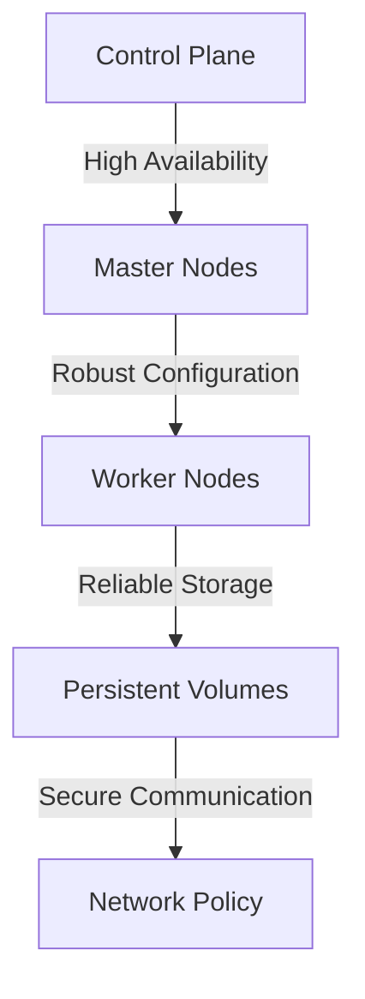
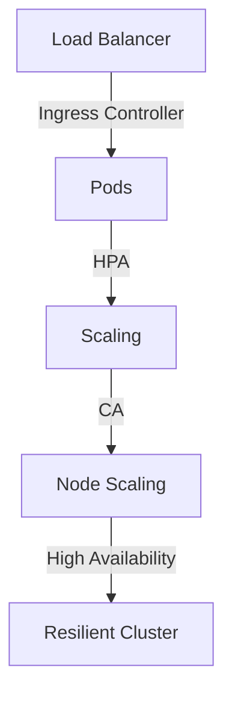

A well-designed Kubernetes cluster is crucial for ensuring high availability, scalability, and reliability of containerized applications. In this comprehensive guide, we will delve into the world of resilient Kubernetes cluster implementations, exploring the best practices, tools, and techniques for building and maintaining robust clusters.

## Table of Contents
1. [Introduction to Kubernetes Resilience](#introduction-to-kubernetes-resilience)
2. [Designing a Resilient Kubernetes Cluster Architecture](#designing-a-resilient-kubernetes-cluster-architecture)
3. [Implementing High Availability and Scalability](#implementing-high-availability-and-scalability)
4. [Monitoring and Logging for Resilient Clusters](#monitoring-and-logging-for-resilient-clusters)
5. [Security Considerations for Kubernetes Clusters](#security-considerations-for-kubernetes-clusters)
6. [Visual Insights Gallery](#visual-insights-gallery)
7. [Summary and Conclusion](#summary-and-conclusion)
8. [Frequently Asked Questions](#frequently-asked-questions)

## Introduction to Kubernetes Resilience
Kubernetes is a powerful container orchestration platform that enables efficient deployment, scaling, and management of containerized applications. However, building a resilient Kubernetes cluster requires careful planning, design, and implementation to ensure high availability, scalability, and reliability.

## Designing a Resilient Kubernetes Cluster Architecture
A well-designed Kubernetes cluster architecture is essential for ensuring resilience. This includes:
* Using a highly available control plane with multiple master nodes
* Implementing a robust worker node configuration with adequate resources
* Utilizing a reliable storage solution, such as persistent volumes
* Configuring a suitable network policy for secure communication between pods

## Implementing High Availability and Scalability
High availability and scalability are critical components of a resilient Kubernetes cluster. This can be achieved by:
* Implementing load balancing and ingress controllers for efficient traffic management
* Utilizing horizontal pod autoscaling (HPA) for dynamic scaling
* Configuring cluster autoscaling (CA) for automated node scaling

## Monitoring and Logging for Resilient Clusters
Monitoring and logging are essential for identifying and resolving issues in a Kubernetes cluster. This includes:
* Utilizing monitoring tools, such as Prometheus and Grafana, for real-time metrics and alerts
* Implementing logging solutions, such as Fluentd and Elasticsearch, for log aggregation and analysis
* Configuring alerting and notification systems for timely issue resolution
> **Tip:** Use a combination of monitoring and logging tools to ensure comprehensive visibility into your cluster's performance and health.

## Security Considerations for Kubernetes Clusters
Security is a critical aspect of building and maintaining a resilient Kubernetes cluster. This includes:
* Implementing secure authentication and authorization mechanisms, such as RBAC and Network Policies
* Utilizing secure communication protocols, such as TLS and mTLS
* Configuring secure storage solutions, such as encrypted persistent volumes
> **Warning:** Failure to implement proper security measures can result in unauthorized access and data breaches.

## Visual Insights Gallery
Here are some additional visual insights into resilient Kubernetes cluster implementations:

## Summary and Conclusion
In this comprehensive guide, we explored the best practices, tools, and techniques for building and maintaining resilient Kubernetes clusters. By following these guidelines and implementing a well-designed cluster architecture, you can ensure high availability, scalability, and reliability for your containerized applications.

## Frequently Asked Questions
* Q: What is the importance of high availability in a Kubernetes cluster?
A: High availability ensures that your cluster remains operational and accessible, even in the event of node failures or other disruptions.
* Q: How can I implement horizontal pod autoscaling (HPA) in my Kubernetes cluster?
A: You can implement HPA by creating a HorizontalPodAutoscaler resource and configuring it to scale your pods based on CPU utilization or other metrics.
* Q: What is the difference between cluster autoscaling (CA) and horizontal pod autoscaling (HPA)?
A: Cluster autoscaling (CA) dynamically scales the number of nodes in your cluster, while horizontal pod autoscaling (HPA) dynamically scales the number of pods in your cluster.