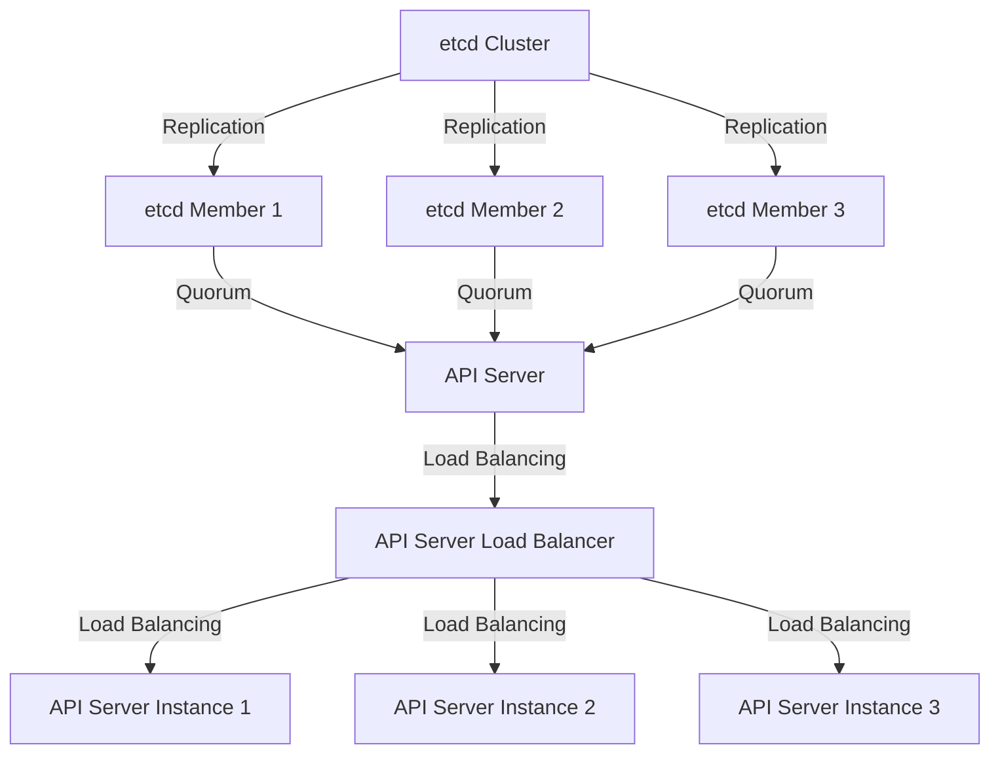
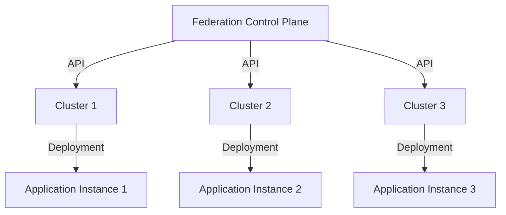

## Part 2: Advanced Resilient Kubernetes Cluster Implementations
### Introduction to Advanced Resilience Concepts
In the first part of this series, we explored the fundamentals of resilient Kubernetes cluster implementations. In this article, we will delve deeper into advanced concepts, edge-cases, and deeper architecture to further enhance the reliability and scalability of our clusters.

### Deep Dive into Kubernetes Control Plane High Availability
To ensure the control plane is highly available, we need to consider multiple factors such as etcd cluster configuration, API server load balancing, and scheduler/controller manager redundancy. Here is a high-level overview of the control plane components:

As shown in the diagram above, we have an etcd cluster with three members, each replicating the others to ensure data consistency. The API server instances are load-balanced to distribute incoming traffic and provide high availability.

### Implementing Multi-Region and Multi-Cloud Kubernetes Clusters
For global applications, it's essential to have a presence in multiple regions and clouds to reduce latency and improve user experience. We can achieve this by deploying multiple Kubernetes clusters in different regions and clouds and using a federation control plane to manage them.

### Using Kubernetes Federation for Multi-Cluster Management
Kubernetes federation provides a way to manage multiple clusters from a single control plane. We can use the federation control plane to deploy and manage applications across multiple clusters, ensuring consistency and reducing administrative overhead.

In the diagram above, the federation control plane manages multiple clusters, each running an instance of the application.

### Advanced Networking and Service Mesh Concepts
Service mesh provides a way to manage service discovery, traffic management, and security in a microservices architecture. We can use service mesh to implement advanced networking concepts such as circuit breakers, load balancing, and traffic splitting.

### Real-World Case Studies and Implementations
Let's take a look at some real-world case studies and implementations of advanced resilient Kubernetes cluster architectures:
*   **Financial Services**: A leading financial institution deployed a multi-region Kubernetes cluster to provide high availability and scalability for their trading platform.
*   **E-commerce**: An e-commerce company implemented a service mesh to manage traffic and security for their microservices-based application.
*   **Healthcare**: A healthcare organization deployed a multi-cloud Kubernetes cluster to provide a highly available and scalable platform for their medical imaging application.

## Visual Insights Gallery
Here are some visual insights into advanced resilient Kubernetes cluster implementations:
*   
*   
*   

By following these advanced concepts and implementing them in our Kubernetes clusters, we can further enhance the reliability, scalability, and performance of our applications. In the next part of this series, we will explore even more advanced topics and edge-cases in resilient Kubernetes cluster implementations.