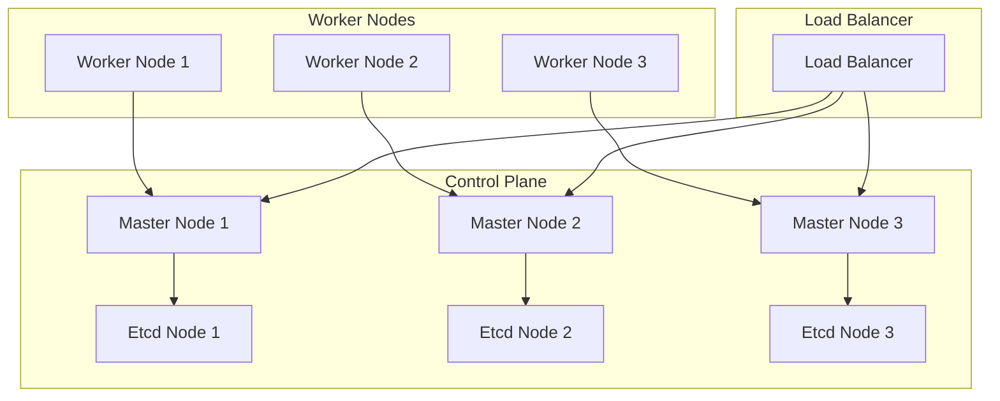
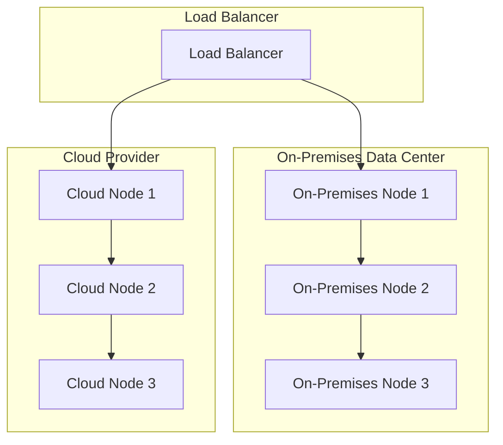

## Part 2: Advanced Resilient Kubernetes Cluster Implementations
### Introduction to Advanced Kubernetes Resilience
In the first part of this series, we explored the fundamentals of building a resilient Kubernetes cluster. In this article, we will delve deeper into advanced topics, including edge cases, complex architectures, and real-world scenarios that can help you further enhance the resilience of your Kubernetes cluster.


### Designing a Highly Available Control Plane
A highly available control plane is crucial for ensuring the overall resilience of your Kubernetes cluster. This can be achieved by deploying multiple control plane nodes across different availability zones or regions.

As shown in the diagram above, a highly available control plane can be designed by deploying multiple master nodes, each with its own etcd node, behind a load balancer.

### Implementing Pod Disruption Budgets
Pod disruption budgets are an essential feature in Kubernetes that helps ensure the availability of your applications during voluntary disruptions, such as node maintenance or upgrades.
```yml
apiVersion: policy/v1
kind: PodDisruptionBudget
metadata:
  name: example-pdb
spec:
  selector:
    matchLabels:
      app: example
  minAvailable: 2
  maxUnavailable: 1
```
In the example above, the pod disruption budget ensures that at least 2 pods are available at all times, and no more than 1 pod can be unavailable during a disruption.

### Advanced Networking and Security
Advanced networking and security features, such as network policies and ingress controllers, can help further enhance the resilience of your Kubernetes cluster.

Network policies can be used to control traffic flow between pods, while ingress controllers can help manage incoming traffic to your cluster.

### Real-World Case Studies
Let's take a look at a real-world scenario where a highly available Kubernetes cluster was deployed to support a mission-critical application.

In this scenario, a highly available Kubernetes cluster was deployed across both on-premises and cloud-based infrastructure, with a load balancer distributing traffic between the two environments.

## Visual Insights Gallery
Below are some visual insights into advanced resilient Kubernetes cluster implementations:
* [](https://picsum.photos/seed/kubernetes-architecture/800/400)
* [](https://picsum.photos/seed/highly-available-control-plane/800/400)
* [](https://picsum.photos/seed/pod-disruption-budgets/800/400)