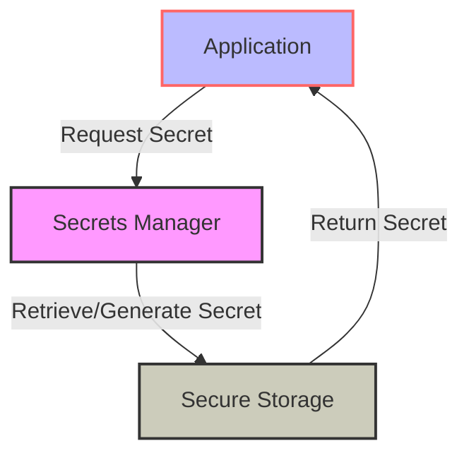
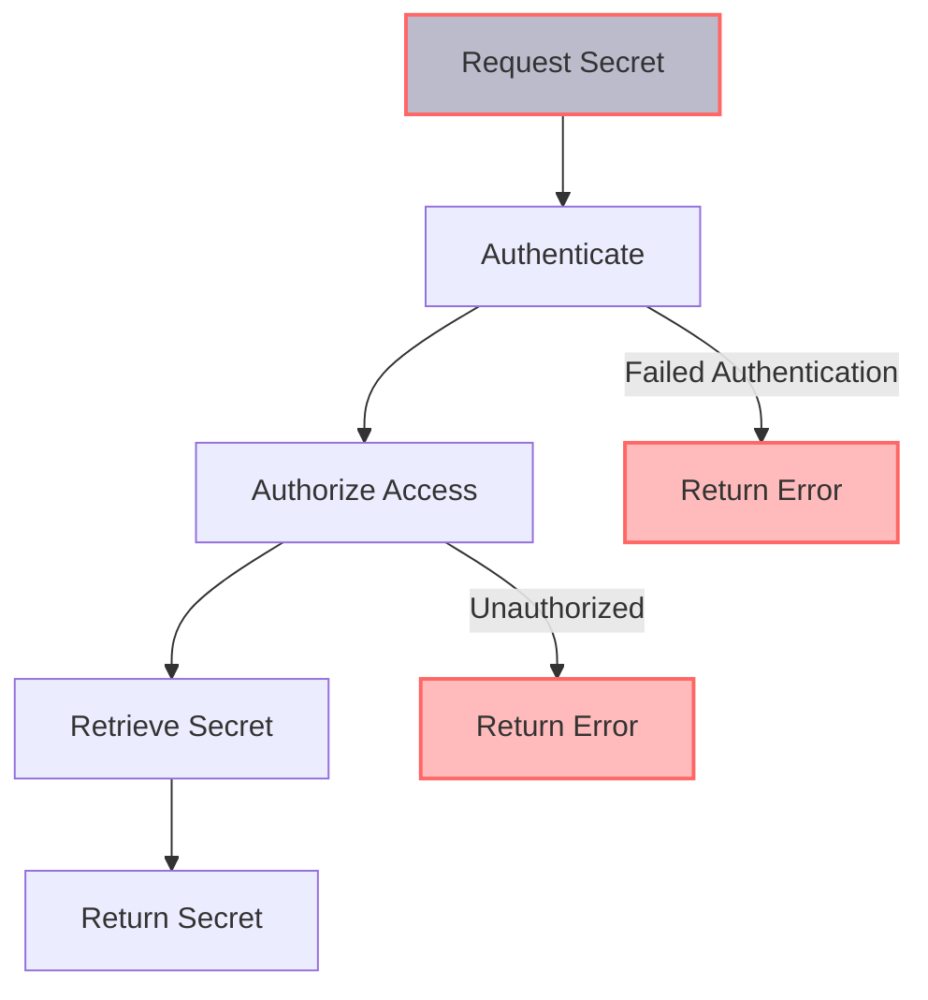

In the realm of cybersecurity, secrets management stands as a critical pillar, ensuring that sensitive information such as passwords, API keys, and certificates are handled securely. As systems and applications grow in complexity, the challenge of managing these secrets effectively becomes increasingly daunting. This guide is designed to delve into the depths of secrets management, providing actionable insights and strategies for implementing robust solutions.

## Table of Contents
1. [Introduction to Secrets Management](#introduction-to-secrets-management)
2. [Key Components of Secrets Management](#key-components-of-secrets-management)
3. [Implementing Secrets Management](#implementing-secrets-management)
4. [Best Practices for Secrets Management](#best-practices-for-secrets-management)
5. [Visual Insights Gallery](#visual-insights-gallery)
6. [Summary/Conclusion](#summary/conclusion)
7. [FAQ](#faq)

## Introduction to Secrets Management

Secrets management is the practice of securely storing, managing, and controlling access to sensitive data. This includes not just passwords and API keys but also certificates, cryptographic keys, and other confidential information. Effective secrets management is fundamental to preventing unauthorized access, data breaches, and other security incidents.

> **Note:** A key aspect of secrets management is encryption. Encrypting secrets ensures that even if an unauthorized party gains access to the stored data, they will not be able to read or exploit it without the decryption key.

## Key Components of Secrets Management

The core components of a robust secrets management system include:
- **Secure Storage:** This involves using encrypted vaults or secure repositories to store sensitive information.
- **Access Control:** Implementing strict access controls to ensure that only authorized personnel or services can retrieve or modify secrets.
- **Rotation and Revocation:** Regularly rotating (changing) secrets and having the ability to quickly revoke access in case of a security incident.

```markdown
| Component | Description |
| --- | --- |
| Secure Storage | Encrypted storage for secrets |
| Access Control | Strict controls over who can access secrets |
| Rotation and Revocation | Regularly changing secrets and ability to revoke access |
```

## Implementing Secrets Management
### Architecture Overview


### Flow Diagram


## Best Practices for Secrets Management
> **Tip:** Implement a least privilege access model, where each service or user has the minimum level of access necessary to perform their tasks. This reduces the risk of secrets being exposed or misused.

- Regularly review and update access controls.
- Use secure communication protocols (like HTTPS) when transmitting secrets.
- Monitor and audit all access to secrets.

## Visual Insights Gallery
## Visual Insights Gallery


## Summary/Conclusion
Effective secrets management is crucial for protecting sensitive information and preventing security breaches. By understanding the key components, implementing robust solutions, and following best practices, organizations can significantly enhance their security posture.

## FAQ
1. **What is secrets management?**
   - Secrets management refers to the practice of securely storing, managing, and controlling access to sensitive data.

2. **Why is secrets management important?**
   - It prevents unauthorized access, data breaches, and other security incidents by ensuring that sensitive information is handled securely.

3. **What are the key components of secrets management?**
   - Secure storage, access control, and rotation/revocation of secrets.

4. **How often should secrets be rotated?**
   - The frequency of rotation depends on the type of secret and the organization's security policy, but it's generally recommended to rotate secrets regularly, such as every 90 days.