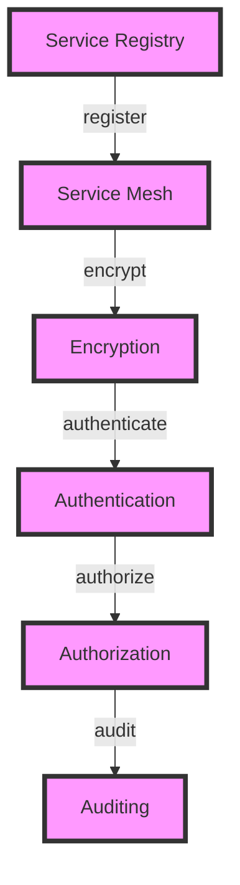
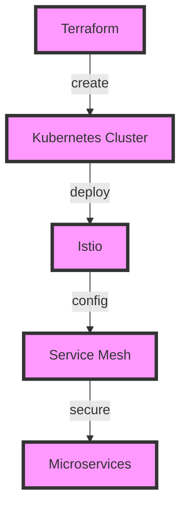

In the realm of modern cloud computing and DevOps, service mesh has emerged as a critical component for managing microservices-based architectures. However, with the increasing complexity of these systems comes the challenge of ensuring their security. This comprehensive guide is designed to walk you through the process of implementing a secure service mesh, leveraging tools like Terraform and Kubernetes.

## Table of Contents
1. [Introduction to Service Mesh](#introduction-to-service-mesh)
2. [Security Challenges in Service Mesh](#security-challenges-in-service-mesh)
3. [Architecture for Secure Service Mesh](#architecture-for-secure-service-mesh)
4. [Implementing Secure Service Mesh with Terraform and Kubernetes](#implementing-secure-service-mesh-with-terraform-and-kubernetes)
5. [Best Practices for Securing Service Mesh](#best-practices-for-securing-service-mesh)
6. [Visual Insights Gallery](#visual-insights-gallery)
7. [Summary and Conclusion](#summary-and-conclusion)
8. [FAQ](#faq)

## Introduction to Service Mesh

A service mesh is an infrastructure layer that enables managed, observable, and secure communication between microservices. It provides a configurable infrastructure layer for microservices application, making it easier to manage service discovery, traffic management, and security. Popular service mesh implementations include Istio and Linkerd.

## Security Challenges in Service Mesh
> **Warning:** Security is a critical aspect of service mesh implementations. Without proper security measures, your microservices architecture could be vulnerable to attacks.
The security challenges in service mesh include:
- **Encryption**: Ensuring that all communication between services is encrypted.
- **Authentication**: Verifying the identity of services.
- **Authorization**: Controlling what actions services can perform.
- **Auditing**: Monitoring and logging all service interactions.

## Architecture for Secure Service Mesh

A secure service mesh architecture should include service registry, encryption, authentication, authorization, and auditing components.

## Implementing Secure Service Mesh with Terraform and Kubernetes

Terraform can be used to provision a Kubernetes cluster, and then Istio can be deployed on the cluster to create a service mesh. The service mesh can then be configured to secure the microservices.

## Best Practices for Securing Service Mesh
> **Tip:** Regularly review and update your service mesh configuration to ensure it remains secure.
Best practices for securing service mesh include:
- **Use Mutual TLS**: Encrypt all service communication with mutual TLS.
- **Implement Role-Based Access Control (RBAC)**: Control access to services based on roles.
- **Monitor and Audit**: Regularly monitor and audit service interactions.

## Visual Insights Gallery
## Visual Insights Gallery

## Summary and Conclusion
Implementing a secure service mesh is crucial for protecting your microservices-based architecture. By following the guidelines and best practices outlined in this guide, you can create a secure and reliable service mesh using Terraform and Kubernetes.

## FAQ
- Q: What is a service mesh?
  A: A service mesh is an infrastructure layer that enables managed, observable, and secure communication between microservices.
- Q: Why is security important in service mesh?
  A: Security is important in service mesh to protect against attacks and ensure the integrity of the microservices architecture.
- Q: What are some best practices for securing service mesh?
  A: Best practices include using mutual TLS, implementing role-based access control, and monitoring and auditing service interactions.