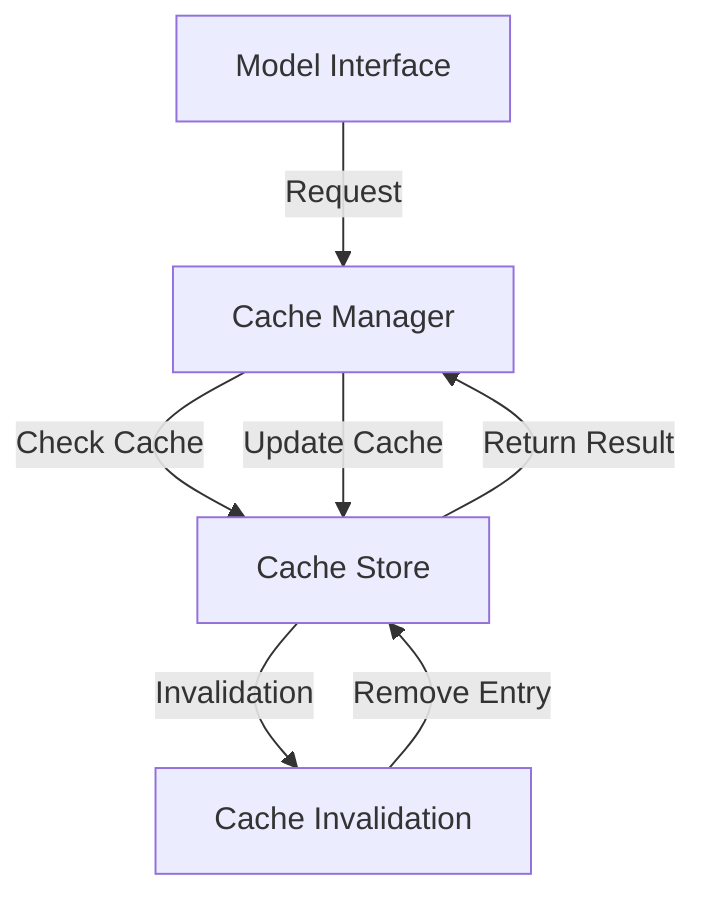
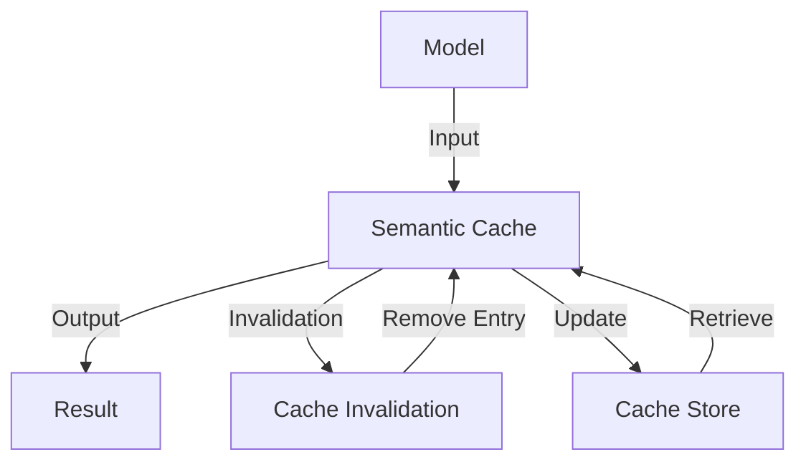

# The Complete Guide to Semantic Cache Implementations
A comprehensive overview of semantic cache implementations, including architectures, patterns, and strategies for optimizing AI and ML models.

> **Introduction:** As AI and ML models become increasingly complex, the need for efficient and effective caching mechanisms has never been more pressing. Semantic caching is a powerful technique for improving the performance of these models by storing and reusing previously computed results. In this article, we will delve into the world of semantic cache implementations, exploring the key concepts, architectures, and best practices for optimizing AI and ML models.

## Table of Contents
1. [Introduction to Semantic Caching](#introduction-to-semantic-caching)
2. [Architecture of Semantic Cache Implementations](#architecture-of-semantic-cache-implementations)
3. [Patterns and Strategies for Optimizing Semantic Caches](#patterns-and-strategies-for-optimizing-semantic-caches)
4. [Mermaid.js Diagrams for Semantic Cache Implementations](#mermaidjs-diagrams-for-semantic-cache-implementations)
5. [Visual Insights Gallery](#visual-insights-gallery)
6. [Summary and Conclusion](#summary-and-conclusion)
7. [FAQ](#faq)

## Introduction to Semantic Caching
Semantic caching is a technique used to improve the performance of AI and ML models by storing and reusing previously computed results. This is particularly useful in applications where the same inputs are repeatedly processed, such as in natural language processing or computer vision tasks.

## Architecture of Semantic Cache Implementations
The architecture of a semantic cache implementation typically consists of three main components:
* **Cache Store:** This is the component responsible for storing and retrieving cached results.
* **Cache Manager:** This component is responsible for managing the cache, including deciding what to cache, when to cache it, and when to invalidate the cache.
* **Model Interface:** This component provides an interface between the cache and the AI or ML model, allowing the model to access and update the cache as needed.

## Patterns and Strategies for Optimizing Semantic Caches
There are several patterns and strategies that can be used to optimize semantic caches, including:
* **Cache invalidation:** This involves removing outdated or irrelevant cache entries to ensure that the cache remains up-to-date and accurate.
* **Cache sizing:** This involves adjusting the size of the cache to balance memory usage and performance.
* **Cache replacement policies:** This involves choosing the optimal policy for replacing cache entries when the cache is full.
> **Tip:** The choice of cache replacement policy can have a significant impact on the performance of the semantic cache. Common policies include least recently used (LRU), first-in-first-out (FIFO), and random replacement.

## Mermaid.js Diagrams for Semantic Cache Implementations

This diagram illustrates the flow of a semantic cache implementation, including the model interface, cache manager, cache store, and cache invalidation components.

This graph illustrates the architecture of a semantic cache implementation, including the model, semantic cache, result, cache invalidation, and cache store components.

## Visual Insights Gallery
## Visual Insights Gallery

## Summary and Conclusion
In conclusion, semantic cache implementations are a powerful technique for optimizing AI and ML models. By understanding the architecture, patterns, and strategies for optimizing semantic caches, developers can create more efficient and effective models. Whether you are working on a natural language processing or computer vision task, semantic caching can help improve the performance of your model.

## FAQ
1. **What is semantic caching?**
Semantic caching is a technique used to improve the performance of AI and ML models by storing and reusing previously computed results.
2. **What are the benefits of semantic caching?**
The benefits of semantic caching include improved performance, reduced memory usage, and increased efficiency.
3. **What are some common cache replacement policies?**
Common cache replacement policies include least recently used (LRU), first-in-first-out (FIFO), and random replacement.