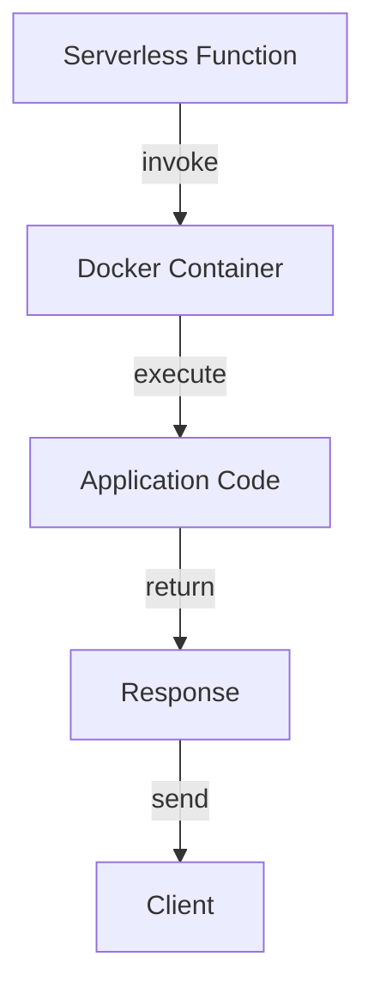
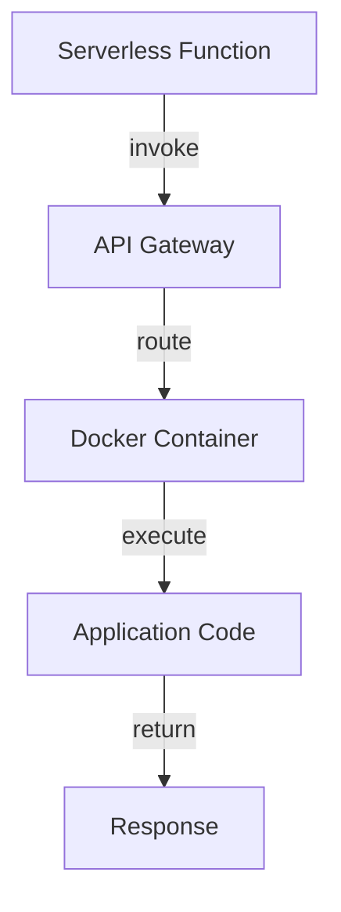

Serverless computing and Docker have revolutionized the way applications are deployed and managed. However, optimizing Docker for serverless environments can be a complex task. In this comprehensive guide, we will explore the best practices and strategies for serverless Docker optimization implementations.

## Table of Contents
1. [Introduction to Serverless Computing](#introduction-to-serverless-computing)
2. [Understanding Docker and Serverless](#understanding-docker-and-serverless)
3. [Optimization Strategies for Serverless Docker](#optimization-strategies-for-serverless-docker)
4. [Implementing Serverless Docker Architecture](#implementing-serverless-docker-architecture)
5. [Best Practices for Serverless Docker Security](#best-practices-for-serverless-docker-security)
6. [Visual Insights Gallery](#visual-insights-gallery)
7. [Summary and Conclusion](#summary-and-conclusion)
8. [FAQ](#faq)

## Introduction to Serverless Computing
Serverless computing is a cloud computing model where the cloud provider manages the infrastructure and dynamically allocates resources as needed. This approach allows developers to focus on writing code without worrying about the underlying infrastructure.


## Understanding Docker and Serverless
Docker is a containerization platform that allows developers to package applications and their dependencies into a single container. Serverless computing and Docker can be used together to create scalable and efficient applications.


## Optimization Strategies for Serverless Docker
To optimize serverless Docker implementations, consider the following strategies:
- **Minimize Container Size**: Reduce the size of Docker containers to improve deployment times and reduce storage costs.
- **Optimize Resource Allocation**: Allocate resources efficiently to avoid over-provisioning and reduce costs.
- **Use Caching Mechanisms**: Implement caching mechanisms to reduce the load on the application and improve performance.
```markdown
| Strategy | Description |
| --- | --- |
| Minimize Container Size | Reduce container size to improve deployment times and reduce storage costs |
| Optimize Resource Allocation | Allocate resources efficiently to avoid over-provisioning and reduce costs |
| Use Caching Mechanisms | Implement caching mechanisms to reduce load and improve performance |
```
### Mermaid.js Diagram: Serverless Docker Flow


## Implementing Serverless Docker Architecture
To implement serverless Docker architecture, consider the following components:
- **Serverless Function**: The serverless function that invokes the Docker container.
- **Docker Container**: The Docker container that runs the application code.
- **Application Code**: The application code that is executed by the Docker container.
```markdown
> **Note:** Use a serverless function to invoke the Docker container, and use the Docker container to run the application code.
```
### Mermaid.js Diagram: Serverless Docker Architecture


## Best Practices for Serverless Docker Security
To ensure the security of serverless Docker implementations, consider the following best practices:
- **Use Secure Images**: Use secure Docker images to prevent vulnerabilities.
- **Implement Access Controls**: Implement access controls to restrict access to the Docker container.
- **Monitor and Log**: Monitor and log the Docker container to detect security issues.
```markdown
| Best Practice | Description |
| --- | --- |
| Use Secure Images | Use secure Docker images to prevent vulnerabilities |
| Implement Access Controls | Implement access controls to restrict access to the Docker container |
| Monitor and Log | Monitor and log the Docker container to detect security issues |
```
> **Warning:** Failure to implement security best practices can result in security breaches and data loss.

## Visual Insights Gallery
This section provides a visual representation of serverless Docker optimization implementations.


## Summary and Conclusion
In this comprehensive guide, we explored the best practices and strategies for serverless Docker optimization implementations. By following these guidelines, developers can create scalable, efficient, and secure serverless Docker applications.

## FAQ
Q: What is serverless computing?
A: Serverless computing is a cloud computing model where the cloud provider manages the infrastructure and dynamically allocates resources as needed.
Q: What is Docker?
A: Docker is a containerization platform that allows developers to package applications and their dependencies into a single container.
Q: How can I optimize serverless Docker implementations?
A: To optimize serverless Docker implementations, consider minimizing container size, optimizing resource allocation, and using caching mechanisms.