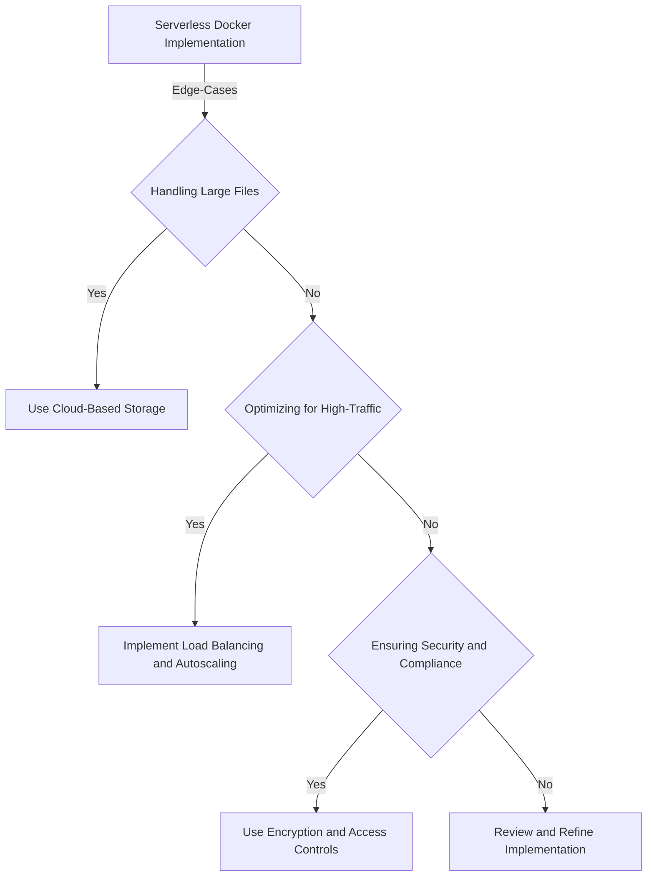
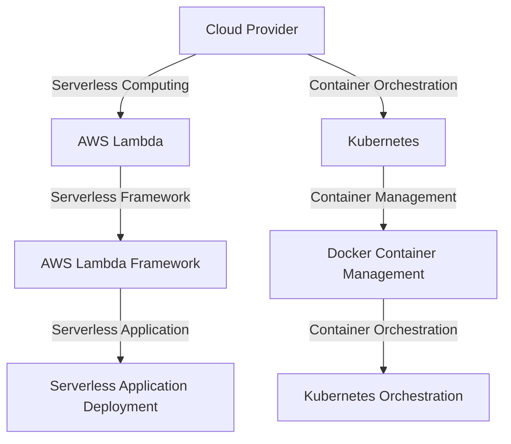

## Part 2: Advanced Serverless Docker Optimization Implementations
### Introduction to Advanced Topics
In the first part of this series, we explored the basics of serverless computing and Docker, as well as optimization strategies for serverless Docker implementations. In this article, we will delve deeper into advanced topics, including edge-cases, deeper architecture, and real-world case studies.

### Edge-Cases in Serverless Docker Implementations
When implementing serverless Docker, there are several edge-cases to consider, including:
* Handling large files and datasets
* Optimizing for high-traffic applications
* Ensuring security and compliance
To handle these edge-cases, developers can use various strategies, such as:
* Using cloud-based storage solutions for large files and datasets
* Implementing load balancing and autoscaling for high-traffic applications
* Using encryption and access controls to ensure security and compliance

### Real-World Case Studies
Several companies have successfully implemented serverless Docker architectures, including:
* A leading e-commerce company that used serverless Docker to optimize their application deployment and reduce costs
* A financial services company that used serverless Docker to improve the security and compliance of their applications
* A healthcare company that used serverless Docker to develop a scalable and efficient application for medical imaging analysis

### Deeper Architecture
To achieve advanced serverless Docker optimization, it's essential to understand the deeper architecture of serverless computing and Docker. This includes:
* Understanding the role of cloud providers, such as AWS, Azure, and Google Cloud
* Knowing how to use container orchestration tools, such as Kubernetes
* Familiarity with serverless frameworks, such as AWS Lambda and Azure Functions

### Advanced Security and Compliance
Advanced security and compliance are critical aspects of serverless Docker implementations. This includes:
* Using encryption and access controls to protect sensitive data
* Implementing logging and monitoring to detect security threats
* Ensuring compliance with regulatory requirements, such as HIPAA and PCI-DSS

## Visual Insights Gallery
Here are some additional visual insights into advanced serverless Docker optimization implementations:
* 
* 
* 