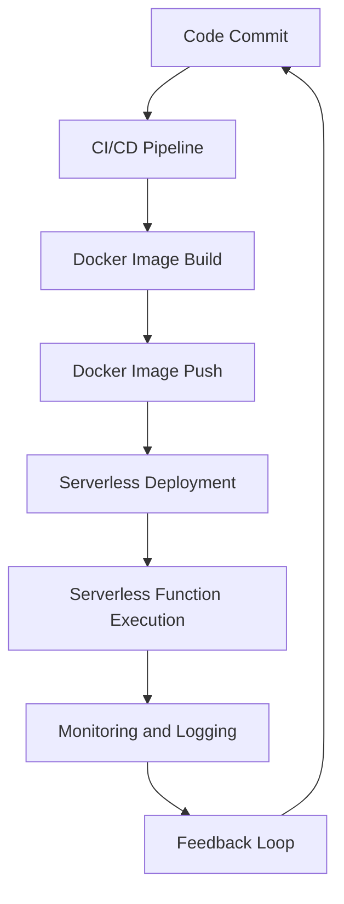

## Part 2: Advanced Serverless Docker Optimization Implementations
Optimizing Docker for serverless environments is crucial for achieving scalability, efficiency, and cost-effectiveness. In the first part of this series, we explored the fundamentals of serverless computing, Docker, and the best practices for optimizing serverless Docker implementations. In this article, we will delve deeper into advanced topics, including edge cases, architecture, and security considerations.

## Edge Cases in Serverless Docker Optimization
When optimizing Docker for serverless environments, several edge cases must be considered. These include:
* **Cold Start**: The time it takes for a serverless function to start executing after a period of inactivity. This can be mitigated by using provisioned concurrency or keeping the function warm.
* **Container Reuse**: Serverless providers often reuse containers to improve performance. However, this can lead to issues with container state and caching.
* **Memory Constraints**: Serverless functions often have limited memory, which can lead to issues with large Docker images or memory-intensive applications.

## Advanced Serverless Docker Architecture
A well-designed architecture is critical for optimizing serverless Docker implementations. This includes:
* **Microservices**: Breaking down applications into smaller, independent services that can be scaled and optimized individually.
* **Service Mesh**: Implementing a service mesh to manage communication between services and improve observability.
* **CI/CD Pipelines**: Implementing continuous integration and continuous deployment (CI/CD) pipelines to automate testing, building, and deployment of Docker images.

```mermaid
flowchart TD
    A[Code Commit] --> B["CI/CD Pipeline"]
    B --> C[Docker Image Build]
    C --> D[Docker Image Push]
    D --> E[Serverless Deployment]
    E --> F[Serverless Function Execution]
    F --> G[Monitoring and Logging]
    G --> H[Feedback Loop]
    H --> A
```

## Security Considerations for Serverless Docker
Security is a critical aspect of serverless Docker implementations. This includes:
* **Image Scanning**: Scanning Docker images for vulnerabilities and malware.
* **Network Policies**: Implementing network policies to control communication between services.
* **Secret Management**: Managing secrets and sensitive data in serverless applications.

## Real-World Case Studies
Several companies have successfully implemented serverless Docker optimizations, including:
* **Netflix**: Using serverless computing and Docker to improve scalability and efficiency.
* **Airbnb**: Implementing a service mesh to manage communication between services.
* **Uber**: Using CI/CD pipelines to automate testing, building, and deployment of Docker images.

## Visual Insights Gallery
### Image 1: Serverless Docker Architecture

### Image 2: CI/CD Pipeline

### Image 3: Serverless Docker Security

### Image 4: Edge Cases in Serverless Docker

### Image 5: Real-World Case Studies

## Summary and Conclusion
In this article, we explored advanced topics in serverless Docker optimization, including edge cases, architecture, and security considerations. By understanding these concepts and implementing best practices, developers can create scalable, efficient, and secure serverless applications. In the next part of this series, we will delve deeper into the implementation details of serverless Docker optimizations.