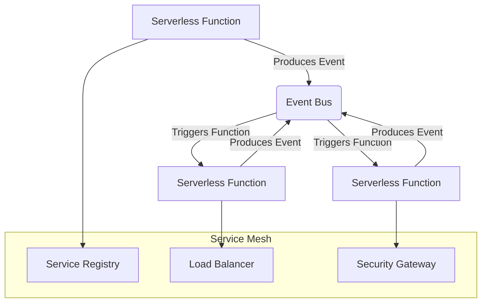

## Part 3: Expert Edge Cases and Architecture in Serverless Docker Optimization
In the previous articles of this series, we explored the fundamentals and advanced topics of serverless Docker optimization. In this article, we will delve deeper into expert-level edge cases and architecture, providing a comprehensive guide for optimizing serverless Docker implementations.

## Expert Edge Cases in Serverless Docker Optimization
Beyond the common edge cases, there are several expert-level scenarios that must be considered when optimizing Docker for serverless environments. These include:
* **Function Chaining**: The practice of linking multiple serverless functions together to create a workflow. This can lead to issues with latency, error handling, and debugging.
* **Container Networking**: Serverless providers often use container networking to enable communication between functions. However, this can lead to issues with security, latency, and complexity.
* **Resource Constraints**: Serverless functions often have limited resources, including CPU, memory, and storage. This can lead to issues with performance, scalability, and cost-effectiveness.

## Deep Dive into Serverless Docker Architecture
A well-designed architecture is critical for optimizing serverless Docker implementations. This includes:
* **Service Mesh**: A configurable infrastructure layer for microservices that makes it easy to manage service discovery, traffic management, and security.
* **Event-Driven Architecture**: A design pattern that focuses on producing and handling events to create a scalable and flexible system.
* **Serverless Frameworks**: Open-source frameworks that provide a set of tools and libraries to build, deploy, and manage serverless applications.

## Advanced Security Considerations
Security is a critical aspect of serverless Docker optimization. This includes:
* **Image Scanning**: The practice of scanning Docker images for vulnerabilities and malware.
* **Network Security**: The practice of securing container networking to prevent unauthorized access.
* **Access Control**: The practice of controlling access to serverless functions and resources.

## Real-World Case Studies
Several organizations have successfully optimized their serverless Docker implementations using the strategies outlined in this article. These include:
* **Netflix**: Uses a service mesh to manage its microservices architecture.
* **Uber**: Uses an event-driven architecture to handle high volumes of requests.
* **Airbnb**: Uses serverless frameworks to build and deploy its applications.

## Visual Insights Gallery
### Image 1: Serverless Docker Architecture

### Image 2: Expert Edge Cases in Serverless Docker

### Image 3: Advanced Security Considerations
