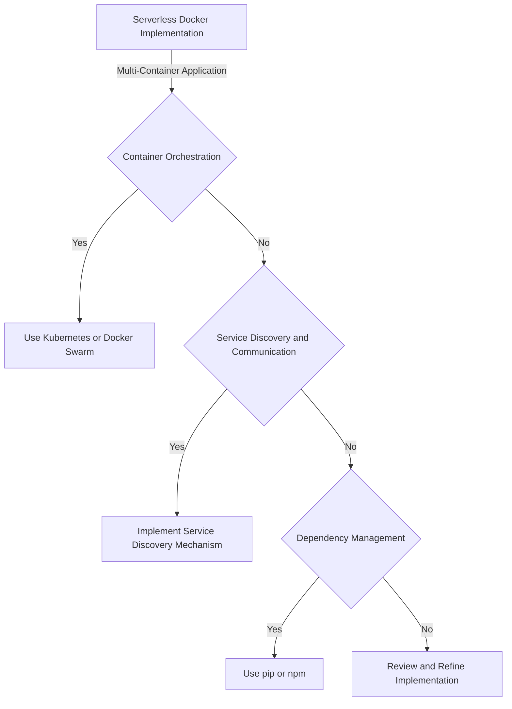
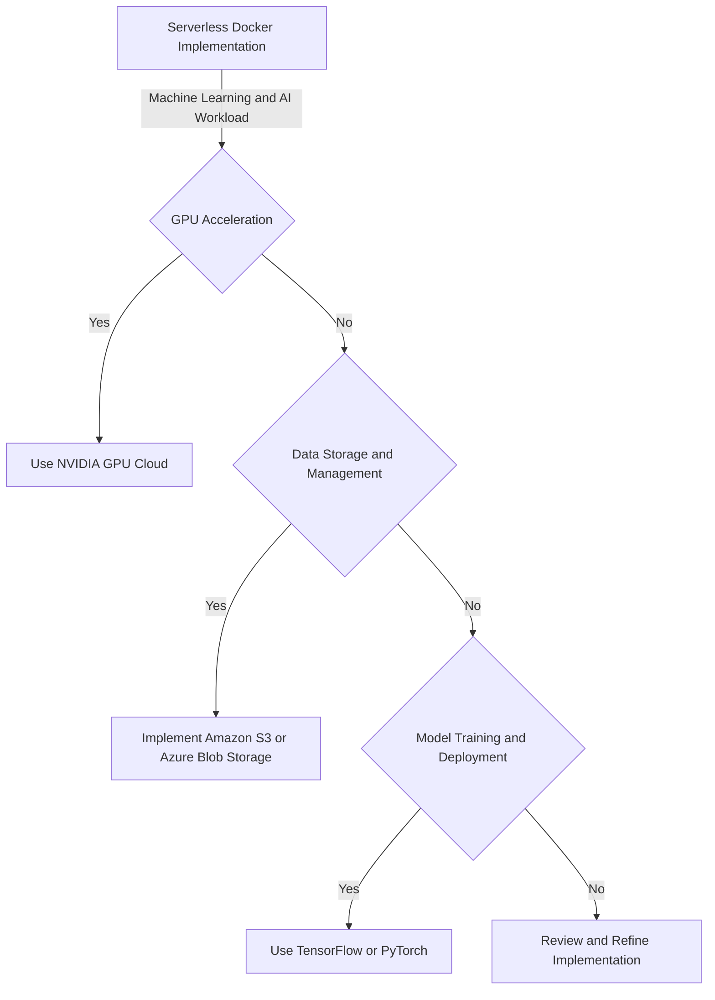
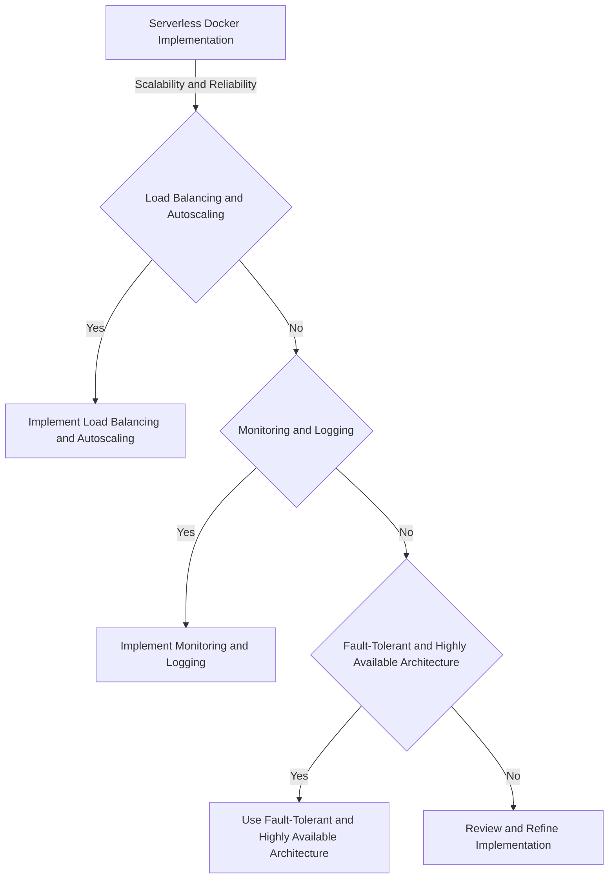

## Part 3: Mastering Advanced Edge-Cases and Deeper Architecture in Serverless Docker Optimization
### Introduction to Advanced Edge-Cases
In the previous parts of this series, we explored the basics of serverless computing and Docker, as well as optimization strategies for serverless Docker implementations. We also delved into some advanced topics, including edge-cases and deeper architecture. In this article, we will master advanced edge-cases and deeper architecture, including:
* Handling multi-container applications
* Optimizing for machine learning and AI workloads
* Ensuring scalability and reliability

### Handling Multi-Container Applications
When implementing serverless Docker for multi-container applications, there are several considerations to keep in mind, including:
* Orchestrating container deployment and management
* Ensuring communication between containers
* Managing dependencies and libraries
To handle these considerations, developers can use various strategies, such as:
* Using container orchestration tools like Kubernetes or Docker Swarm
* Implementing service discovery and communication mechanisms
* Using dependency management tools like pip or npm

### Optimizing for Machine Learning and AI Workloads
When implementing serverless Docker for machine learning and AI workloads, there are several considerations to keep in mind, including:
* Optimizing for GPU acceleration
* Ensuring data storage and management
* Managing model training and deployment
To handle these considerations, developers can use various strategies, such as:
* Using GPU-accelerated containers like NVIDIA GPU Cloud
* Implementing data storage and management solutions like Amazon S3 or Azure Blob Storage
* Using model training and deployment tools like TensorFlow or PyTorch

### Ensuring Scalability and Reliability
When implementing serverless Docker, ensuring scalability and reliability is crucial. There are several strategies to achieve this, including:
* Implementing load balancing and autoscaling
* Ensuring monitoring and logging
* Using fault-tolerant and highly available architecture

## Visual Insights Gallery
Here are some additional visual insights into advanced edge-cases and deeper architecture in serverless Docker optimization:
* 
* 
* 