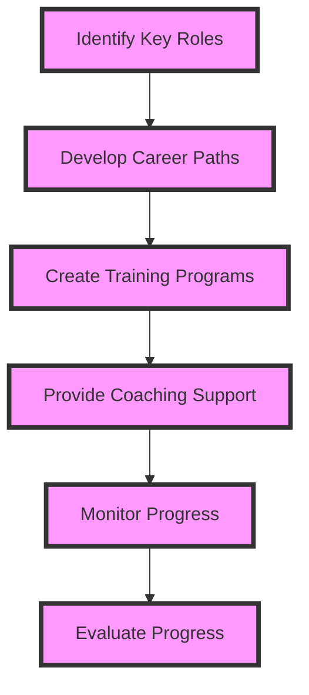

A well-structured career development strategy is essential for any organization looking to attract, retain, and develop top talent. In this comprehensive guide, we will explore the key elements of strategic career development implementations and provide actionable advice for leaders looking to create a culture of growth and development.

## Introduction to Strategic Career Development
Strategic career development is a proactive approach to managing an organization's talent pipeline. It involves creating a structured framework for identifying, developing, and retaining key employees, with the goal of driving business success and achieving long-term goals.


## Understanding the Importance of Career Development
Career development is critical for organizations looking to stay competitive in today's fast-paced business environment. It helps to:
* Improve employee engagement and retention
* Enhance job satisfaction and performance
* Develop future leaders and succession plans
* Drive business growth and innovation
> **Note:** A well-structured career development strategy can help organizations to attract and retain top talent, reduce turnover rates, and improve overall business performance.

## Creating a Career Development Framework
A career development framework is a structured approach to managing an organization's talent pipeline. It involves:
* Identifying key roles and competencies
* Developing career paths and progression plans
* Creating training and development programs
* Providing coaching and mentoring support
* Monitoring and evaluating progress
```markdown
| Career Development Stage | Description |
| --- | --- |
| Identification | Identifying key roles and competencies |
| Development | Creating career paths and progression plans |
| Implementation | Providing training and development programs |
| Evaluation | Monitoring and evaluating progress |
```
## Implementing a Career Development Strategy
Implementing a career development strategy requires a structured approach. It involves:
* Communicating the strategy to all employees
* Providing training and development opportunities
* Encouraging feedback and coaching
* Monitoring and evaluating progress
* Making adjustments as needed

## Measuring the Success of Career Development Implementations
Measuring the success of career development implementations is critical to evaluating the effectiveness of the strategy. It involves:
* Tracking key performance indicators (KPIs)
* Conducting regular feedback and coaching sessions
* Monitoring employee engagement and retention rates
* Evaluating the impact on business performance
> **Tip:** Use data and analytics to measure the success of career development implementations and make adjustments as needed.

## Overcoming Common Challenges
Implementing a career development strategy can be challenging. Common challenges include:
* Limited resources and budget
* Lack of buy-in from employees and managers
* Difficulty in measuring success
* Limited opportunities for growth and development
> **Warning:** Failure to address these challenges can result in a lack of engagement and retention among employees, ultimately impacting business performance.

## Visual Insights Gallery
## Visual Insights Gallery


## Summary and Conclusion
In conclusion, strategic career development implementations are critical for organizations looking to attract, retain, and develop top talent. By creating a structured framework, implementing a career development strategy, and measuring success, organizations can drive business growth and innovation. Remember to overcome common challenges and use data and analytics to measure success.

## Frequently Asked Questions
* Q: What is strategic career development?
A: Strategic career development is a proactive approach to managing an organization's talent pipeline.
* Q: Why is career development important?
A: Career development is critical for improving employee engagement and retention, enhancing job satisfaction and performance, and driving business growth and innovation.
* Q: How do I create a career development framework?
A: A career development framework involves identifying key roles and competencies, developing career paths and progression plans, creating training and development programs, and providing coaching and mentoring support.
* Q: How do I measure the success of career development implementations?
A: Measuring success involves tracking key performance indicators (KPIs), conducting regular feedback and coaching sessions, monitoring employee engagement and retention rates, and evaluating the impact on business performance.