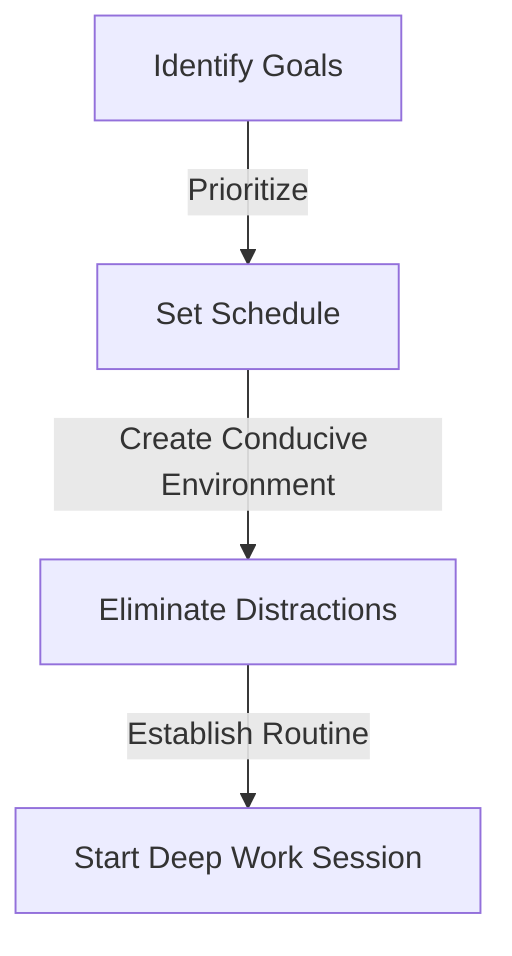

In today's fast-paced, technology-driven world, maintaining focus and productivity is more challenging than ever. With numerous distractions at our fingertips, it's easy to get sidetracked and lose sight of our goals. However, by implementing structured deep work sessions, you can significantly improve your ability to concentrate and achieve more in less time. In this article, we'll delve into the world of deep work, exploring its benefits, and providing a step-by-step guide on how to implement structured deep work sessions.

## Table of Contents
1. [Introduction to Deep Work](#introduction-to-deep-work)
2. [Benefits of Deep Work](#benefits-of-deep-work)
3. [Preparing for Deep Work Sessions](#preparing-for-deep-work-sessions)
4. [Implementing Structured Deep Work Sessions](#implementing-structured-deep-work-sessions)
5. [Overcoming Distractions and Challenges](#overcoming-distractions-and-challenges)
6. [Visual Insights Gallery](#visual-insights-gallery)
7. [Conclusion and FAQ](#conclusion-and-faq)

## Introduction to Deep Work

Deep work refers to the ability to focus without distraction on a cognitively demanding task. It's a skill that allows you to concentrate on a specific activity, shutting out interruptions and minimizing multitasking. By doing so, you can achieve a state of flow, where your skills and challenges are perfectly balanced, leading to increased productivity and job satisfaction.

## Benefits of Deep Work
The benefits of deep work are numerous and well-documented. Some of the most significant advantages include:
- Improved focus and concentration
- Increased productivity and efficiency
- Enhanced creativity and problem-solving skills
- Better work-life balance
- Reduced stress and burnout

```markdown
| Benefit | Description |
| --- | --- |
| Improved Focus | Ability to concentrate on a task without distraction |
| Increased Productivity | Completion of tasks in less time with higher quality |
| Enhanced Creativity | Ability to think outside the box and find innovative solutions |
| Better Work-Life Balance | Separation of work and personal life, reducing burnout |
| Reduced Stress | Decreased feelings of overwhelm and anxiety |
```

## Preparing for Deep Work Sessions

To prepare for deep work sessions, you need to:
- Set clear goals and priorities
- Eliminate distractions (turn off notifications, log out of social media, etc.)
- Create a conducive work environment (comfortable, quiet, and well-lit)
- Establish a routine and schedule



## Implementing Structured Deep Work Sessions

To implement structured deep work sessions, follow these steps:
1. **Time blocking**: Schedule fixed, uninterrupted blocks of time for deep work.
2. **Pomodoro technique**: Work in focused, 25-minute increments, followed by a 5-minute break.
3. **Task segmentation**: Break down large tasks into smaller, manageable chunks.
4. **Regular breaks**: Take longer breaks every 4-6 cycles to recharge and refocus.

```mermaid
flowchart TD
    id["Start Session"] -->|Time Blocking| id2["Work (25 minutes)"]
    id2 -->|Break (5 minutes)| id3["Repeat Cycle"]
    id3 -->|Regular Breaks| id4["End Session"]
```

## Overcoming Distractions and Challenges

To overcome distractions and challenges, remember:
> **Note:** Identify potential distractions and eliminate them before starting your deep work session.
> **Warning:** Avoid multitasking, as it can decrease productivity and increase stress.
> **Tip:** Use tools like website blockers or phone apps to help you stay focused.

## Visual Insights Gallery
## Visual Insights Gallery


## Conclusion and FAQ
In conclusion, implementing structured deep work sessions can have a significant impact on your productivity, focus, and overall well-being. By following the steps outlined in this guide, you can create a conducive work environment, eliminate distractions, and achieve a state of flow.

**Frequently Asked Questions:**
1. **Q: What is deep work?**
   - A: Deep work refers to the ability to focus without distraction on a cognitively demanding task.
2. **Q: How can I overcome distractions during deep work sessions?**
   - A: Identify potential distractions, eliminate them, and use tools like website blockers or phone apps to help you stay focused.
3. **Q: What is the Pomodoro technique?**
   - A: The Pomodoro technique involves working in focused, 25-minute increments, followed by a 5-minute break.