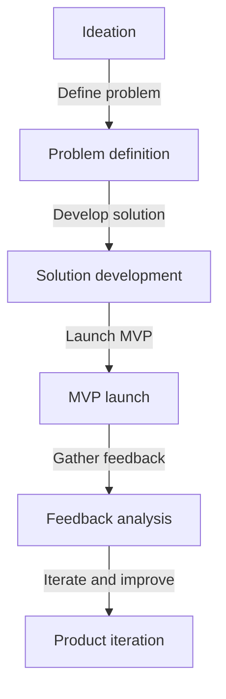
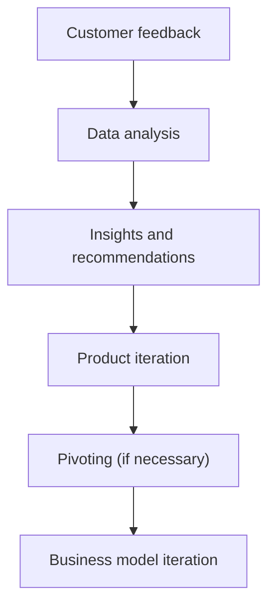

A well-planned and executed founder strategy is crucial for the success of any startup, especially for solopreneurs and bootstrapped SaaS companies. In this article, we will delve into the world of validated founder strategies, exploring the key principles, patterns, and architectures that can help you navigate the challenges of building a successful startup.

## Table of Contents
1. [Introduction to Validated Founder Strategy](#introduction-to-validated-founder-strategy)
2. [Understanding Customer Needs](#understanding-customer-needs)
3. [Building a Minimum Viable Product (MVP)](#building-a-minimum-viable-product-mvp)
4. [Iterating and Pivoting](#iterating-and-pivoting)
5. [Scaling Your Startup](#scaling-your-startup)
6. [Visual Insights Gallery](#visual-insights-gallery)
7. [Conclusion and FAQ](#conclusion-and-faq)

## Introduction to Validated Founder Strategy
A validated founder strategy is an approach to building a startup that focuses on continuous learning, experimentation, and iteration. It involves identifying and validating assumptions about your business, customers, and market, and using that information to inform your product development, marketing, and sales efforts.


> **Note:** The validated founder strategy is not a one-time event, but rather an ongoing process that requires continuous learning and adaptation.

## Understanding Customer Needs
Understanding your customers' needs is critical to the success of your startup. This involves conducting customer interviews, surveys, and other forms of research to gain a deep understanding of their pain points, motivations, and behaviors.
```markdown
| Customer Need | Description | Priority |
| --- | --- | --- |
| Ease of use | The product should be easy to use and intuitive | High |
| Features | The product should have the features that customers need | Medium |
| Support | The product should have good customer support | Low |
```
> **Tip:** Use customer feedback to inform your product development and iteration process.

## Building a Minimum Viable Product (MVP)
A minimum viable product (MVP) is a product that has just enough features to satisfy early customers and provide feedback for future development. Building an MVP is an essential part of the validated founder strategy, as it allows you to test your assumptions about the market and your customers with minimal investment.

## Iterating and Pivoting
Iteration and pivoting are critical components of the validated founder strategy. This involves using customer feedback and data to inform product development and iteration, and making significant changes to your business model or product if necessary.

> **Warning:** Be prepared to pivot your business model or product if your assumptions are proven incorrect.

## Scaling Your Startup
Scaling your startup involves growing your customer base, revenue, and team. This requires careful planning, execution, and iteration, as well as a deep understanding of your customers and market.


## Visual Insights Gallery
This gallery provides additional visual insights into the validated founder strategy implementation process.


## Conclusion and FAQ
In conclusion, the validated founder strategy is a powerful approach to building a successful startup. By continuously learning, experimenting, and iterating, you can reduce the risks associated with building a startup and increase your chances of success.

### FAQ
1. **What is a validated founder strategy?**
A validated founder strategy is an approach to building a startup that focuses on continuous learning, experimentation, and iteration.
2. **Why is customer feedback important?**
Customer feedback is essential for informing product development and iteration, and for reducing the risks associated with building a startup.
3. **What is a minimum viable product (MVP)?**
A minimum viable product (MVP) is a product that has just enough features to satisfy early customers and provide feedback for future development.
4. **How do I know when to pivot my business model or product?**
You should pivot your business model or product if your assumptions are proven incorrect, or if customer feedback indicates that significant changes are necessary.