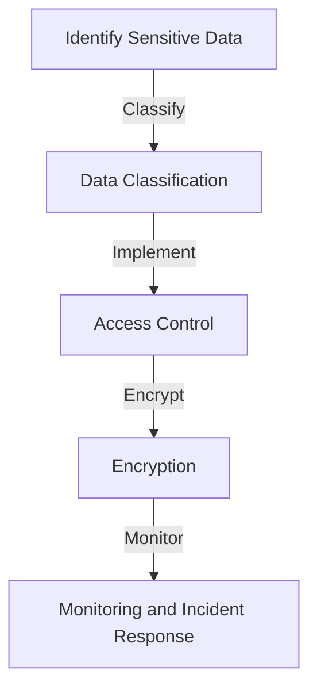
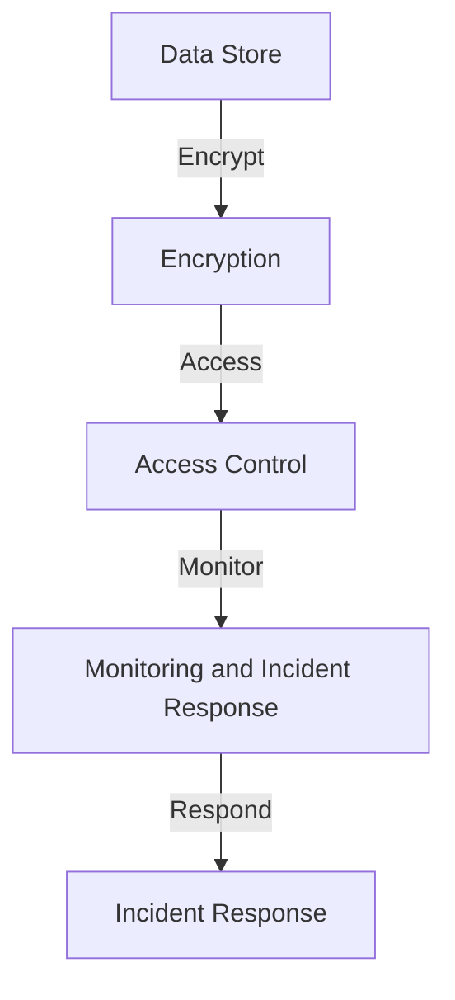

In today's digital landscape, security is a top priority for organizations of all sizes. With the increasing number of cyber threats and data breaches, it's essential to implement robust security measures to protect sensitive data. One approach that has gained significant attention in recent years is Zero-Trust Row-Level Security (ZT-RLL). In this comprehensive guide, we'll delve into the world of ZT-RLL, exploring its concepts, benefits, and implementation strategies.

## Table of Contents
1. [Introduction to Zero-Trust Row-Level Security](#introduction-to-zero-trust-row-level-security)
2. [Key Concepts and Principles](#key-concepts-and-principles)
3. [Benefits of Zero-Trust Row-Level Security](#benefits-of-zero-trust-row-level-security)
4. [Implementation Strategies and Best Practices](#implementation-strategies-and-best-practices)
5. [Architecture and Data Flow](#architecture-and-data-flow)
6. [Visual Insights Gallery](#visual-insights-gallery)
7. [Summary and Conclusion](#summary-and-conclusion)
8. [FAQ](#faq)

## Introduction to Zero-Trust Row-Level Security
Zero-Trust Row-Level Security is a security approach that assumes that all users and devices, whether inside or outside an organization's network, are potential threats. This approach focuses on granting access to sensitive data on a need-to-know basis, ensuring that each user or device has the minimum required privileges to perform their tasks. 


## Key Concepts and Principles
To understand ZT-RLL, it's essential to grasp the following key concepts and principles:
* **Least Privilege Access**: Granting users and devices the minimum required privileges to perform their tasks.
* **Micro-Segmentation**: Dividing a network into smaller, isolated segments to reduce the attack surface.
* **Encryption**: Protecting data both in transit and at rest using encryption algorithms.
* **Authentication and Authorization**: Verifying the identity of users and devices and granting access to sensitive data based on their roles and permissions.
```markdown
| Concept | Description |
| --- | --- |
| Least Privilege Access | Granting minimum required privileges |
| Micro-Segmentation | Dividing network into isolated segments |
| Encryption | Protecting data in transit and at rest |
| Authentication and Authorization | Verifying identity and granting access |
```
## Benefits of Zero-Trust Row-Level Security
The benefits of implementing ZT-RLL are numerous:
> **Note:** ZT-RLL helps reduce the risk of data breaches, improves compliance with regulatory requirements, and provides real-time monitoring and incident response capabilities.
* **Improved Security**: Reduced risk of data breaches and cyber threats.
* **Compliance**: Meeting regulatory requirements and industry standards.
* **Real-Time Monitoring**: Detecting and responding to security incidents in real-time.


## Implementation Strategies and Best Practices
To implement ZT-RLL effectively, consider the following strategies and best practices:
> **Tip:** Start by identifying sensitive data and classifying it based on its sensitivity level.
* **Data Classification**: Classifying data based on its sensitivity level.
* **Access Control**: Implementing role-based access control and attribute-based access control.
* **Encryption**: Encrypting data both in transit and at rest.
* **Monitoring and Incident Response**: Implementing real-time monitoring and incident response capabilities.


## Architecture and Data Flow
The architecture of ZT-RLL involves multiple components, including:
* **Data Store**: Storing sensitive data in a secure repository.
* **Access Control**: Controlling access to sensitive data based on user roles and permissions.
* **Encryption**: Encrypting data both in transit and at rest.
* **Monitoring and Incident Response**: Detecting and responding to security incidents in real-time.

## Visual Insights Gallery
The following images provide a visual representation of ZT-RLL concepts and principles:


## Summary and Conclusion
In conclusion, Zero-Trust Row-Level Security is a robust security approach that helps protect sensitive data from cyber threats and data breaches. By implementing ZT-RLL, organizations can reduce the risk of security incidents, improve compliance with regulatory requirements, and provide real-time monitoring and incident response capabilities.

## FAQ
1. **What is Zero-Trust Row-Level Security?**
Zero-Trust Row-Level Security is a security approach that assumes all users and devices are potential threats and grants access to sensitive data on a need-to-know basis.
2. **What are the benefits of implementing ZT-RLL?**
The benefits of implementing ZT-RLL include improved security, compliance with regulatory requirements, and real-time monitoring and incident response capabilities.
3. **How do I implement ZT-RLL in my organization?**
To implement ZT-RLL, start by identifying sensitive data and classifying it based on its sensitivity level. Then, implement access control, encryption, and monitoring and incident response capabilities.