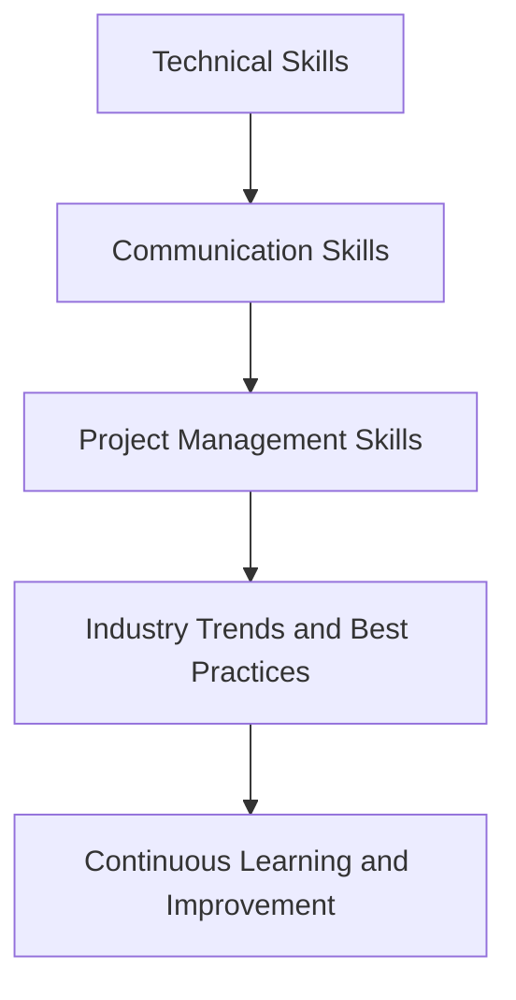
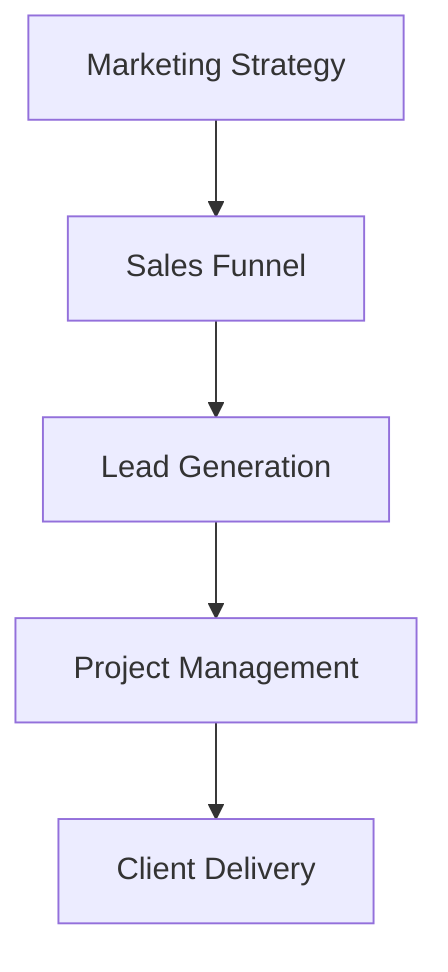

# The Freelance Roadmap: Going from Amateur to Professional
As the gig economy continues to grow, more and more individuals are turning to freelancing as a viable career option. However, making the transition from amateur to professional freelancer can be a daunting task. In this article, we will explore the essential steps to help you navigate the freelance landscape and establish a successful and sustainable career.

## Table of Contents
1. [Laying the Foundation](#laying-the-foundation)
2. [Building Your Skills](#building-your-skills)
3. [Creating a Professional Online Presence](#creating-a-professional-online-presence)
4. [Finding Clients and Managing Projects](#finding-clients-and-managing-projects)
5. [Scaling Your Business](#scaling-your-business)

## Laying the Foundation
[IMAGE: A person sitting at a desk with a laptop, notebook, and pen, surrounded by books and papers, with a cityscape in the background]
Before you can start your freelance journey, it's essential to lay the foundation for success. This includes:
* Defining your niche and specialty
* Setting clear goals and objectives
* Developing a business plan and strategy
* Establishing a dedicated workspace and routine

```markdown
### Freelance Foundation Checklist
| Task | Description | Status |
| --- | --- | --- |
| Define niche | Identify area of expertise | |
| Set goals | Establish clear objectives | |
| Develop business plan | Outline strategy and approach | |
| Establish workspace | Create dedicated workspace | |
```

## Building Your Skills
[IMAGE: A person attending an online course or workshop, with a laptop and notebook, surrounded by books and papers]
To succeed as a freelancer, you need to have a strong foundation of skills and knowledge. This includes:
* Developing your technical skills and expertise
* Improving your communication and project management skills
* Staying up-to-date with industry trends and best practices



## Creating a Professional Online Presence
[IMAGE: A person creating a website or profile on a freelance platform, with a laptop and notebook, surrounded by books and papers]
A professional online presence is crucial for attracting clients and establishing your credibility as a freelancer. This includes:
* Creating a website or profile on freelance platforms
* Developing a strong portfolio and showcase of work
* Establishing a consistent brand and visual identity

```markdown
### Online Presence Checklist
| Task | Description | Status |
| --- | --- | --- |
| Create website | Develop professional website | |
| Create profile | Establish presence on freelance platforms | |
| Develop portfolio | Showcase work and expertise | |
| Establish brand | Develop consistent visual identity | |
```

## Finding Clients and Managing Projects
[IMAGE: A person meeting with a client or working on a project, with a laptop and notebook, surrounded by books and papers]
Finding clients and managing projects is a critical aspect of freelancing. This includes:
* Developing a marketing strategy and approach
* Creating a sales funnel and lead generation system
* Establishing a project management process and workflow



## Scaling Your Business
[IMAGE: A person working with a team or outsourcing tasks, with a laptop and notebook, surrounded by books and papers]
As your freelance business grows, it's essential to scale your operations and systems. This includes:
* Hiring subcontractors or outsourcing tasks
* Developing a team and leadership structure
* Establishing a scalable business model and revenue stream

### Scaling Your Business Checklist
| Task | Description | Status |
| --- | --- | --- |
| Hire subcontractors | Outsource tasks and projects | |
| Develop team | Establish leadership structure and roles | |
| Establish scalable model | Develop revenue stream and business model | |

## Visual Insights Gallery
### Freelance Landscape
[IMAGE: A panoramic view of a cityscape with freelancers working in different locations, such as coffee shops, co-working spaces, and home offices]
### Freelance Workflow
[IMAGE: A diagram showing the workflow and process of a freelancer, from finding clients to delivering projects]
### Freelance Community
[IMAGE: A group of freelancers working together, collaborating, and sharing knowledge and expertise]

## Summary and Conclusion
In conclusion, going from amateur to professional freelancer requires a deep understanding of the freelance landscape, a strong foundation of skills and knowledge, and a professional online presence. By following the steps outlined in this article, you can establish a successful and sustainable freelance career.

## FAQ
Q: What are the most in-demand freelance skills?
A: The most in-demand freelance skills vary by industry and market, but common skills include writing, design, development, and marketing.
Q: How do I find clients as a freelancer?
A: You can find clients through freelance platforms, networking, and marketing your services.
Q: What are the benefits of freelancing?
A: The benefits of freelancing include flexibility, autonomy, and unlimited earning potential.