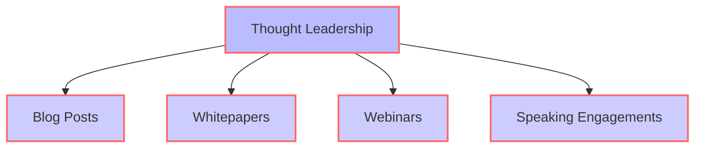
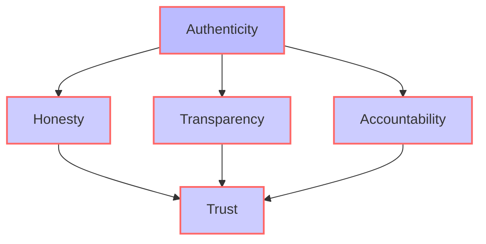
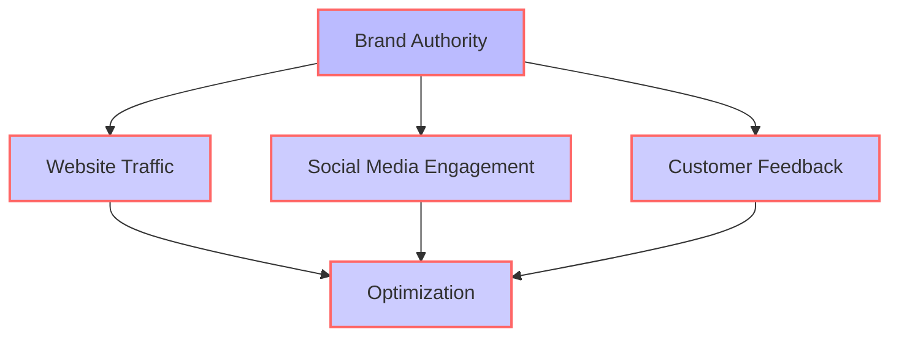

In today's fast-paced digital landscape, establishing and maintaining brand authority is more crucial than ever. As consumers become increasingly savvy and discerning, businesses must adapt to stay ahead of the curve. In this article, we'll delve into the key trends shaping the future of brand authority and explore how businesses can leverage these trends to build trust, credibility, and loyalty with their target audiences.

## Table of Contents
1. [Introduction to Brand Authority](#introduction-to-brand-authority)
2. [The Rise of Thought Leadership](#the-rise-of-thought-leadership)
3. [The Importance of Authenticity and Transparency](#the-importance-of-authenticity-and-transparency)
4. [The Role of Technology in Brand Authority](#the-role-of-technology-in-brand-authority)
5. [Measuring and Optimizing Brand Authority](#measuring-and-optimizing-brand-authority)

## Introduction to Brand Authority
Brand authority refers to the degree to which a brand is perceived as trustworthy, credible, and expert in its industry. It's the culmination of various factors, including the quality of products or services, customer experiences, and the brand's online presence. Establishing brand authority is essential for businesses to differentiate themselves from competitors, build customer loyalty, and drive long-term growth.

## The Rise of Thought Leadership
Thought leadership has become a critical component of brand authority. By establishing themselves as industry experts, businesses can demonstrate their expertise, build trust with their target audiences, and stay top of mind. This can be achieved through various channels, including blog posts, whitepapers, webinars, and speaking engagements.

> **Tip:** To establish thought leadership, businesses should focus on creating high-quality, informative, and engaging content that addresses the needs and interests of their target audiences.

## The Importance of Authenticity and Transparency
Authenticity and transparency are essential for building trust and credibility with customers. Businesses should strive to be honest, open, and transparent in their communications, acknowledging mistakes and taking responsibility when things go wrong.

> **Note:** Authenticity and transparency are not just buzzwords; they're essential for building strong relationships with customers and establishing brand authority.

## The Role of Technology in Brand Authority
Technology plays a crucial role in brand authority, enabling businesses to reach wider audiences, build stronger relationships, and measure their performance. From social media to content management systems, technology provides businesses with the tools they need to establish and maintain brand authority.

## Measuring and Optimizing Brand Authority
Measuring brand authority is critical for businesses to understand their strengths and weaknesses, identify areas for improvement, and optimize their strategies. This can be done through various metrics, including website traffic, social media engagement, and customer feedback.

> **Warning:** Failing to measure and optimize brand authority can result in a loss of credibility, trust, and customer loyalty.

## Visual Insights Gallery
Below are some visual insights into the future of brand authority:

## Summary/Conclusion
Establishing and maintaining brand authority is crucial for businesses to build trust, credibility, and loyalty with their target audiences. By focusing on thought leadership, authenticity, transparency, technology, and measurement, businesses can stay ahead of the curve and drive long-term growth.

## FAQ
Q: What is brand authority?
A: Brand authority refers to the degree to which a brand is perceived as trustworthy, credible, and expert in its industry.
Q: How can businesses establish thought leadership?
A: Businesses can establish thought leadership by creating high-quality, informative, and engaging content that addresses the needs and interests of their target audiences.
Q: Why is authenticity and transparency important for brand authority?
A: Authenticity and transparency are essential for building trust and credibility with customers, and for establishing strong relationships with them.