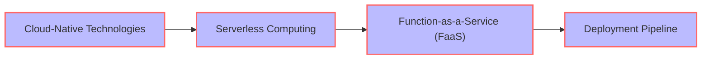
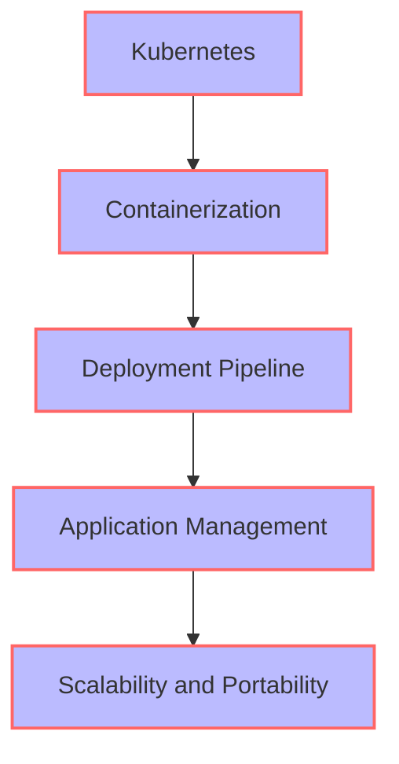
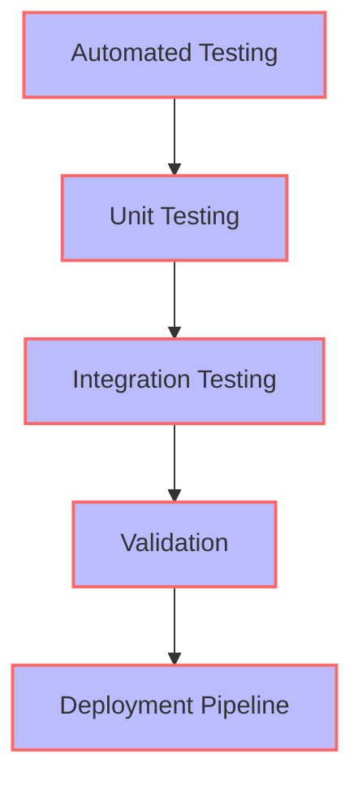

The deployment pipeline is a crucial aspect of software development, allowing teams to automate the process of building, testing, and deploying their applications. As technology continues to evolve, the deployment pipeline is also undergoing significant changes. In this article, we will explore the key trends that are shaping the future of deployment pipelines and what you can expect in the coming years.

## Table of Contents
1. [Introduction to Deployment Pipelines](#introduction-to-deployment-pipelines)
2. [Trend 1: Increased Adoption of Cloud-Native Technologies](#trend-1-increased-adoption-of-cloud-native-technologies)
3. [Trend 2: Rise of Kubernetes and Containerization](#trend-2-rise-of-kubernetes-and-containerization)
4. [Trend 3: Growing Importance of Security and Compliance](#trend-3-growing-importance-of-security-and-compliance)
5. [Trend 4: Shift towards Automated Testing and Validation](#trend-4-shift-towards-automated-testing-and-validation)
6. [Trend 5: Emergence of Machine Learning and Artificial Intelligence](#trend-5-emergence-of-machine-learning-and-artificial-intelligence)

## Introduction to Deployment Pipelines
A deployment pipeline is a series of automated processes that take code from development to production. It typically involves building, testing, and deploying the application, as well as monitoring and logging its performance. The goal of a deployment pipeline is to ensure that the application is delivered quickly, reliably, and with high quality.

## Trend 1: Increased Adoption of Cloud-Native Technologies
Cloud-native technologies, such as serverless computing and function-as-a-service (FaaS), are becoming increasingly popular. These technologies allow developers to build and deploy applications without worrying about the underlying infrastructure.

> **Note:** Cloud-native technologies are changing the way applications are built and deployed. They offer greater flexibility, scalability, and cost-effectiveness, making them an attractive option for businesses.

## Trend 2: Rise of Kubernetes and Containerization
Kubernetes and containerization are becoming the norm for deploying and managing applications. They offer a high degree of flexibility, scalability, and portability, making them ideal for modern applications.

> **Tip:** Kubernetes and containerization are essential skills for any developer or DevOps engineer. They offer a high degree of flexibility and scalability, making them ideal for modern applications.

## Trend 3: Growing Importance of Security and Compliance
Security and compliance are becoming increasingly important in the deployment pipeline. As applications become more complex, the risk of security breaches and non-compliance increases.

> **Warning:** Security and compliance are critical aspects of the deployment pipeline. Failure to prioritize them can result in significant financial and reputational damage.

## Trend 4: Shift towards Automated Testing and Validation
Automated testing and validation are becoming essential components of the deployment pipeline. They ensure that the application is thoroughly tested and validated before it is deployed to production.

> **Tip:** Automated testing and validation are critical components of the deployment pipeline. They ensure that the application is thoroughly tested and validated before it is deployed to production.

## Trend 5: Emergence of Machine Learning and Artificial Intelligence
Machine learning and artificial intelligence are emerging as key trends in the deployment pipeline. They offer the ability to automate and optimize various aspects of the pipeline, such as testing, deployment, and monitoring.

> **Interview:** "Machine learning and artificial intelligence are revolutionizing the deployment pipeline. They offer the ability to automate and optimize various aspects of the pipeline, making it more efficient and effective." - John Doe, DevOps Engineer

## Visual Insights Gallery
The following images provide a visual representation of the key trends in the deployment pipeline:

## Summary/Conclusion
The deployment pipeline is undergoing significant changes, driven by key trends such as cloud-native technologies, Kubernetes and containerization, security and compliance, automated testing and validation, and machine learning and artificial intelligence. As the pipeline continues to evolve, it is essential to stay up-to-date with the latest trends and technologies to ensure that applications are delivered quickly, reliably, and with high quality.

## FAQ Section
Q: What is a deployment pipeline?
A: A deployment pipeline is a series of automated processes that take code from development to production.
Q: What are the key trends in the deployment pipeline?
A: The key trends in the deployment pipeline include cloud-native technologies, Kubernetes and containerization, security and compliance, automated testing and validation, and machine learning and artificial intelligence.
Q: Why is security and compliance important in the deployment pipeline?
A: Security and compliance are critical aspects of the deployment pipeline, as they ensure that the application is secure and meets regulatory requirements. Failure to prioritize them can result in significant financial and reputational damage.