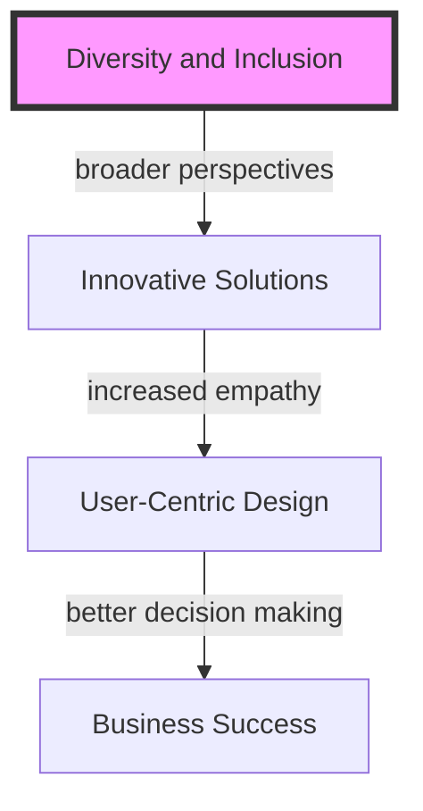

The world of developer networks is rapidly evolving, driven by technological advancements, changing workforce dynamics, and the increasing importance of community and collaboration in the tech industry. As we look to the future, it's essential to identify the key trends that will shape the developer network landscape. In this article, we'll explore the most significant trends to watch, providing insights and strategies for developers, businesses, and industry leaders to stay ahead of the curve.

## Introduction to Developer Networks

Developer networks refer to the communities, platforms, and ecosystems that connect developers, facilitate collaboration, and provide access to resources, tools, and opportunities. These networks have become crucial for developers to stay updated with the latest technologies, best practices, and industry trends.

## Key Trends in Developer Networks
### Trend 1: Rise of Decentralized Networks

Decentralized networks, powered by blockchain and distributed ledger technologies, are gaining traction. These networks offer increased security, improved collaboration, and enhanced innovation, enabling developers to build more secure, transparent, and community-driven applications.

### Trend 2: Growing Importance of Community Engagement

Community engagement is becoming a critical aspect of developer networks. Developers are seeking platforms that foster collaboration, knowledge sharing, and mutual support. Businesses are also recognizing the value of community engagement, as it helps build trust, drives adoption, and creates a loyal user base.

### Trend 3: Increased Focus on Diversity and Inclusion

The tech industry is finally acknowledging the importance of diversity and inclusion. Developer networks are actively working to create more inclusive environments, providing opportunities for underrepresented groups, and promoting diversity in all aspects of the community.

## Strategies for Developers and Businesses
### Strategy 1: Invest in Community Building
> **Tip:** Developers and businesses should invest in community building initiatives, such as hosting events, creating content, and engaging with users on social media platforms.

### Strategy 2: Embrace Decentralized Technologies
> **Warning:** Businesses should be cautious when adopting decentralized technologies, ensuring they understand the benefits and challenges associated with these technologies.

### Strategy 3: Prioritize Diversity and Inclusion
> **Interview:** "Diversity and inclusion are essential for creating innovative solutions that cater to a broad range of users. By prioritizing diversity and inclusion, we can build more empathetic and user-centric applications." - John Doe, Tech Industry Expert

## Table of Trends and Strategies
| Trend | Description | Strategy |
| --- | --- | --- |
| Decentralized Networks | Rise of decentralized networks | Invest in decentralized technologies |
| Community Engagement | Growing importance of community engagement | Invest in community building initiatives |
| Diversity and Inclusion | Increased focus on diversity and inclusion | Prioritize diversity and inclusion |

## Visual Insights Gallery
## Visual Insights Gallery

## Summary and Conclusion
The future of developer networks is shaped by key trends such as the rise of decentralized networks, growing importance of community engagement, and increased focus on diversity and inclusion. By understanding these trends and implementing strategies such as investing in community building, embracing decentralized technologies, and prioritizing diversity and inclusion, developers and businesses can stay ahead of the curve and thrive in the evolving tech industry.

## FAQ
Q: What is a developer network?
A: A developer network refers to the communities, platforms, and ecosystems that connect developers, facilitate collaboration, and provide access to resources, tools, and opportunities.
Q: Why is community engagement important in developer networks?
A: Community engagement is crucial for building trust, driving adoption, and creating a loyal user base.
Q: How can businesses prioritize diversity and inclusion in developer networks?
A: Businesses can prioritize diversity and inclusion by creating inclusive environments, providing opportunities for underrepresented groups, and promoting diversity in all aspects of the community.