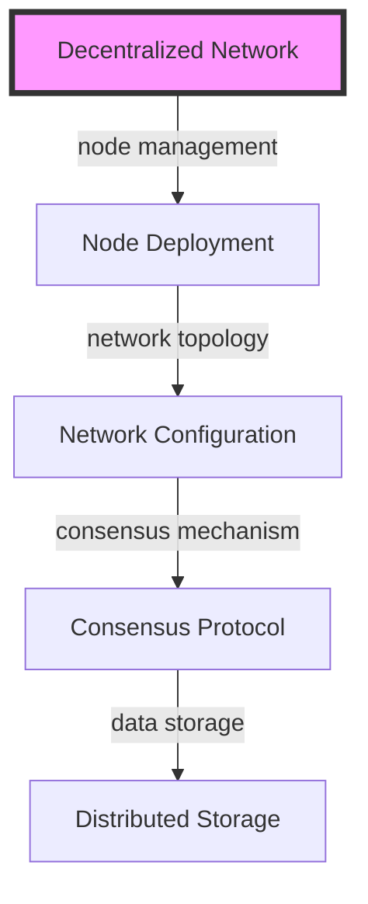
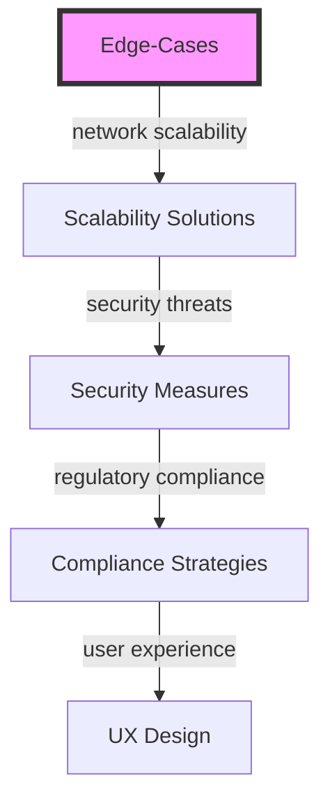

## Part 2: Advanced Architectures and Edge-Cases in Developer Networks

As we explored in the first part of this series, the future of developer networks is shaped by key trends such as decentralized networks and community engagement. In this article, we'll delve deeper into advanced architectures and edge-cases that are emerging in the developer network landscape.

## Decentralized Network Architectures
Decentralized networks are becoming increasingly popular due to their ability to provide increased security, improved collaboration, and enhanced innovation. However, building decentralized networks can be complex, and several architectural considerations must be taken into account. 

For instance, decentralized networks require careful node management, network topology design, consensus mechanism selection, and data storage solutions.

## Community Engagement Strategies
Community engagement is critical to the success of developer networks. To foster a strong sense of community, network administrators must implement effective strategies for community building, such as hosting events, creating content, and facilitating communication. 

Some advanced community engagement strategies include:

* **Gamification**: using game design elements to encourage participation and engagement
* **Influencer partnerships**: collaborating with industry influencers to promote the network
* **Content creation**: developing high-quality content to attract and retain community members

## Edge-Cases in Developer Networks
As developer networks continue to evolve, several edge-cases are emerging that require special consideration. These include:

For example, network scalability, security threats, regulatory compliance, and user experience are all critical edge-cases that must be addressed in order to ensure the success and sustainability of developer networks.

## Real-World Case Studies
Several real-world case studies demonstrate the effectiveness of advanced architectures and community engagement strategies in developer networks. For instance:

* **GitHub**: GitHub's decentralized network architecture and community engagement strategies have made it one of the most popular developer networks in the world.
* **Stack Overflow**: Stack Overflow's gamification and content creation strategies have helped to build a large and active community of developers.

## Visual Insights Gallery
The following images provide additional insights into advanced architectures and edge-cases in developer networks:
* 
* 
* 