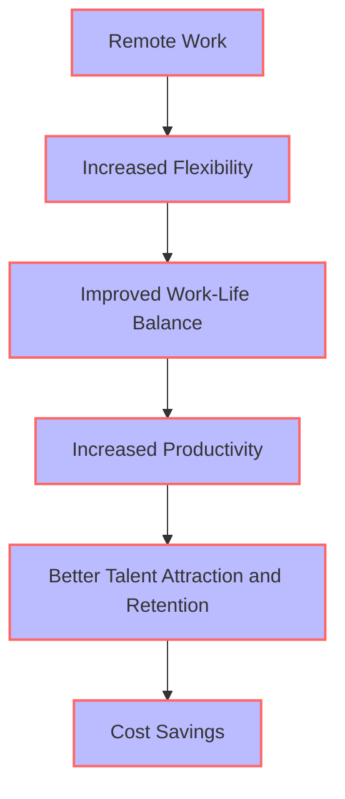
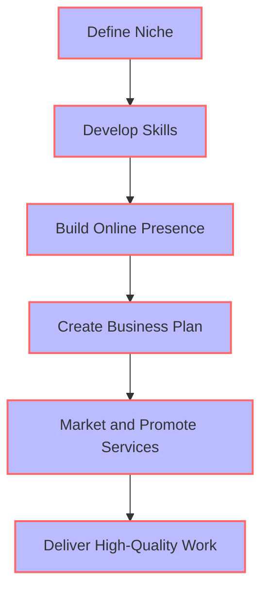

As the world of work continues to evolve, freelancing has become an increasingly popular career choice for many professionals. With the rise of remote work and the gig economy, freelancers are no longer limited by geographical boundaries or traditional employment structures. In this article, we'll explore the key trends shaping the future of freelancing and provide a roadmap for success in this exciting and rapidly changing landscape.

## Table of Contents
1. [Introduction to Freelancing](#introduction-to-freelancing)
2. [Key Trends in Freelancing](#key-trends-in-freelancing)
3. [The Rise of Remote Work](#the-rise-of-remote-work)
4. [Building a Successful Freelance Career](#building-a-successful-freelance-career)
5. [Visual Insights Gallery](#visual-insights-gallery)
6. [Summary and Conclusion](#summary-and-conclusion)
7. [FAQ](#faq)

## Introduction to Freelancing
Freelancing offers a unique blend of flexibility, autonomy, and unlimited earning potential. However, it also requires a high degree of self-motivation, discipline, and business acumen. As the freelance market continues to grow, it's essential to stay ahead of the curve and adapt to the latest trends and technologies.


## Key Trends in Freelancing
The freelance landscape is constantly evolving, with new trends and technologies emerging all the time. Some of the key trends to watch include:
* The rise of artificial intelligence and automation
* The growing demand for specialized skills and expertise
* The increasing importance of online presence and personal branding
* The shift towards more flexible and remote work arrangements
```markdown
| Trend | Description |
| --- | --- |
| AI and Automation | Increased use of AI and automation tools to streamline workflows and improve efficiency |
| Specialized Skills | Growing demand for specialized skills and expertise, such as data science and cybersecurity |
| Online Presence | Importance of building a strong online presence and personal brand |
| Remote Work | Shift towards more flexible and remote work arrangements |
```
## The Rise of Remote Work
Remote work is becoming increasingly popular, with more and more companies adopting flexible work arrangements. This trend is driven by advances in technology, changes in workforce demographics, and the need for greater work-life balance.

## Building a Successful Freelance Career
To build a successful freelance career, it's essential to have a clear understanding of the market, a strong online presence, and a well-defined niche or specialty. It's also important to develop a range of skills, including business, marketing, and project management.

> **Tip:** Develop a strong online presence by creating a professional website and engaging with potential clients on social media.

## Visual Insights Gallery
Here are some visual insights into the world of freelancing:


## Summary and Conclusion
The future of freelancing is exciting and full of opportunities. By staying ahead of the curve and adapting to the latest trends and technologies, freelancers can build successful and sustainable careers. Remember to define your niche, develop your skills, build a strong online presence, and deliver high-quality work to succeed in the freelance market.

## FAQ
Q: What are the key trends shaping the future of freelancing?
A: The key trends shaping the future of freelancing include the rise of artificial intelligence and automation, the growing demand for specialized skills and expertise, the increasing importance of online presence and personal branding, and the shift towards more flexible and remote work arrangements.
Q: How can I build a successful freelance career?
A: To build a successful freelance career, it's essential to have a clear understanding of the market, a strong online presence, and a well-defined niche or specialty. It's also important to develop a range of skills, including business, marketing, and project management.
Q: What are the benefits of freelancing?
A: The benefits of freelancing include increased flexibility, autonomy, and unlimited earning potential. Freelancers also have the opportunity to work with a variety of clients and projects, which can be stimulating and challenging.