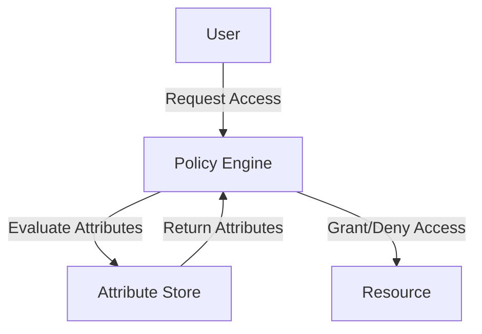
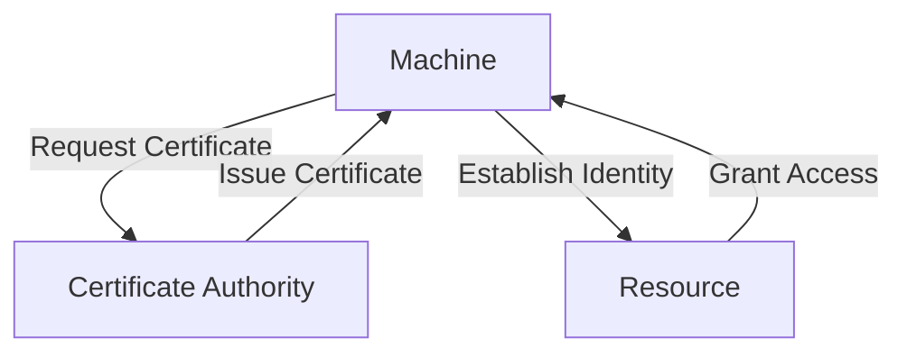

In the ever-evolving landscape of cloud computing and DevOps, Identity and Access Management (IAM) policies play a crucial role in ensuring the security and compliance of organizational resources. As technology continues to advance, the future of IAM policy is poised to undergo significant transformations. In this article, we will delve into the key trends that are expected to shape the future of IAM policy, and explore how organizations can prepare themselves for these changes.

## Table of Contents
1. [Introduction to IAM Policy](#introduction-to-iam-policy)
2. [Trend 1: Shift to Attribute-Based Access Control (ABAC)](#trend-1-shift-to-attribute-based-access-control-abac)
3. [Trend 2: Increased Adoption of Infrastructure as Code (IaC)](#trend-2-increased-adoption-of-infrastructure-as-code-iac)
4. [Trend 3: Growing Importance of Machine Identity Management](#trend-3-growing-importance-of-machine-identity-management)
5. [Trend 4: Enhanced Focus on Cloud Security and Compliance](#trend-4-enhanced-focus-on-cloud-security-and-compliance)
6. [Visual Insights Gallery](#visual-insights-gallery)
7. [Summary and Conclusion](#summary-and-conclusion)
8. [FAQ](#faq)

## Introduction to IAM Policy

Identity and Access Management (IAM) policies are a set of rules and guidelines that govern access to an organization's resources and data. These policies are designed to ensure that only authorized individuals and systems have access to sensitive information, and that access is granted based on the principle of least privilege. As organizations continue to migrate to the cloud, the importance of IAM policies has never been more critical.

## Trend 1: Shift to Attribute-Based Access Control (ABAC)

Attribute-Based Access Control (ABAC) is an access control model that grants access to resources based on a set of attributes associated with the user, the resource, and the environment. This approach provides a more fine-grained and flexible access control mechanism compared to traditional role-based access control (RBAC). As organizations adopt ABAC, they can expect to see improved security, reduced administrative overhead, and increased scalability.

## Trend 2: Increased Adoption of Infrastructure as Code (IaC)

Infrastructure as Code (IaC) is a practice that involves managing and provisioning infrastructure through code, rather than through a graphical user interface. IaC tools such as Terraform and AWS CloudFormation allow organizations to define their infrastructure configuration in a version-controlled repository, making it easier to manage and track changes to the infrastructure. As IaC adoption increases, organizations can expect to see improved infrastructure consistency, reduced errors, and increased efficiency.

## Trend 3: Growing Importance of Machine Identity Management

Machine identity management refers to the process of managing the identities of machines, such as servers, containers, and IoT devices. As the number of machines in an organization increases, the importance of machine identity management grows. Organizations must ensure that each machine has a unique identity, and that access to resources is granted based on that identity. This approach helps to prevent unauthorized access, reduce the risk of machine compromise, and improve overall security.

## Trend 4: Enhanced Focus on Cloud Security and Compliance

As organizations move more workloads to the cloud, the importance of cloud security and compliance has never been more critical. Cloud providers such as AWS, Azure, and Google Cloud offer a range of security and compliance features, including IAM policies, network security groups, and data encryption. Organizations must ensure that they are using these features effectively, and that they are complying with relevant regulations and standards, such as PCI-DSS, HIPAA, and GDPR.

## Visual Insights Gallery

## Summary and Conclusion
In conclusion, the future of IAM policy is poised to undergo significant transformations, driven by key trends such as the shift to attribute-based access control, increased adoption of infrastructure as code, growing importance of machine identity management, and enhanced focus on cloud security and compliance. As organizations navigate these trends, they must ensure that they are using IAM policies effectively, and that they are complying with relevant regulations and standards. By doing so, they can improve security, reduce administrative overhead, and increase scalability.

## FAQ
1. **What is IAM policy?**
IAM policy refers to a set of rules and guidelines that govern access to an organization's resources and data.
2. **What is attribute-based access control (ABAC)?**
ABAC is an access control model that grants access to resources based on a set of attributes associated with the user, the resource, and the environment.
3. **What is infrastructure as code (IaC)?**
IaC is a practice that involves managing and provisioning infrastructure through code, rather than through a graphical user interface.
4. **Why is machine identity management important?**
Machine identity management is important because it helps to prevent unauthorized access, reduce the risk of machine compromise, and improve overall security.