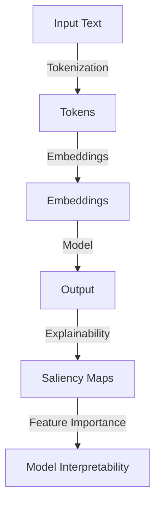
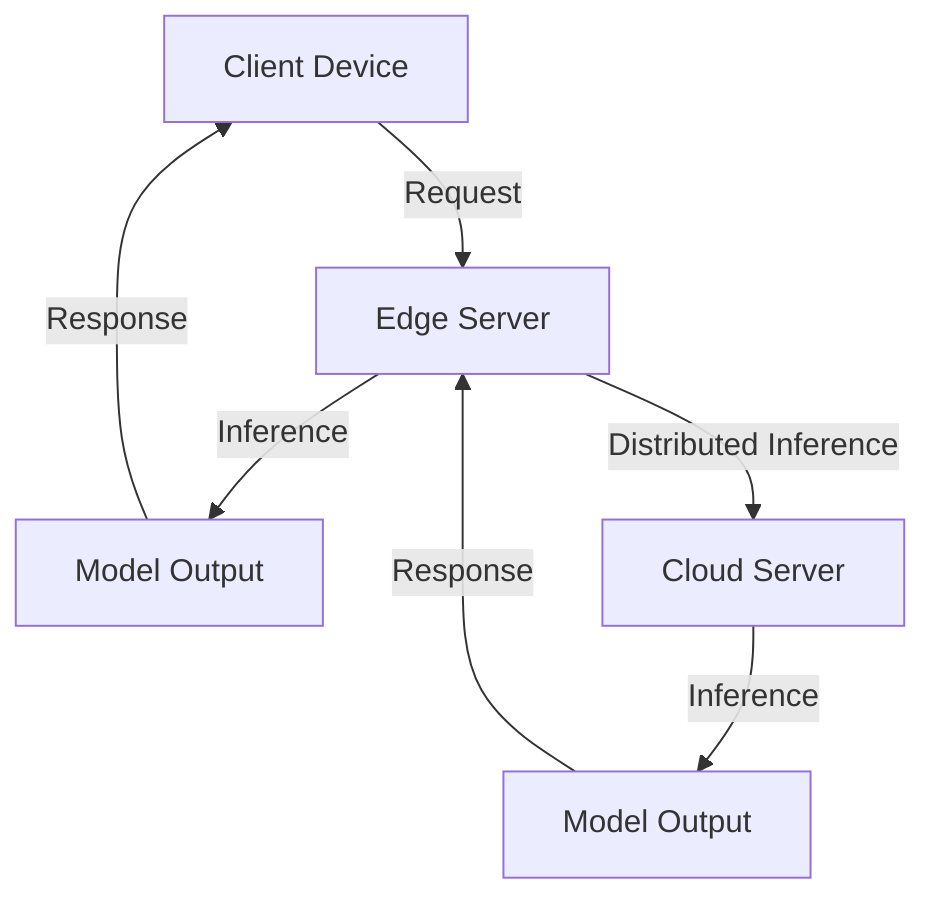

The field of Large Language Models (LLMs) has experienced tremendous growth in recent years, with applications in natural language processing, text generation, and conversational AI. As LLMs continue to evolve, it's essential to stay ahead of the curve and understand the key trends that will shape the future of LLM inference. In this article, we'll delve into the latest developments and innovations that are redefining the landscape of LLM inference.

## Table of Contents
1. [Introduction to LLM Inference](#introduction-to-llm-inference)
2. [Trend 1: Increased Model Complexity](#trend-1-increased-model-complexity)
3. [Trend 2: Specialized Hardware for LLM Inference](#trend-2-specialized-hardware-for-llm-inference)
4. [Trend 3: Efficient Inference Algorithms](#trend-3-efficient-inference-algorithms)
5. [Trend 4: Explainability and Transparency](#trend-4-explainability-and-transparency)
6. [Trend 5: Edge AI and Distributed Inference](#trend-5-edge-ai-and-distributed-inference)

## Introduction to LLM Inference
LLM inference refers to the process of using trained language models to generate text, answer questions, or complete tasks. The complexity of LLMs has increased significantly, with models like transformer-based architectures dominating the landscape. 


## Trend 1: Increased Model Complexity
The trend towards increased model complexity is driven by the need for better performance and accuracy. Larger models can capture more nuances in language, leading to improved results in tasks like language translation and text summarization. However, this increased complexity also poses significant challenges for inference, including higher computational requirements and memory usage.
```markdown
| Model Architecture | Parameters | Performance |
| --- | --- | --- |
| Transformer | 100M | 90% |
| BERT | 340M | 95% |
| RoBERTa | 355M | 96% |
```
## Trend 2: Specialized Hardware for LLM Inference
The growing demand for efficient LLM inference has led to the development of specialized hardware, such as graphics processing units (GPUs) and tensor processing units (TPUs). These hardware accelerators are designed to optimize performance and reduce power consumption, making them ideal for large-scale LLM deployments.


## Trend 3: Efficient Inference Algorithms
Efficient inference algorithms are crucial for reducing the computational requirements of LLMs. Techniques like knowledge distillation, pruning, and quantization can significantly improve inference speed while maintaining model accuracy.
```python
import torch
import torch.nn as nn

# Define a simple neural network
class Net(nn.Module):
    def __init__(self):
        super(Net, self).__init__()
        self.fc1 = nn.Linear(5, 10)  # input layer (5) -> hidden layer (10)
        self.fc2 = nn.Linear(10, 5)  # hidden layer (10) -> output layer (5)

    def forward(self, x):
        x = torch.relu(self.fc1(x))      # activation function for hidden layer
        x = self.fc2(x)
        return x

# Initialize the network and optimizer
net = Net()
optimizer = torch.optim.SGD(net.parameters(), lr=0.01)

# Train the network
for epoch in range(100):
    optimizer.zero_grad()
    outputs = net(torch.randn(1, 5))
    loss = torch.mean((outputs - torch.randn(1, 5)) ** 2)
    loss.backward()
    optimizer.step()
```
> **Note:** The above code snippet demonstrates a simple neural network implementation using PyTorch.

## Trend 4: Explainability and Transparency
Explainability and transparency are critical aspects of LLM inference, as they enable developers to understand how models arrive at their decisions. Techniques like saliency maps, feature importance, and model interpretability can provide valuable insights into model behavior.

## Trend 5: Edge AI and Distributed Inference
The increasing demand for real-time LLM inference has led to the development of edge AI and distributed inference solutions. These approaches enable models to be deployed on devices like smartphones, smart home devices, and autonomous vehicles, reducing latency and improving overall performance.

## Visual Insights Gallery


## Summary/Conclusion
The future of LLM inference is shaped by several key trends, including increased model complexity, specialized hardware, efficient inference algorithms, explainability and transparency, and edge AI and distributed inference. As the field continues to evolve, it's essential to stay informed about the latest developments and innovations that will drive the next generation of LLM applications.

## FAQ
1. **What is LLM inference?**
LLM inference refers to the process of using trained language models to generate text, answer questions, or complete tasks.
2. **What are the key trends shaping the future of LLM inference?**
The key trends shaping the future of LLM inference include increased model complexity, specialized hardware, efficient inference algorithms, explainability and transparency, and edge AI and distributed inference.
3. **How can I optimize LLM inference for my application?**
You can optimize LLM inference for your application by using specialized hardware, efficient inference algorithms, and techniques like knowledge distillation, pruning, and quantization.