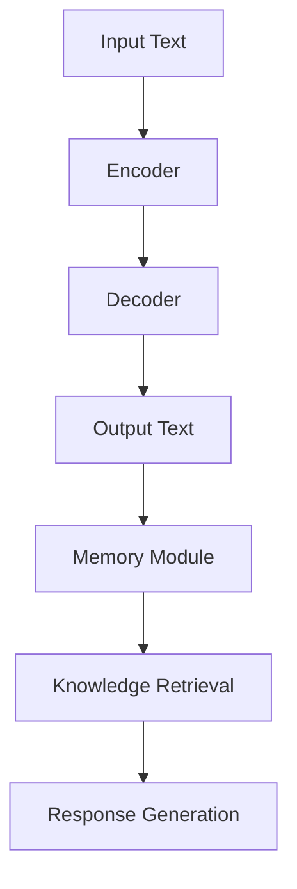
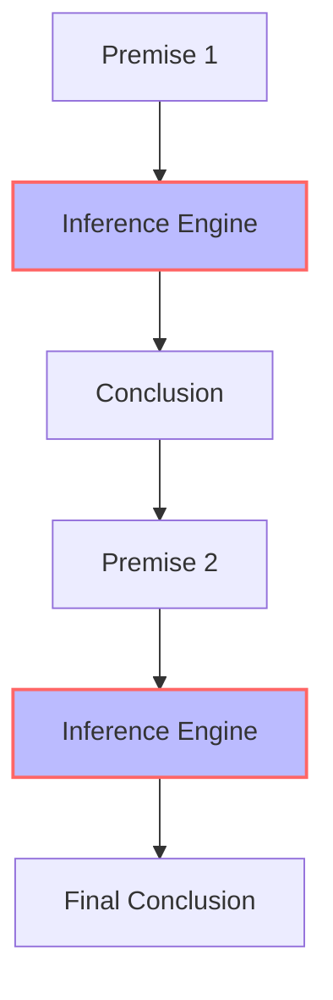

# The Future of LLMs: Memory, Reasoning, and Logic in 2026
The landscape of Large Language Models (LLMs) is evolving at an unprecedented pace, with advancements in memory, reasoning, and logic redefining the capabilities of these artificial intelligence (AI) systems. As we step into 2026, it's crucial to explore the current state, future directions, and potential applications of LLMs, especially in terms of their ability to process, understand, and generate human-like language.

## Table of Contents
1. [Introduction to LLMs](#introduction-to-llms)
2. [Advancements in Memory](#advancements-in-memory)
3. [Reasoning and Logic in LLMs](#reasoning-and-logic-in-llms)
4. [Applications and Future Directions](#applications-and-future-directions)
5. [Challenges and Limitations](#challenges-and-limitations)
6. [Visual Insights Gallery](#visual-insights-gallery)
7. [Summary/Conclusion](#summary/conclusion)
8. [FAQ](#faq)

## Introduction to LLMs
Large Language Models have revolutionized the field of natural language processing (NLP) by demonstrating an unprecedented ability to understand and generate coherent, context-specific text. These models are trained on vast amounts of text data, allowing them to learn patterns, relationships, and structures within language.

## Advancements in Memory
Recent advancements in LLMs focus on enhancing their memory capabilities, enabling them to retain and recall information more effectively. This involves improving the models' ability to store and retrieve knowledge, which is crucial for tasks such as question-answering, text summarization, and dialogue generation.

## Reasoning and Logic in LLMs
Reasoning and logic are critical components of intelligent systems, allowing them to draw conclusions, make decisions, and solve problems. In the context of LLMs, incorporating reasoning and logic capabilities involves enabling these models to understand the underlying semantics and pragmatics of language, thereby enhancing their ability to generate coherent, contextually appropriate text.

## Applications and Future Directions
The potential applications of advanced LLMs are vast, ranging from chatbots and virtual assistants to content generation and language translation. As these models continue to evolve, we can expect to see significant advancements in areas such as:

- **Conversational AI**: More sophisticated and engaging dialogue systems.
- **Content Creation**: Automated generation of high-quality text, such as articles, stories, and reports.
- **Language Understanding**: Improved comprehension of nuances in language, including idioms, metaphors, and figurative speech.

## Challenges and Limitations
Despite the rapid progress in LLMs, several challenges and limitations remain, including:

- **Bias and Fairness**: Ensuring that these models do not perpetuate or amplify existing biases.
- **Explainability**: Understanding how LLMs arrive at their conclusions and decisions.
- **Ethical Considerations**: Addressing concerns related to privacy, security, and the potential misuse of LLMs.

## Visual Insights Gallery
### Image 1: LLM Architecture

### Image 2: Reasoning Process

### Image 3: Future Applications

## Summary/Conclusion
The future of LLMs holds immense promise, with ongoing research and development aimed at enhancing their memory, reasoning, and logic capabilities. As these models continue to evolve, we can expect to see significant advancements in a wide range of applications, from conversational AI to content creation. However, it's essential to address the challenges and limitations associated with LLMs, ensuring that their development and deployment prioritize fairness, explainability, and ethical considerations.

## FAQ
1. **What are Large Language Models?**
   - Large Language Models are artificial intelligence systems designed to process, understand, and generate human-like language.
2. **How do LLMs learn and improve?**
   - LLMs learn through extensive training on vast amounts of text data, allowing them to discover patterns, relationships, and structures within language.
3. **What are the potential applications of advanced LLMs?**
   - Potential applications include conversational AI, content creation, language translation, and more, with the goal of creating more sophisticated and engaging interactions between humans and machines.