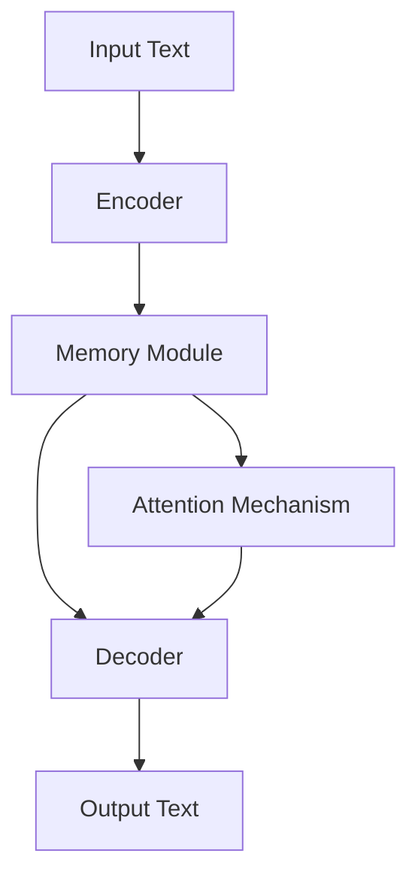
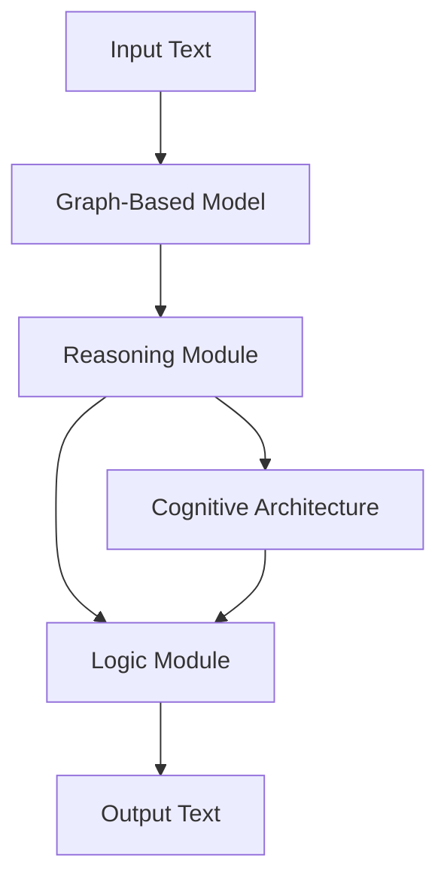
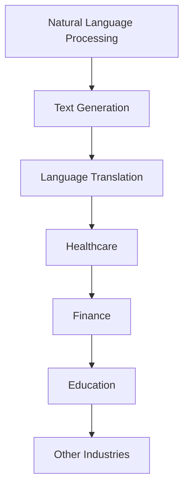

# Advanced Architectures in LLMs: Deepening Memory, Reasoning, and Logic
As we delve deeper into the future of Large Language Models (LLMs), it becomes increasingly important to explore the advanced architectures that are redefining the boundaries of artificial intelligence (AI). In this article, we will examine the latest developments in LLMs, focusing on enhanced memory, reasoning, and logic capabilities.

## Table of Contents
1. [Introduction to Advanced LLM Architectures](#introduction-to-advanced-llm-architectures)
2. [Deepening Memory Capabilities](#deepening-memory-capabilities)
3. [Reasoning and Logic Enhancements](#reasoning-and-logic-enhancements)
4. [Edge-Cases and Challenges](#edge-cases-and-challenges)
5. [Real-World Applications](#real-world-applications)
6. [Visual Insights Gallery](#visual-insights-gallery)
7. [Summary/Conclusion](#summary/conclusion)
8. [FAQ](#faq)

## Introduction to Advanced LLM Architectures
The development of advanced LLM architectures is driven by the need for more efficient, scalable, and effective models. Recent advancements have focused on improving the memory, reasoning, and logic capabilities of LLMs, enabling them to tackle complex tasks and generate more coherent, context-specific text.

## Deepening Memory Capabilities
One of the key areas of focus in advanced LLM architectures is the development of more efficient and effective memory mechanisms. This includes the use of external memory modules, attention mechanisms, and other techniques to enhance the model's ability to retain and retrieve information.

The above diagram illustrates the integration of an external memory module and attention mechanism in an advanced LLM architecture.

## Reasoning and Logic Enhancements
In addition to enhancing memory capabilities, advanced LLM architectures also focus on improving reasoning and logic capabilities. This includes the use of graph-based models, cognitive architectures, and other techniques to enable the model to reason and draw conclusions based on the input text.

The above diagram illustrates the integration of graph-based models, reasoning modules, and cognitive architectures in an advanced LLM architecture.

## Edge-Cases and Challenges
While advanced LLM architectures have shown significant promise, there are still several edge-cases and challenges that need to be addressed. These include issues related to bias, fairness, and transparency, as well as the need for more efficient and scalable models.

## Real-World Applications
Despite the challenges, advanced LLM architectures have numerous real-world applications, including natural language processing, text generation, and language translation. These models have the potential to revolutionize industries such as healthcare, finance, and education, and are being explored by researchers and developers around the world.

The above diagram illustrates the various real-world applications of advanced LLM architectures.

## Visual Insights Gallery
The following images provide a deeper look into the advanced architectures and applications of LLMs:
* 
* 
* 

## Summary/Conclusion
In conclusion, advanced LLM architectures have the potential to revolutionize the field of natural language processing and beyond. By deepening memory capabilities, enhancing reasoning and logic, and exploring real-world applications, researchers and developers can create more efficient, scalable, and effective models that can tackle complex tasks and generate more coherent, context-specific text.

## FAQ
Q: What are the key areas of focus in advanced LLM architectures?
A: The key areas of focus include deepening memory capabilities, enhancing reasoning and logic, and exploring real-world applications.
Q: What are some of the challenges and edge-cases in advanced LLM architectures?
A: Some of the challenges and edge-cases include issues related to bias, fairness, and transparency, as well as the need for more efficient and scalable models.
Q: What are some of the real-world applications of advanced LLM architectures?
A: Some of the real-world applications include natural language processing, text generation, and language translation, with potential applications in industries such as healthcare, finance, and education.