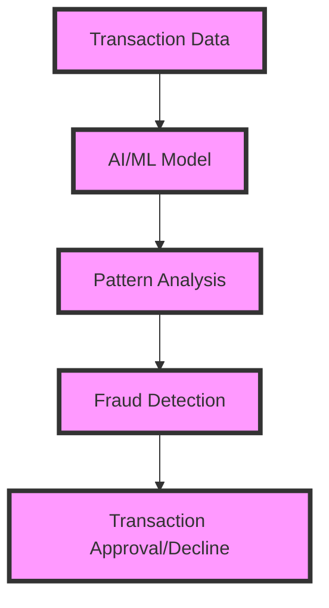
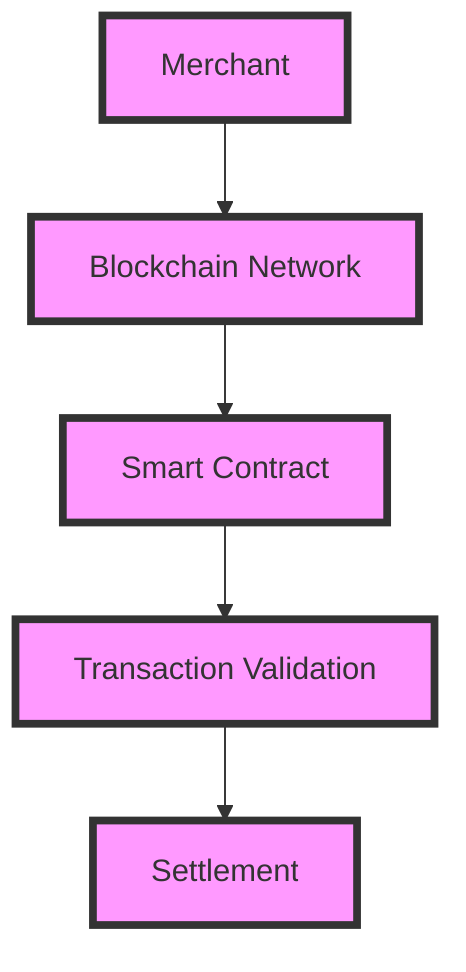

The payment gateway landscape is evolving rapidly, driven by technological advancements, changing consumer behavior, and the rise of new payment methods. As we look to the future, it's essential to stay ahead of the curve and understand the key trends that will shape the industry. In this article, we'll explore the most significant developments in payment gateways and what they mean for businesses and consumers alike.

## Table of Contents
1. [Introduction to Payment Gateways](#introduction-to-payment-gateways)
2. [Trend 1: Mobile Payments and Contactless Transactions](#trend-1-mobile-payments-and-contactless-transactions)
3. [Trend 2: Artificial Intelligence and Machine Learning](#trend-2-artificial-intelligence-and-machine-learning)
4. [Trend 3: Blockchain and Cryptocurrency Integration](#trend-3-blockchain-and-cryptocurrency-integration)
5. [Trend 4: Enhanced Security and Compliance](#trend-4-enhanced-security-and-compliance)
6. [Trend 5: Omnichannel Payment Experiences](#trend-5-omnichannel-payment-experiences)
7. [Visual Insights Gallery](#visual-insights-gallery)
8. [Summary and Conclusion](#summary-and-conclusion)
9. [FAQ](#faq)

## Introduction to Payment Gateways

Payment gateways are the backbone of online transactions, enabling businesses to accept payments from customers securely and efficiently. They act as a bridge between merchants and banks, facilitating the exchange of sensitive information and ensuring that transactions are processed smoothly. With the rise of e-commerce and digital payments, the demand for reliable and secure payment gateways has never been higher.

## Trend 1: Mobile Payments and Contactless Transactions

Mobile payments and contactless transactions are revolutionizing the way we make purchases. With the proliferation of smartphones and contactless payment methods like Apple Pay, Google Pay, and Samsung Pay, consumers are increasingly expecting seamless and convenient payment experiences. Merchants must adapt to these changing expectations by integrating mobile payment options into their platforms.

```markdown
### Mobile Payment Methods
| Method | Description |
| --- | --- |
| Apple Pay | A mobile payment service by Apple |
| Google Pay | A mobile payment service by Google |
| Samsung Pay | A mobile payment service by Samsung |
```

## Trend 2: Artificial Intelligence and Machine Learning

Artificial intelligence (AI) and machine learning (ML) are transforming the payment gateway landscape by enhancing security, improving customer experiences, and optimizing transaction processing. AI-powered systems can detect and prevent fraudulent activities, while ML algorithms can analyze customer behavior and provide personalized payment options.



## Trend 3: Blockchain and Cryptocurrency Integration

Blockchain technology and cryptocurrencies are gaining traction in the payment gateway space, offering increased security, transparency, and efficiency. By integrating blockchain-based payment methods, merchants can reduce transaction fees, improve settlement times, and enhance customer trust.



## Trend 4: Enhanced Security and Compliance

As payment gateways handle sensitive customer information, security and compliance are of utmost importance. Merchants must ensure that their payment gateways adhere to stringent security standards, such as PCI-DSS, GDPR, and PSD2, to prevent data breaches and maintain customer trust.

> **Note:** Merchants should regularly update their payment gateways to ensure compliance with evolving security regulations.

## Trend 5: Omnichannel Payment Experiences

Omnichannel payment experiences are becoming increasingly important, as customers expect seamless payment options across online and offline channels. Merchants must integrate their payment gateways with various channels, such as social media, messaging apps, and physical stores, to provide a cohesive and convenient payment experience.

### Omnichannel Payment Channels
| Channel | Description |
| --- | --- |
| Online | E-commerce websites and mobile apps |
| Offline | Physical stores and retail outlets |
| Social Media | Social media platforms and messaging apps |

## Visual Insights Gallery


## Summary and Conclusion
The future of payment gateways is shaped by technological advancements, changing consumer behavior, and the emergence of new payment methods. By understanding and adapting to these trends, merchants can stay ahead of the curve and provide seamless, secure, and convenient payment experiences for their customers.

## FAQ
1. **What is a payment gateway?**
A payment gateway is a service that enables businesses to accept payments from customers securely and efficiently.
2. **What are the key trends in payment gateways?**
The key trends in payment gateways include mobile payments and contactless transactions, artificial intelligence and machine learning, blockchain and cryptocurrency integration, enhanced security and compliance, and omnichannel payment experiences.
3. **How can merchants adapt to the changing payment landscape?**
Merchants can adapt to the changing payment landscape by integrating mobile payment options, leveraging AI and ML to enhance security and customer experiences, exploring blockchain-based payment methods, ensuring compliance with security regulations, and providing omnichannel payment experiences.