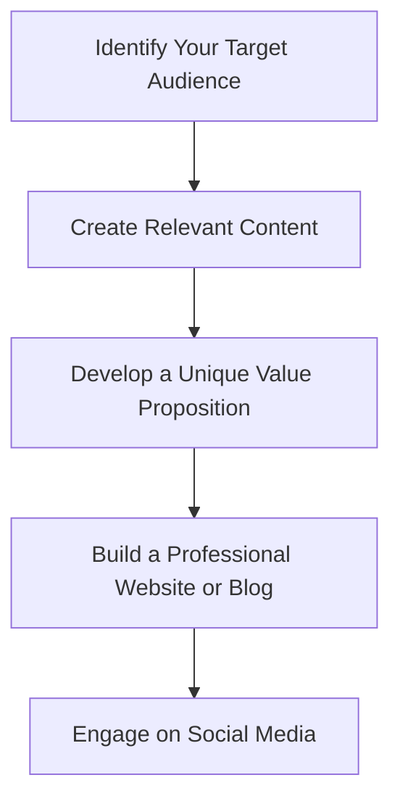
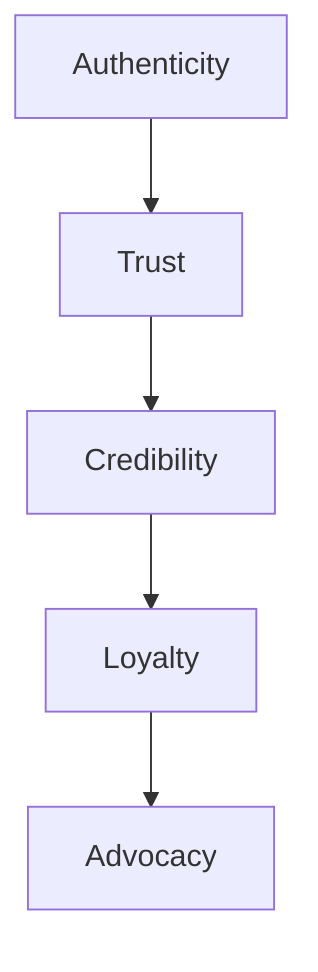

In today's digital age, having a strong personal brand is crucial for career success. With the rise of remote work and online networking, it's easier than ever to build and maintain a professional online presence. However, the landscape of personal branding is constantly evolving, and it's essential to stay ahead of the curve. In this article, we'll explore the key trends that will shape the future of personal branding.

## Table of Contents
1. [Introduction to Personal Branding](#introduction-to-personal-branding)
2. [The Rise of Remote Work](#the-rise-of-remote-work)
3. [Building a Strong Online Presence](#building-a-strong-online-presence)
4. [The Importance of Authenticity](#the-importance-of-authenticity)
5. [Visual Insights Gallery](#visual-insights-gallery)
6. [Summary and Conclusion](#summary-and-conclusion)
7. [FAQ](#faq)

## Introduction to Personal Branding
Personal branding refers to the process of creating and maintaining a unique image or identity that showcases your skills, values, and personality. It's about presenting yourself as a professional and building a reputation that opens doors to new opportunities. 


## The Rise of Remote Work
The shift to remote work has transformed the way we work and interact with others. With more people working from home, the lines between personal and professional life are becoming increasingly blurred. This trend is expected to continue, with many companies adopting flexible work arrangements to attract and retain top talent.
```markdown
| **Remote Work Benefits** | **Description** |
| --- | --- |
| Flexibility | Work from anywhere, at any time |
| Increased productivity | Reduced commuting time and distractions |
| Better work-life balance | More time for personal and family responsibilities |
```
> **Tip:** To thrive in a remote work environment, it's essential to establish a dedicated workspace, set clear boundaries, and maintain regular communication with your team.

## Building a Strong Online Presence
Having a strong online presence is critical for building a successful personal brand. This includes creating a professional website or blog, engaging on social media, and developing a unique value proposition that sets you apart from others.

## The Importance of Authenticity
Authenticity is the foundation of a strong personal brand. It's about being true to yourself, your values, and your passions. When you're authentic, you build trust and credibility with your audience, which is essential for long-term success.

> **Warning:** Trying to fake it or be someone you're not can lead to disaster. Your audience will see through the facade, and you'll lose credibility.

## Visual Insights Gallery
Here are some visual insights to help you build a strong personal brand:


## Summary and Conclusion
Building a strong personal brand is a continuous process that requires effort, dedication, and a willingness to adapt to changing trends. By understanding the key trends shaping the future of personal branding, you can stay ahead of the curve and achieve your career goals.

## FAQ
Q: What is personal branding?
A: Personal branding refers to the process of creating and maintaining a unique image or identity that showcases your skills, values, and personality.
Q: Why is authenticity important in personal branding?
A: Authenticity is the foundation of a strong personal brand. It builds trust and credibility with your audience, which is essential for long-term success.
Q: How can I build a strong online presence?
A: You can build a strong online presence by creating a professional website or blog, engaging on social media, and developing a unique value proposition that sets you apart from others.