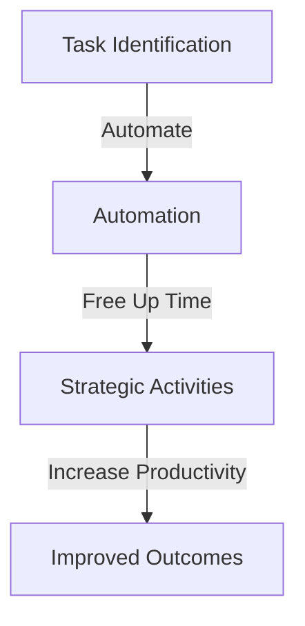
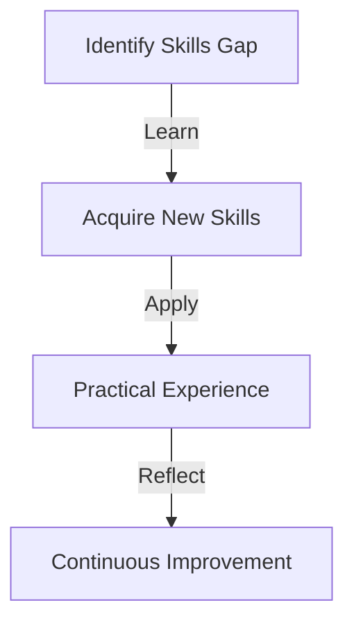

In today's fast-paced, technology-driven world, staying ahead of the curve is crucial for achieving success in both personal and professional life. As we continue to navigate the complexities of remote work, building and maintaining effective productivity habits has become more important than ever. In this article, we will delve into the key trends shaping the future of productivity and explore strategies for maximizing your output in a rapidly changing landscape.

## Table of Contents
1. [Introduction to Productivity Trends](#introduction-to-productivity-trends)
2. [The Rise of Remote Work](#the-rise-of-remote-work)
3. [Technology and Automation](#technology-and-automation)
4. [Wellness and Self-Care](#wellness-and-self-care)
5. [Lifelong Learning](#lifelong-learning)
6. [Visual Insights Gallery](#visual-insights-gallery)
7. [Conclusion](#conclusion)
8. [FAQ](#faq)

## Introduction to Productivity Trends
The way we work is undergoing a significant transformation. With the advent of new technologies, shifting workforce demographics, and evolving societal values, it's essential to stay informed about the latest trends in productivity. 


> **Note:** Understanding these trends will enable you to adapt your habits and strategies to achieve greater success in your career and personal life.

## The Rise of Remote Work
Remote work has become the new norm, with many companies adopting flexible work arrangements to attract and retain top talent. This shift has brought about both opportunities and challenges. On one hand, remote work offers greater autonomy and work-life balance. On the other hand, it requires discipline and effective time management to stay productive.
```markdown
| Benefits | Challenges |
| --- | --- |
| Flexibility and autonomy | Distractions and lack of structure |
| Improved work-life balance | Difficulty in separating work and personal life |
| Increased productivity | Limited face-to-face interaction and collaboration |
```
To thrive in a remote work environment, it's crucial to establish a dedicated workspace, set clear boundaries, and leverage technology to facilitate communication and collaboration.

## Technology and Automation
Technology is revolutionizing the way we work, with automation and artificial intelligence (AI) playing a significant role in enhancing productivity. By automating repetitive and mundane tasks, individuals can focus on higher-value activities that require creativity, problem-solving, and strategic thinking.

> **Tip:** Explore tools and software that can help streamline your workflow, such as project management platforms, time tracking apps, and AI-powered assistants.

## Wellness and Self-Care
Wellness and self-care are essential components of productivity. When you prioritize your physical and mental health, you're better equipped to handle stress, stay focused, and maintain your energy levels throughout the day.

```markdown
### Self-Care Strategies
* Regular exercise and physical activity
* Balanced diet and healthy eating habits
* Adequate sleep and relaxation techniques
* Mindfulness and meditation practices
```
By incorporating these strategies into your daily routine, you'll be able to perform at your best and achieve a better work-life balance.

## Lifelong Learning
The future of productivity is closely tied to lifelong learning. As technologies continue to evolve and new skills emerge, it's essential to stay curious, adapt to change, and continuously update your knowledge and expertise.

> **Interview:** According to industry experts, "The ability to learn quickly and adapt to new situations is crucial for success in today's fast-paced work environment."

## Visual Insights Gallery
Here are some visual insights to help you better understand the key trends shaping the future of productivity:


## Conclusion
The future of productivity is all about embracing change, leveraging technology, and prioritizing wellness and self-care. By staying informed about the latest trends and adapting your habits and strategies accordingly, you'll be well-equipped to succeed in a rapidly changing world.

## FAQ
1. **Q: What are the most important productivity trends to watch?**
   A: The most important productivity trends to watch include the rise of remote work, technology and automation, wellness and self-care, and lifelong learning.
2. **Q: How can I stay productive while working remotely?**
   A: To stay productive while working remotely, establish a dedicated workspace, set clear boundaries, and leverage technology to facilitate communication and collaboration.
3. **Q: What role does technology play in enhancing productivity?**
   A: Technology plays a significant role in enhancing productivity by automating repetitive and mundane tasks, freeing up time for higher-value activities that require creativity, problem-solving, and strategic thinking.