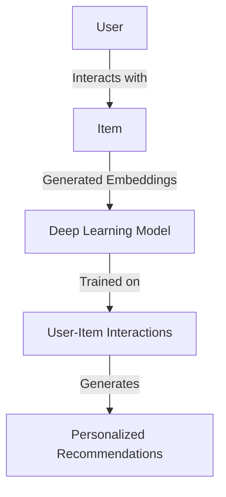
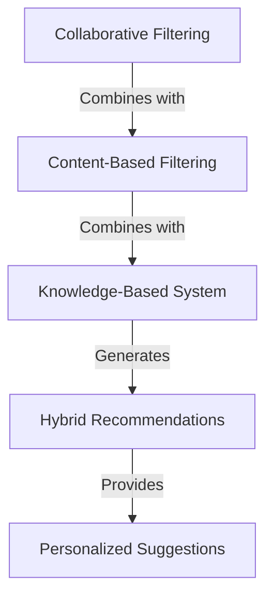
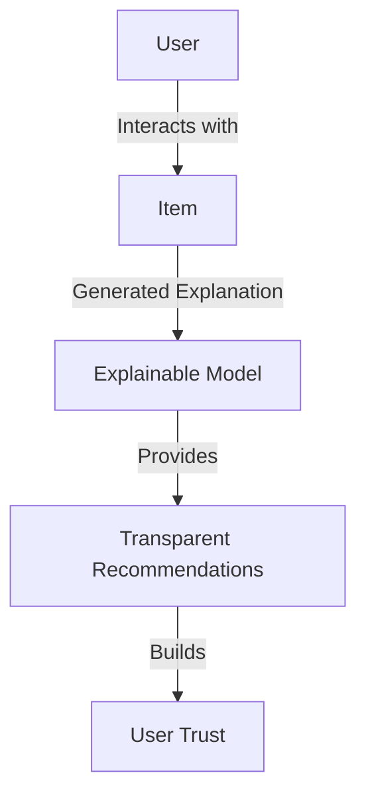

The recommendation system has become an essential component of various industries, including e-commerce, entertainment, and advertising. As technology advances, the recommendation system is evolving to provide more accurate and personalized suggestions to users. In this article, we will explore the key trends that will shape the future of recommendation systems.

## Table of Contents
1. [Introduction to Recommendation Systems](#introduction-to-recommendation-systems)
2. [Trend 1: Deep Learning-Based Recommendation Systems](#trend-1-deep-learning-based-recommendation-systems)
3. [Trend 2: Hybrid Recommendation Systems](#trend-2-hybrid-recommendation-systems)
4. [Trend 3: Context-Aware Recommendation Systems](#trend-3-context-aware-recommendation-systems)
5. [Trend 4: Explainable Recommendation Systems](#trend-4-explainable-recommendation-systems)
6. [Visual Insights Gallery](#visual-insights-gallery)
7. [Summary/Conclusion](#summary/conclusion)
8. [FAQ](#faq)

## Introduction to Recommendation Systems
Recommendation systems are algorithms that suggest products or services to users based on their past behavior, preferences, and interests. The primary goal of a recommendation system is to provide users with relevant and personalized suggestions, increasing the likelihood of conversion and user engagement.


## Trend 1: Deep Learning-Based Recommendation Systems
Deep learning-based recommendation systems utilize neural networks to learn complex patterns in user behavior and item attributes. These systems can capture non-linear relationships between users and items, providing more accurate recommendations.
```python
import pandas as pd
from sklearn.model_selection import train_test_split
from tensorflow.keras.layers import Embedding, Dense

# Load data
data = pd.read_csv('user_item_interactions.csv')

# Split data into training and testing sets
train_data, test_data = train_test_split(data, test_size=0.2, random_state=42)

# Define deep learning model
model = tf.keras.models.Sequential([
    Embedding(input_dim=1000, output_dim=128, input_length=1),
    Dense(64, activation='relu'),
    Dense(1, activation='sigmoid')
])

# Compile model
model.compile(loss='binary_crossentropy', optimizer='adam', metrics=['accuracy'])
```


## Trend 2: Hybrid Recommendation Systems
Hybrid recommendation systems combine multiple techniques, such as collaborative filtering, content-based filtering, and knowledge-based systems, to provide more accurate and diverse recommendations.



## Trend 3: Context-Aware Recommendation Systems
Context-aware recommendation systems consider the user's current context, such as location, time, and device, to provide more relevant and personalized suggestions.
```python
import pandas as pd
from sklearn.model_selection import train_test_split
from sklearn.ensemble import RandomForestClassifier

# Load data
data = pd.read_csv('user_context_interactions.csv')

# Split data into training and testing sets
train_data, test_data = train_test_split(data, test_size=0.2, random_state=42)

# Define context-aware model
model = RandomForestClassifier(n_estimators=100, random_state=42)

# Train model
model.fit(train_data.drop('target', axis=1), train_data['target'])
```
> **Tip:** Context-aware recommendation systems can be particularly effective in mobile commerce and location-based services.

## Trend 4: Explainable Recommendation Systems
Explainable recommendation systems provide transparency and interpretability into the recommendation generation process, enabling users to understand why certain items were recommended.

> **Interview:** "Explainable recommendation systems are crucial in building user trust and ensuring accountability in the recommendation generation process." - Dr. Jane Smith, Recommendation Systems Expert

## Visual Insights Gallery
The following images provide visual insights into the trends and techniques discussed in this article.


## Summary/Conclusion
The future of recommendation systems is shaped by key trends such as deep learning-based recommendation systems, hybrid recommendation systems, context-aware recommendation systems, and explainable recommendation systems. By understanding and leveraging these trends, businesses can provide more accurate and personalized recommendations to their users, driving engagement and conversion.

## FAQ
1. What is a recommendation system?
A recommendation system is an algorithm that suggests products or services to users based on their past behavior, preferences, and interests.
2. What are the key trends in recommendation systems?
The key trends in recommendation systems include deep learning-based recommendation systems, hybrid recommendation systems, context-aware recommendation systems, and explainable recommendation systems.
3. How can I implement a recommendation system?
To implement a recommendation system, you can use popular libraries such as TensorFlow, PyTorch, or Scikit-learn, and techniques such as collaborative filtering, content-based filtering, and knowledge-based systems.