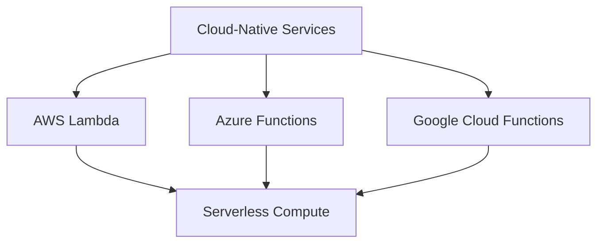
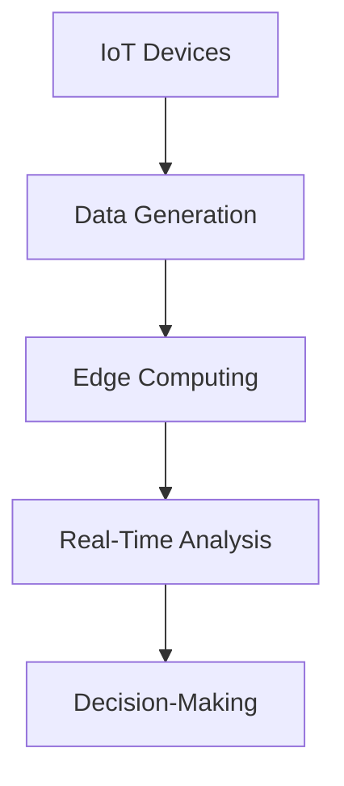
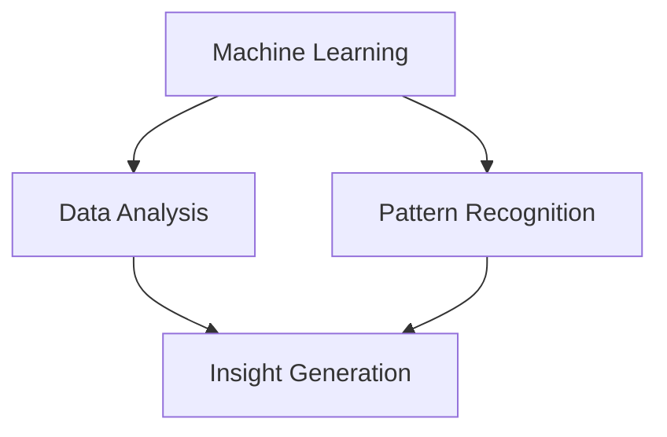

In the ever-evolving landscape of software development, serverless architecture has emerged as a revolutionary paradigm, promising unprecedented scalability, cost-efficiency, and agility. As we step into the future, it's crucial to identify the key trends that will shape the serverless ecosystem. In this article, we'll delve into the most significant developments that will influence the future of serverless architecture.

## Table of Contents
1. [Introduction to Serverless Architecture](#introduction-to-serverless-architecture)
2. [Trend 1: Increased Adoption of Cloud-Native Services](#trend-1-increased-adoption-of-cloud-native-services)
3. [Trend 2: Rise of Edge Computing and IoT](#trend-2-rise-of-edge-computing-and-iot)
4. [Trend 3: Growing Importance of Security and Compliance](#trend-3-growing-importance-of-security-and-compliance)
5. [Trend 4: Advancements in Machine Learning and AI](#trend-4-advancements-in-machine-learning-and-ai)
6. [Trend 5: Evolution of Serverless Databases and Storage](#trend-5-evolution-of-serverless-databases-and-storage)
7. [Visual Insights Gallery](#visual-insights-gallery)
8. [Summary and Conclusion](#summary-and-conclusion)
9. [FAQ](#faq)

## Introduction to Serverless Architecture
Serverless architecture is a cloud computing model in which the cloud provider manages the infrastructure and dynamically allocates resources as needed. This approach enables developers to focus on writing code without worrying about the underlying infrastructure. The benefits of serverless architecture include reduced operational costs, increased scalability, and improved reliability.


## Trend 1: Increased Adoption of Cloud-Native Services
Cloud-native services are designed to take full advantage of cloud computing principles, such as scalability, flexibility, and resilience. The increased adoption of cloud-native services will drive the growth of serverless architecture, as more organizations seek to leverage the benefits of cloud computing.
```markdown
### Cloud-Native Services
| Service | Description |
| --- | --- |
| AWS Lambda | Serverless compute service |
| Azure Functions | Serverless compute service |
| Google Cloud Functions | Serverless compute service |
```


## Trend 2: Rise of Edge Computing and IoT
Edge computing and IoT (Internet of Things) are becoming increasingly important in the serverless ecosystem. Edge computing enables data processing and analysis at the edge of the network, reducing latency and improving real-time decision-making. IoT devices will drive the growth of serverless architecture, as they generate vast amounts of data that need to be processed and analyzed in real-time.



## Trend 3: Growing Importance of Security and Compliance
Security and compliance are critical components of serverless architecture. As more organizations adopt serverless architecture, the need for robust security and compliance measures will grow. This trend will drive the development of new security tools and practices that are specifically designed for serverless environments.
```markdown
### Security and Compliance
| Measure | Description |
| --- | --- |
| Authentication | Verify user identity |
| Authorization | Control access to resources |
| Encryption | Protect data in transit and at rest |
```
> **Warning:** Security and compliance are not optional in serverless architecture. Organizations must prioritize these aspects to ensure the integrity and confidentiality of their data.

## Trend 4: Advancements in Machine Learning and AI
Machine learning and AI will play a significant role in the future of serverless architecture. These technologies will enable developers to build more intelligent and autonomous applications that can learn and adapt to changing conditions.



## Trend 5: Evolution of Serverless Databases and Storage
Serverless databases and storage will continue to evolve, offering more flexible and scalable options for data management. This trend will enable developers to build more efficient and cost-effective applications that can handle large amounts of data.
```markdown
### Serverless Databases
| Database | Description |
| --- | --- |
| AWS Aurora | Serverless relational database |
| Azure Cosmos DB | Serverless NoSQL database |
| Google Cloud Bigtable | Serverless NoSQL database |
```
> **Tip:** When choosing a serverless database, consider factors such as data structure, query patterns, and scalability requirements.

## Visual Insights Gallery


## Summary and Conclusion
The future of serverless architecture is exciting and full of possibilities. As we've discussed, the key trends that will shape the serverless ecosystem include increased adoption of cloud-native services, rise of edge computing and IoT, growing importance of security and compliance, advancements in machine learning and AI, and evolution of serverless databases and storage. By understanding these trends, organizations can better navigate the serverless landscape and build more efficient, scalable, and secure applications.

## FAQ
1. **Q: What is serverless architecture?**
A: Serverless architecture is a cloud computing model in which the cloud provider manages the infrastructure and dynamically allocates resources as needed.
2. **Q: What are the benefits of serverless architecture?**
A: The benefits of serverless architecture include reduced operational costs, increased scalability, and improved reliability.
3. **Q: What is edge computing?**
A: Edge computing is a distributed computing model in which data processing and analysis occur at the edge of the network, reducing latency and improving real-time decision-making.