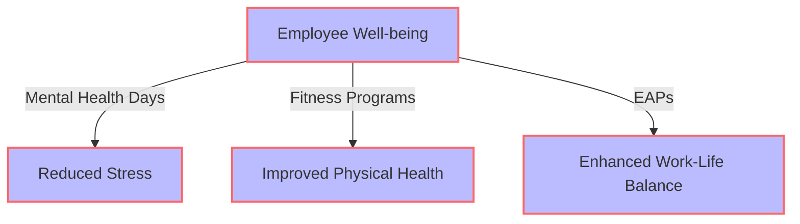
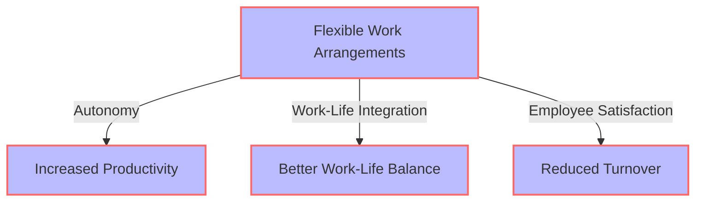

The modern workplace is undergoing a significant transformation, driven by technological advancements, shifting employee expectations, and the ongoing pandemic. As we navigate this new landscape, achieving a healthy work-life balance has become more crucial than ever. In this article, we will delve into the key trends shaping the future of work-life balance and explore strategies for maintaining well-being in the face of changing work dynamics.

## Introduction to the Evolving Workplace

The traditional 9-to-5 office setup is no longer the only norm. With the rise of remote work, flexible schedules, and the gig economy, employees are seeking more autonomy and control over their work-life balance. This shift is driven by the desire for better mental health, increased productivity, and a more fulfilling personal life.

## Trends Redefining Work-Life Balance
### Remote and Hybrid Work Models

Remote and hybrid work models are becoming increasingly popular, offering employees the flexibility to work from anywhere and at any time. This trend is expected to continue, with many companies adopting permanent remote work arrangements.

### Technology-Driven Boundaries
```markdown
| Technology | Benefits | Challenges |
| --- | --- | --- |
| Virtual Private Networks (VPNs) | Secure remote access | Complexity in setup |
| Time Tracking Software | Transparent work hours | Potential for over-monitoring |
| Collaboration Tools | Enhanced teamwork | Information overload |
```
Technology plays a critical role in maintaining work-life balance. Tools like VPNs, time tracking software, and collaboration platforms can help create boundaries between work and personal life. However, it's essential to use these technologies judiciously to avoid blurring the lines between work and personal time.

### Employee Well-being Initiatives
> **Note:** Companies are now recognizing the importance of employee well-being and are implementing initiatives such as mental health days, fitness programs, and employee assistance programs (EAPs).
```markdown

These initiatives not only improve employee well-being but also contribute to increased productivity and job satisfaction.

## Strategies for Achieving Work-Life Balance
### Setting Boundaries
> **Tip:** Establishing clear boundaries between work and personal life is crucial for maintaining a healthy work-life balance. This can be achieved by setting realistic work hours, avoiding work-related activities during personal time, and prioritizing self-care.

### Prioritizing Self-Care

Self-care is essential for maintaining physical and mental well-being. Engaging in activities such as meditation, exercise, and spending time with loved ones can help reduce stress and improve overall quality of life.

### Embracing Flexibility
```markdown

Embracing flexibility in work arrangements can lead to increased productivity, better work-life balance, and higher employee satisfaction.

## Conclusion
Achieving a healthy work-life balance is a continuous process that requires effort, commitment, and support from both employees and employers. By understanding the key trends shaping the future of work-life balance and implementing effective strategies, we can create a more sustainable, productive, and fulfilling work environment.

## Visual Insights Gallery


## FAQ
1. **What are the benefits of remote work for work-life balance?**
Remote work offers flexibility, autonomy, and reduced commuting time, leading to improved work-life balance and increased productivity.
2. **How can employees prioritize self-care in a busy work schedule?**
Employees can prioritize self-care by setting realistic goals, taking regular breaks, engaging in physical activity, and practicing mindfulness and meditation.
3. **What role do employers play in supporting work-life balance?**
Employers can support work-life balance by offering flexible work arrangements, providing employee well-being initiatives, and fostering a culture that values and respects employees' personal time and boundaries.