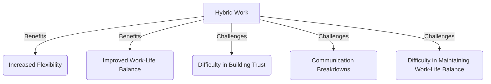
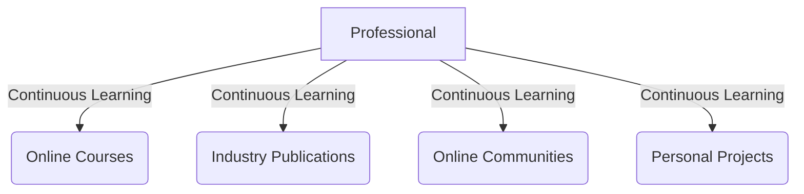

# The Hybrid Work Dilemma: How to Stay Relevant in 2026
As we navigate the complexities of the modern workforce, one thing is clear: the hybrid work model is here to stay. With the rise of remote work and the decline of traditional office settings, professionals are faced with a daunting question: how can I stay relevant in a world where the rules of work are constantly changing? In this article, we'll delve into the hybrid work dilemma and provide actionable strategies for staying ahead of the curve.

## Table of Contents
1. [Introduction to Hybrid Work](#introduction-to-hybrid-work)
2. [The Benefits and Challenges of Hybrid Work](#the-benefits-and-challenges-of-hybrid-work)
3. [Strategies for Staying Relevant in a Hybrid Work Environment](#strategies-for-staying-relevant-in-a-hybrid-work-environment)
4. [Conclusion and Future Outlook](#conclusion-and-future-outlook)

## Introduction to Hybrid Work
Hybrid work refers to a flexible work arrangement that combines elements of remote and in-office work. This model has gained popularity in recent years due to its potential to increase productivity, improve work-life balance, and reduce costs. However, it also presents a unique set of challenges, including communication breakdowns, technological issues, and difficulty in building team cohesion.
[IMAGE: A split-screen image of a person working from home and another person working in an office, with a cityscape in the background]

## The Benefits and Challenges of Hybrid Work
The hybrid work model offers numerous benefits, including increased flexibility, improved work-life balance, and reduced commuting time. However, it also presents several challenges, such as:
* Difficulty in building trust and rapport with remote team members
* Communication breakdowns due to technological issues or lack of face-to-face interaction
* Difficulty in maintaining a healthy work-life balance

## Strategies for Staying Relevant in a Hybrid Work Environment
To stay relevant in a hybrid work environment, professionals must be proactive and adaptable. Here are some strategies for success:
### Develop a Strong Online Presence
In a hybrid work environment, having a strong online presence is crucial. This includes:
* Creating a professional online profile
* Building a personal brand
* Engaging with colleagues and industry leaders on social media
### Invest in Continuous Learning
The hybrid work model requires professionals to be self-motivated and proactive in their learning. This includes:
* Taking online courses and attending webinars
* Reading industry publications and books
* Participating in online communities and forums

### Prioritize Communication and Collaboration
Effective communication and collaboration are essential in a hybrid work environment. This includes:
* Using video conferencing tools to stay connected with team members
* Setting clear goals and expectations
* Providing regular updates and feedback
### Emphasize Work-Life Balance
Maintaining a healthy work-life balance is critical in a hybrid work environment. This includes:
* Setting boundaries between work and personal life
* Prioritizing self-care and wellness
* Taking breaks and practicing mindfulness
| Strategy | Description | Benefits |
| --- | --- | --- |
| Develop a Strong Online Presence | Create a professional online profile, build a personal brand, and engage with colleagues and industry leaders on social media | Increased visibility, improved networking opportunities, enhanced career prospects |
| Invest in Continuous Learning | Take online courses, attend webinars, read industry publications, and participate in online communities and forums | Improved skills, increased knowledge, enhanced career prospects |
| Prioritize Communication and Collaboration | Use video conferencing tools, set clear goals and expectations, and provide regular updates and feedback | Improved teamwork, increased productivity, enhanced collaboration |

## Conclusion and Future Outlook
The hybrid work model is here to stay, and professionals must be prepared to adapt to this new reality. By developing a strong online presence, investing in continuous learning, prioritizing communication and collaboration, and emphasizing work-life balance, professionals can stay relevant and thrive in a hybrid work environment. As we look to the future, it's clear that the hybrid work model will continue to evolve, presenting new challenges and opportunities for growth and development.
[IMAGE: A futuristic image of a person working in a virtual reality environment, with a cityscape in the background]

## Visual Insights Gallery
### Image 1: The Future of Work
[IMAGE: A futuristic image of a person working in a virtual reality environment, with a cityscape in the background]
### Image 2: Hybrid Work Setup
[IMAGE: A photo of a person working from home, with a laptop, headset, and notebook, and a cityscape in the background]
### Image 3: Virtual Team Meeting
[IMAGE: A screenshot of a virtual team meeting, with multiple participants and a collaborative workspace]

## Summary
The hybrid work model presents a unique set of challenges and opportunities for professionals. By developing a strong online presence, investing in continuous learning, prioritizing communication and collaboration, and emphasizing work-life balance, professionals can stay relevant and thrive in a hybrid work environment.

## FAQ
Q: What is the hybrid work model?
A: The hybrid work model refers to a flexible work arrangement that combines elements of remote and in-office work.
Q: What are the benefits of the hybrid work model?
A: The hybrid work model offers numerous benefits, including increased flexibility, improved work-life balance, and reduced commuting time.
Q: What are the challenges of the hybrid work model?
A: The hybrid work model presents several challenges, including difficulty in building trust and rapport with remote team members, communication breakdowns, and difficulty in maintaining a healthy work-life balance.
Q: How can I stay relevant in a hybrid work environment?
A: To stay relevant in a hybrid work environment, professionals must be proactive and adaptable, develop a strong online presence, invest in continuous learning, prioritize communication and collaboration, and emphasize work-life balance.