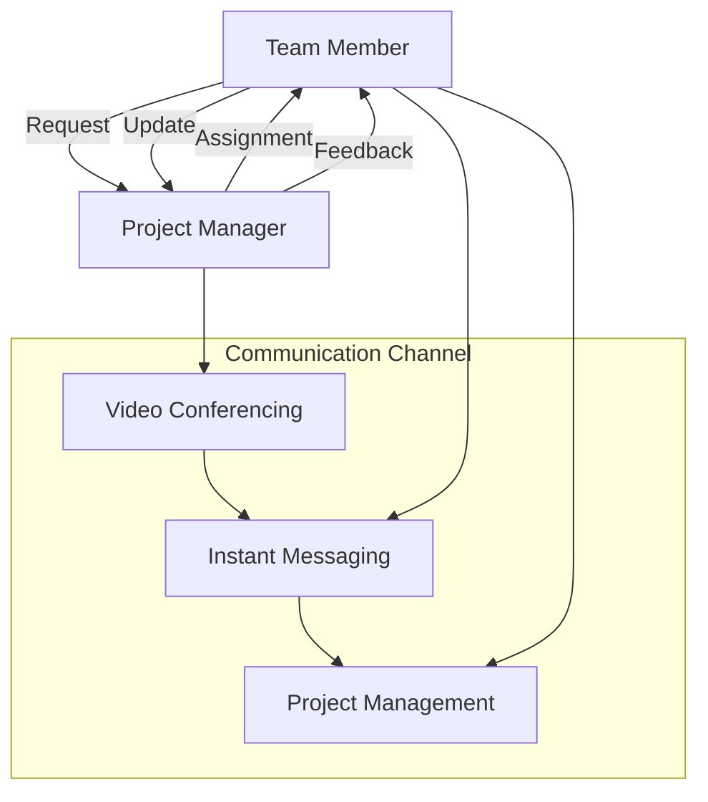
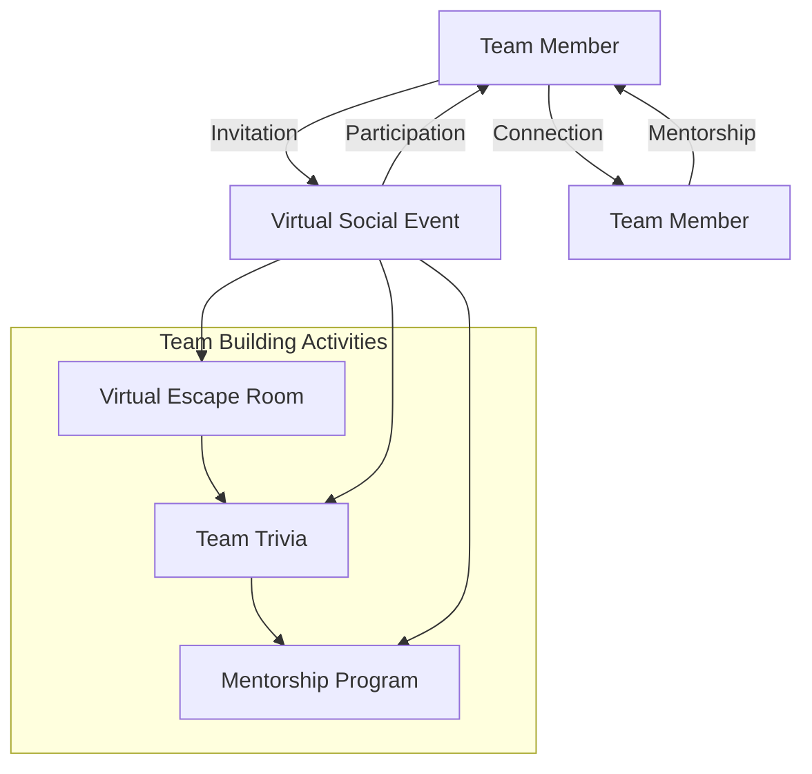
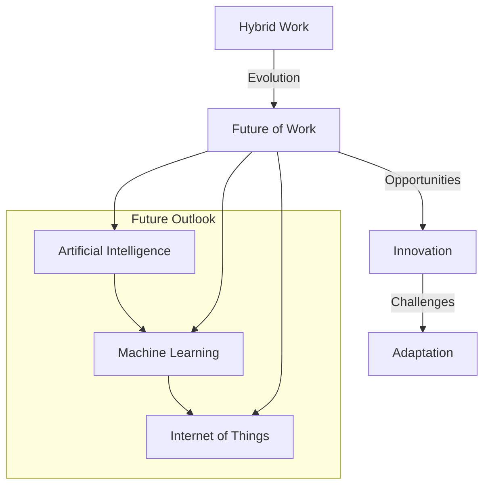

# Part 2: Advanced Strategies for Thriving in a Hybrid Work Environment
As we explored in our previous article, the hybrid work model presents a unique set of challenges and opportunities for professionals. In this follow-up article, we'll delve deeper into the advanced strategies for thriving in a hybrid work environment, including the importance of digital literacy, effective communication, and intentional team building.

## Navigating Edge Cases in Hybrid Work
One of the primary challenges of hybrid work is navigating edge cases, such as conflicting work styles, different communication preferences, and varying levels of technical proficiency. To overcome these challenges, it's essential to establish clear guidelines and protocols for communication, collaboration, and conflict resolution.

## Advanced Communication Strategies for Hybrid Teams
Effective communication is critical to the success of hybrid teams. This includes using digital tools to facilitate communication, such as video conferencing software, instant messaging apps, and project management platforms. It's also essential to establish clear channels for feedback, concerns, and ideas.

## Digital Literacy in the Hybrid Work Era
As the hybrid work model continues to evolve, digital literacy has become an essential skill for professionals. This includes proficiency in digital tools, such as Microsoft Office, Google Workspace, and project management software. It's also important to stay up-to-date with the latest trends and technologies in the industry.

## Intentional Team Building in a Hybrid Work Environment
Team building is critical to the success of hybrid teams. This includes intentional activities, such as virtual social events, team-building exercises, and mentorship programs. It's also essential to foster a sense of community and belonging among team members.

## Case Studies in Hybrid Work
Several organizations have successfully implemented hybrid work models, including companies like IBM, Microsoft, and Dell. These companies have seen improvements in productivity, employee satisfaction, and cost savings. They've also experienced challenges, such as communication breakdowns and difficulty in building team cohesion.

## Conclusion and Future Outlook
In conclusion, thriving in a hybrid work environment requires advanced strategies, including digital literacy, effective communication, and intentional team building. As the hybrid work model continues to evolve, it's essential to stay adaptable, agile, and open to new opportunities and challenges.

## Visual Insights Gallery
* [A split-screen image of a person working from home and another person working in an office, with a cityscape in the background](https://picsum.photos/seed/a-split-screen-image-of-a-pers/800/400)
* [A diagram illustrating the intersection of different work styles and communication preferences](https://picsum.photos/seed/an-illustration-of-different-work-styles/800/400)
* [A screenshot of a person taking an online course to improve their digital literacy](https://picsum.photos/seed/a-screenshot-of-a-person-taking-an-online-course/800/400)
* [A graph illustrating the benefits and challenges of hybrid work](https://picsum.photos/seed/a-graph-illustrating-the-benefits-and-challenges-of-hybrid-work/800/400)
* [A picture of a person working remotely from a coffee shop, with a laptop and a cup of coffee](https://picsum.photos/seed/a-picture-of-a-person-working-remotely-from-a-coffee-shop/800/400)