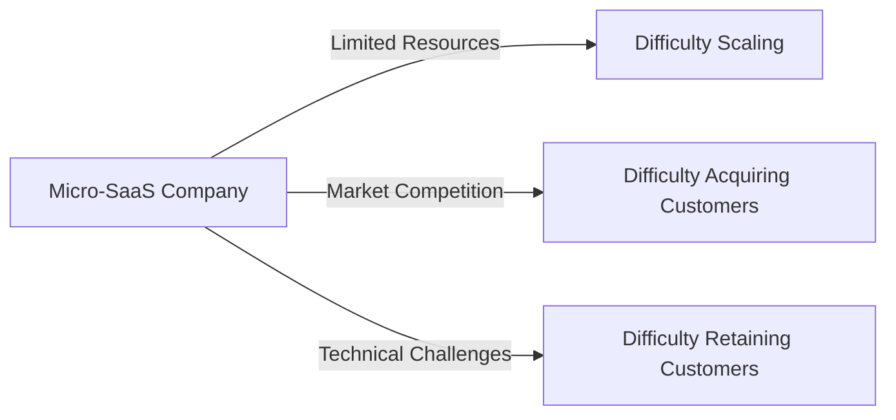

# The Micro-SaaS Phenomenon: Building Small, Profitable Software
The rise of the micro-SaaS (Software as a Service) phenomenon has revolutionized the way entrepreneurs and small businesses approach software development. By focusing on niche markets and delivering highly specialized solutions, micro-SaaS companies are able to generate significant revenue with minimal overhead. In this article, we will delve into the world of micro-SaaS, exploring the benefits, challenges, and strategies for building a successful micro-SaaS business.

## Table of Contents
1. [Introduction to Micro-SaaS](#introduction-to-micro-saas)
2. [Benefits of Micro-SaaS](#benefits-of-micro-saas)
3. [Challenges of Micro-SaaS](#challenges-of-micro-saas)
4. [Building a Micro-SaaS Business](#building-a-micro-saas-business)
5. [Marketing and Sales Strategies](#marketing-and-sales-strategies)
6. [Visual Insights Gallery](#visual-insights-gallery)
7. [Summary and Conclusion](#summary-and-conclusion)
8. [FAQ](#faq)

## Introduction to Micro-SaaS
Micro-SaaS refers to small, niche software applications that cater to specific industries or markets. These applications are typically developed by solo entrepreneurs or small teams, and are designed to solve a particular problem or meet a specific need. Micro-SaaS companies often have lower development costs, faster time-to-market, and higher profit margins compared to traditional SaaS companies.
[IMAGE: A diagram illustrating the concept of micro-SaaS, with a small team of developers working on a niche software application]

## Benefits of Micro-SaaS
The micro-SaaS model offers several benefits, including:
* Lower development costs: Micro-SaaS applications are typically smaller and less complex, reducing development costs and time-to-market.
* Higher profit margins: Micro-SaaS companies can generate significant revenue with minimal overhead, resulting in higher profit margins.
* Increased agility: Micro-SaaS companies are often more agile and able to respond quickly to changing market conditions.
* Niche market focus: Micro-SaaS applications cater to specific industries or markets, allowing for a deeper understanding of customer needs and preferences.
```markdown
| Benefit | Description |
| --- | --- |
| Lower development costs | Reduced development costs and time-to-market |
| Higher profit margins | Increased revenue with minimal overhead |
| Increased agility | Ability to respond quickly to changing market conditions |
| Niche market focus | Deeper understanding of customer needs and preferences |
```
[IMAGE: A graph showing the growth of micro-SaaS companies, with increasing revenue and profit margins]

## Challenges of Micro-SaaS
While the micro-SaaS model offers several benefits, it also presents some challenges, including:
* Limited resources: Micro-SaaS companies often have limited financial and human resources, making it difficult to scale and grow.
* Market competition: Micro-SaaS companies may face competition from larger, more established SaaS companies.
* Customer acquisition: Micro-SaaS companies may struggle to acquire new customers and retain existing ones.
* Technical challenges: Micro-SaaS applications may require specialized technical expertise, which can be difficult to find and retain.

[IMAGE: A photo of a solo entrepreneur working on a micro-SaaS application, highlighting the limited resources and technical challenges]

## Building a Micro-SaaS Business
To build a successful micro-SaaS business, entrepreneurs should focus on the following strategies:
* Identify a niche market: Conduct market research to identify a specific industry or market with a need for a specialized software application.
* Develop a minimum viable product (MVP): Create a basic version of the software application to test with a small group of customers.
* Gather feedback and iterate: Collect feedback from customers and iterate on the software application to improve its features and functionality.
* Develop a marketing and sales strategy: Create a plan to acquire new customers and retain existing ones.
```markdown
### Building a Micro-SaaS Business: A Step-by-Step Guide
1. **Identify a niche market**: Conduct market research to identify a specific industry or market.
2. **Develop a minimum viable product (MVP)**: Create a basic version of the software application.
3. **Gather feedback and iterate**: Collect feedback from customers and iterate on the software application.
4. **Develop a marketing and sales strategy**: Create a plan to acquire new customers and retain existing ones.
```
[IMAGE: A Mermaid.js diagram illustrating the flow of building a micro-SaaS business, from identifying a niche market to developing a marketing and sales strategy]

## Marketing and Sales Strategies
To acquire new customers and retain existing ones, micro-SaaS companies should focus on the following marketing and sales strategies:
* Content marketing: Create high-quality, relevant content to attract and engage with potential customers.
* Social media marketing: Utilize social media platforms to promote the software application and engage with customers.
* Email marketing: Build an email list and create targeted campaigns to promote the software application.
* Paid advertising: Utilize paid advertising channels, such as Google Ads or Facebook Ads, to reach a wider audience.
```markdown
| Marketing Strategy | Description |
| --- | --- |
| Content Marketing | Create high-quality, relevant content to attract and engage with potential customers |
| Social Media Marketing | Utilize social media platforms to promote the software application and engage with customers |
| Email Marketing | Build an email list and create targeted campaigns to promote the software application |
| Paid Advertising | Utilize paid advertising channels to reach a wider audience |
```
[IMAGE: A photo of a marketing team working on a content marketing campaign, highlighting the importance of high-quality content]

## Visual Insights Gallery
The following images provide a visual representation of the micro-SaaS phenomenon and the strategies for building a successful micro-SaaS business.
[IMAGE: A screenshot of a micro-SaaS application, highlighting its features and functionality]
[IMAGE: A graph showing the growth of a micro-SaaS company, with increasing revenue and profit margins]
[IMAGE: A photo of a solo entrepreneur working on a micro-SaaS application, highlighting the limited resources and technical challenges]

## Summary and Conclusion
The micro-SaaS phenomenon has revolutionized the way entrepreneurs and small businesses approach software development. By focusing on niche markets and delivering highly specialized solutions, micro-SaaS companies are able to generate significant revenue with minimal overhead. To build a successful micro-SaaS business, entrepreneurs should identify a niche market, develop a minimum viable product, gather feedback and iterate, and develop a marketing and sales strategy.

## FAQ
Q: What is micro-SaaS?
A: Micro-SaaS refers to small, niche software applications that cater to specific industries or markets.
Q: What are the benefits of micro-SaaS?
A: The benefits of micro-SaaS include lower development costs, higher profit margins, increased agility, and a niche market focus.
Q: What are the challenges of micro-SaaS?
A: The challenges of micro-SaaS include limited resources, market competition, customer acquisition, and technical challenges.
Q: How can I build a successful micro-SaaS business?
A: To build a successful micro-SaaS business, entrepreneurs should identify a niche market, develop a minimum viable product, gather feedback and iterate, and develop a marketing and sales strategy.