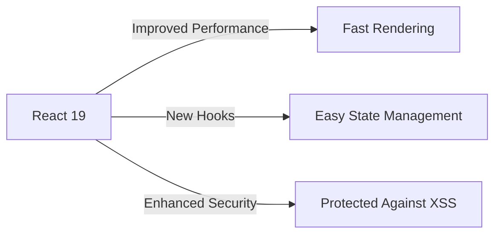

# The Rise of React 19: Everything You Need to Know
React 19 is the latest iteration of the popular React library, and it's packed with exciting new features and improvements. As a frontend developer, it's essential to stay up-to-date with the latest developments in the React ecosystem. In this article, we'll delve into the world of React 19, exploring its key features, benefits, and best practices for implementation.

## Table of Contents
1. [Introduction to React 19](#introduction-to-react-19)
2. [New Features in React 19](#new-features-in-react-19)
3. [Improvements in React 19](#improvements-in-react-19)
4. [Best Practices for Implementing React 19](#best-practices-for-implementing-react-19)
5. [Migrating to React 19](#migrating-to-react-19)
6. [Conclusion](#conclusion)
7. [Visual Insights Gallery](#visual-insights-gallery)
8. [FAQ](#faq)

## Introduction to React 19

React 19 is the latest major release of the React library, and it's designed to make building user interfaces more efficient, scalable, and maintainable. With a strong focus on performance, security, and developer experience, React 19 is set to revolutionize the way we build web applications.

```javascript
// Example of a simple React 19 component
import React from 'react';

function Counter() {
  const [count, setCount] = React.useState(0);

  return (
    <div>
      <p>Count: {count}</p>
      <button onClick={() => setCount(count + 1)}>Increment</button>
    </div>
  );
}
```

## New Features in React 19

React 19 introduces several exciting new features, including:
* Improved performance: React 19 includes several optimizations to reduce the number of unnecessary re-renders and improve overall performance.
* New hooks: React 19 introduces new hooks, such as `useId` and `useDeferredValue`, which make it easier to manage state and side effects in functional components.
* Enhanced security: React 19 includes several security enhancements, including improved protection against cross-site scripting (XSS) attacks.



## Improvements in React 19

React 19 also includes several improvements to existing features, including:
* Improved support for concurrent rendering: React 19 makes it easier to use concurrent rendering to improve performance and reduce latency.
* Enhanced support for server-side rendering: React 19 includes several improvements to server-side rendering, making it easier to pre-render pages and improve SEO.

```mermaid
graph TD
    A[React 18] -->|Concurrent Rendering| B[Improved Performance]
    A -->|Server-Side Rendering| C[Enhanced SEO]
    React 19 -->|Improved Concurrent Rendering| D[Fast Rendering]
    React 19 -->|Enhanced Server-Side Rendering| E[Improved SEO]
```

## Best Practices for Implementing React 19

To get the most out of React 19, follow these best practices:
* Use the latest version of create-react-app to create new React projects.
* Follow the official React documentation to learn about new features and best practices.
* Use a linter and code formatter to ensure your code is consistent and follows best practices.

| Best Practice | Description |
| --- | --- |
| Use the latest version of create-react-app | Create new React projects with the latest version of create-react-app to ensure you have the latest features and security patches. |
| Follow the official React documentation | Stay up-to-date with the latest React features and best practices by following the official React documentation. |
| Use a linter and code formatter | Use a linter and code formatter to ensure your code is consistent and follows best practices. |

## Migrating to React 19

Migrating to React 19 is relatively straightforward, but it does require some planning and effort. Here are the steps to follow:
1. Update your dependencies to the latest version of React.
2. Refactor your code to use the new features and APIs in React 19.
3. Test your application thoroughly to ensure everything is working as expected.

```javascript
// Example of updating dependencies to React 19
npm install react@19
```

## Conclusion
React 19 is a significant release that introduces several exciting new features and improvements. By following the best practices outlined in this article, you can ensure a smooth transition to React 19 and take advantage of its many benefits.

## Visual Insights Gallery
### Image 1: React 19 Logo

### Image 2: React 19 Architecture

### Image 3: React 19 Performance Comparison


## FAQ
### Q: What are the main features of React 19?
A: React 19 includes several exciting new features, including improved performance, new hooks, and enhanced security.
### Q: How do I migrate to React 19?
A: Migrating to React 19 involves updating your dependencies to the latest version of React, refactoring your code to use the new features and APIs, and testing your application thoroughly.
### Q: What are the best practices for implementing React 19?
A: The best practices for implementing React 19 include using the latest version of create-react-app, following the official React documentation, and using a linter and code formatter.