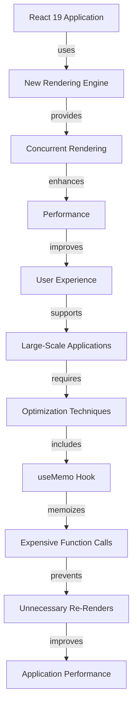

## Part 2: Advanced React 19 - Edge Cases, Architecture, and Optimizations

In our previous article, we introduced the key features and benefits of React 19. However, as with any complex technology, there are edge cases and advanced topics that require a deeper dive. In this article, we'll explore the advanced architecture of React 19, discuss common edge cases, and provide optimization techniques for building high-performance applications.

## Advanced React 19 Architecture
React 19 introduces several new features that enhance the overall architecture of React applications. One of the most significant changes is the introduction of a new rendering engine, which provides improved performance and better support for concurrent rendering.

```javascript
// Example of using the new rendering engine in React 19
import React from 'react';
import { createRoot } from 'react-dom/client';

const root = createRoot(document.getElementById('root'));
root.render(
  <React.StrictMode>
    <App />
  </React.StrictMode>
);
```

### Edge Cases in React 19
As with any complex technology, there are edge cases that can be challenging to handle. In React 19, some common edge cases include:

*   Handling errors in concurrent rendering
*   Optimizing performance in large-scale applications
*   Managing side effects in functional components

To illustrate how to handle these edge cases, let's consider the following example:

```javascript
// Example of handling errors in concurrent rendering
import React, { useState, useEffect } from 'react';

function ErrorBoundary() {
  const [error, setError] = useState(null);

  useEffect(() => {
    const handle_error = (error) => {
      setError(error);
    };
    // Simulate an error occurring during rendering
    throw new Error('Something went wrong');
  }, []);

  if (error) {
    return <div>Error: {error.message}</div>;
  }

  return <div>Rendering successfully</div>;
}
```

## Optimization Techniques for React 19
To optimize the performance of React 19 applications, consider the following techniques:

*   **Use the `useMemo` hook**: Memoize expensive function calls to prevent unnecessary re-renders.
*   **Use the `useCallback` hook**: Memoize functions to prevent unnecessary re-renders.
*   **Optimize images**: Compress images to reduce their file size and improve loading times.

```javascript
// Example of using the `useMemo` hook to optimize performance
import React, { useState, useMemo } from 'react';

function Calculator() {
  const [num1, setNum1] = useState(0);
  const [num2, setNum2] = useState(0);

  const sum = useMemo(() => {
    return num1 + num2;
  }, [num1, num2]);

  return (
    <div>
      <input type="number" value={num1} onChange={(e) => setNum1(e.target.valueAsNumber)} />
      <input type="number" value={num2} onChange={(e) => setNum2(e.target.valueAsNumber)} />
      <p>Sum: {sum}</p>
    </div>
  );
}
```

### Advanced Architecture Diagram
To better understand the advanced architecture of React 19, let's consider the following Mermaid.js diagram:


## Visual Insights Gallery
Here are some visual insights into React 19:


