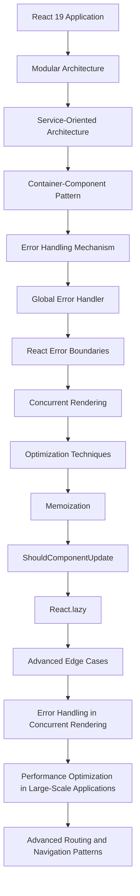

## Part 3: Mastering Advanced Edge Cases and Architecture in React 19

In our previous articles, we introduced the key features and benefits of React 19, as well as explored advanced topics such as architecture and optimization techniques. However, as with any complex technology, there are advanced edge cases that require a deeper understanding of the underlying architecture and mechanisms. In this article, we'll delve into the most challenging edge cases in React 19, discuss advanced architecture patterns, and provide expert-level optimization techniques for building highly scalable and performant applications.

## Advanced Edge Cases in React 19
React 19 introduces several new features that can be challenging to handle in certain edge cases. Some of the most advanced edge cases include:

*   Handling errors in concurrent rendering with multiple suspense boundaries
*   Optimizing performance in large-scale applications with complex component trees
*   Managing side effects in functional components with multiple dependencies
*   Implementing advanced routing and navigation patterns in React 19 applications

### Advanced Architecture Patterns in React 19
To handle advanced edge cases and build highly scalable applications, it's essential to understand advanced architecture patterns in React 19. Some of the most effective patterns include:

*   Using a modular architecture with separate modules for different features and components
*   Implementing a service-oriented architecture with separate services for data fetching and manipulation
*   Using a container-component pattern to separate presentation and logic

```javascript
// Example of using a modular architecture in React 19
import React from 'react';
import { createRoot } from 'react-dom/client';
import { BrowserRouter, Routes, Route } from 'react-router-dom';
import { Home } from './Home';
import { About } from './About';

const root = createRoot(document.getElementById('root'));
root.render(
  <React.StrictMode>
    <BrowserRouter>
      <Routes>
        <Route path="/" element={<Home />} />
        <Route path="/about" element={<About />} />
      </Routes>
    </BrowserRouter>
  </React.StrictMode>
);
```

### Expert-Level Optimization Techniques
To optimize performance in React 19 applications, it's essential to use expert-level techniques such as:

*   Using memoization to cache expensive function calls
*   Implementing shouldComponentUpdate to reduce unnecessary re-renders
*   Using React.lazy to lazy-load components and reduce initial bundle size

```javascript
// Example of using memoization in React 19
import React, { useMemo } from 'react';

const expensiveFunction = (data) => {
  // Simulate an expensive function call
  for (let i = 0; i < 10000000; i++) {
    // Do something expensive
  }
  return data;
};

const Component = () => {
  const data = useMemo(() => expensiveFunction('Hello World'), []);
  return <div>{data}</div>;
};
```

### Advanced Error Handling in React 19
To handle errors in React 19 applications, it's essential to use advanced error handling techniques such as:

*   Using error boundaries to catch and handle errors in components
*   Implementing a global error handler to catch and handle errors globally
*   Using React Error Boundaries to handle errors in concurrent rendering

```javascript
// Example of using error boundaries in React 19
import React, { Component } from 'react';

class ErrorBoundary extends Component {
  constructor(props) {
    super(props);
    this.state = { hasError: false };
  }

  static getDerivedStateFromError(error) {
    return { hasError: true };
  }

  render() {
    if (this.state.hasError) {
      return <h1>Something went wrong.</h1>;
    }
    return this.props.children;
  }
}

const App = () => {
  return (
    <ErrorBoundary>
      <Component />
    </ErrorBoundary>
  );
};
```

### Mermaid.js Diagram: Advanced React 19 Architecture


## Visual Insights Gallery
Here are some visual insights into advanced React 19 architecture and edge cases:
*   
*   
*   