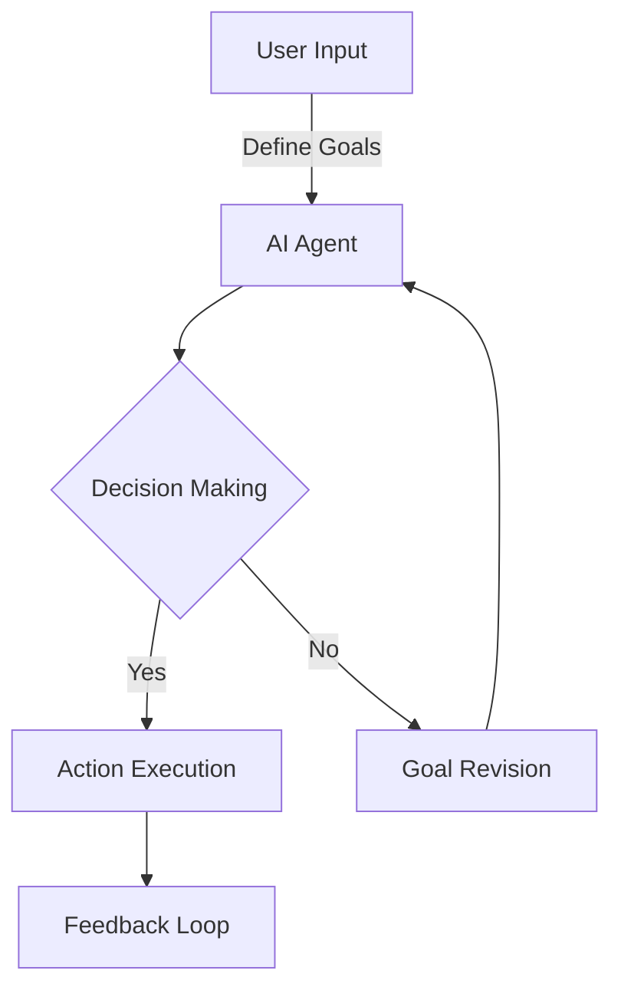

In the rapidly evolving landscape of artificial intelligence (AI), a significant paradigm shift is underway, moving from the traditional focus on prompt engineering to the development of agentic AI workflows. This transition marks a crucial step towards more autonomous, efficient, and adaptive AI systems. As we delve into the intricacies of this shift, it becomes clear that the future of AI lies not just in its ability to process and respond to human inputs but in its capacity to act, decide, and interact with its environment in a more human-like manner.

## Introduction to Agentic AI Workflows

Agentic AI workflows represent a new frontier in AI development, where AI systems are designed to be proactive, taking initiative and making decisions based on their programming, environment, and goals. This approach contrasts with the more passive nature of traditional AI systems, which await human input to perform specific tasks. The shift towards agentic AI is driven by the need for more sophisticated, autonomous, and flexible AI solutions that can adapt to complex, dynamic environments.

## The Limitations of Prompt Engineering

Prompt engineering, while crucial in the development of large language models (LLMs) and other AI systems, faces inherent limitations. It relies heavily on human-designed prompts to elicit specific responses from AI models, which can be time-consuming, inefficient, and sometimes ineffective. The complexity and nuance of human language, coupled with the black-box nature of many AI models, make it challenging to craft prompts that consistently yield desired outcomes. Furthermore, prompt engineering does not address the need for autonomy and proactive behavior in AI systems.

## Architecture of Agentic AI Workflows

The architecture of agentic AI workflows involves a feedback loop where AI agents receive goals or objectives, make decisions based on their programming and environmental inputs, execute actions, and then receive feedback to adjust their decision-making process. This loop enables AI systems to learn from their interactions with the environment and adapt their behavior over time.

## Implementing Agentic AI Workflows with Large Language Models

Large language models (LLMs) can play a pivotal role in agentic AI workflows by serving as the brain of AI agents. LLMs can process vast amounts of information, generate human-like text, and even engage in dialogue, making them ideal for tasks that require understanding, reasoning, and communication. By integrating LLMs into agentic AI workflows, developers can create AI systems that not only understand and respond to their environment but also communicate their intentions, needs, and outcomes effectively.

## Challenges and Opportunities

The shift to agentic AI workflows presents both challenges and opportunities. On one hand, developing AI systems that can act autonomously and make decisions raises ethical concerns, such as accountability, transparency, and the potential for unintended consequences. On the other hand, agentic AI workflows offer the promise of more efficient, adaptive, and innovative solutions across various sectors, from healthcare and finance to education and entertainment.

## Conclusion
The transition from prompt engineering to agentic AI workflows marks a significant evolution in AI development, promising more autonomous, proactive, and adaptive AI systems. As we move forward in this new paradigm, it is essential to address the challenges and leverage the opportunities presented by agentic AI. By doing so, we can unlock the full potential of AI and create systems that not only assist humans but also work alongside them as partners in problem-solving and innovation.

## Visual Insights Gallery
### Image 1: Autonomous AI Agents

### Image 2: Decision-Making Process

### Image 3: Human-AI Collaboration

## Summary
The shift from prompt engineering to agentic AI workflows is a revolutionary step in AI development, aiming to create more autonomous, proactive, and adaptive AI systems. This transition is driven by the need for AI solutions that can interact with their environment in a more human-like manner, making decisions and taking actions based on their programming, goals, and feedback. As we explore the depths of agentic AI, we must address the challenges and opportunities it presents, ensuring that these systems are developed and used responsibly.

## FAQ
- **Q: What is the primary difference between prompt engineering and agentic AI workflows?**
  A: The primary difference lies in the level of autonomy and proactivity. Prompt engineering relies on human-designed inputs to elicit specific responses, whereas agentic AI workflows are designed to be proactive, making decisions and taking actions based on their environment and goals.
- **Q: How can large language models (LLMs) be integrated into agentic AI workflows?**
  A: LLMs can serve as the core component of AI agents, enabling them to understand, reason, and communicate effectively. They process information, generate text, and engage in dialogue, making them crucial for tasks requiring understanding and communication.
- **Q: What are the potential applications of agentic AI workflows?**
  A: The applications are vast and varied, including but not limited to healthcare, finance, education, and entertainment. Agentic AI can improve efficiency, adaptability, and innovation across these sectors by providing more autonomous and proactive AI solutions.