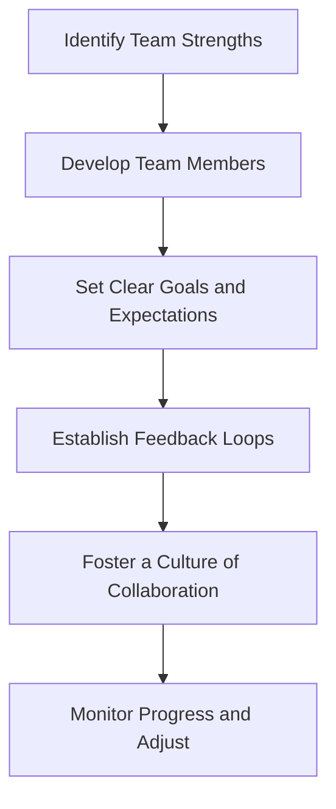
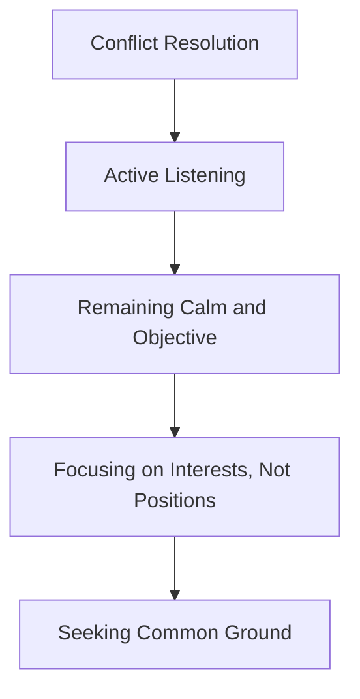

As a senior engineer, you've spent years mastering the technical skills required to excel in your field. However, when you're presented with the opportunity to transition into an engineering manager role, you may find yourself at a crossroads. The shift from individual contributor to leader requires a significant change in mindset, skills, and approach. In this article, we'll explore the key considerations and strategies for making a successful transition from senior engineer to engineering manager.

## Understanding the Role of an Engineering Manager

An engineering manager is responsible for leading a team of engineers, guiding the technical direction of a project or organization, and ensuring the successful execution of engineering projects. This role requires a unique blend of technical expertise, leadership skills, and business acumen. As an engineering manager, you'll need to balance the needs of your team, stakeholders, and the organization as a whole.

## Developing the Necessary Skills
To succeed as an engineering manager, you'll need to develop a range of skills beyond your technical expertise. These include:
* Leadership and management skills: The ability to motivate, guide, and direct your team.
* Communication skills: The ability to effectively communicate technical information to non-technical stakeholders.
* Strategic thinking: The ability to develop and execute a technical strategy that aligns with the organization's goals.
* Coaching and mentoring: The ability to help your team members grow and develop their skills.

```markdown
| Skill | Description |
| --- | --- |
| Leadership | Motivate, guide, and direct your team |
| Communication | Effectively communicate technical information to non-technical stakeholders |
| Strategic Thinking | Develop and execute a technical strategy that aligns with the organization's goals |
| Coaching and Mentoring | Help your team members grow and develop their skills |
```

## Architecting Your Team's Success

As an engineering manager, your team's success is your top priority. To architect your team's success, you'll need to:
* Identify the strengths and weaknesses of your team members.
* Develop your team members through coaching, mentoring, and training.
* Set clear goals and expectations for your team.
* Establish feedback loops to ensure that your team is on track to meet its goals.
* Foster a culture of collaboration and open communication.

## Navigating the Challenges of Management
> **Note:** As an engineering manager, you'll face a range of challenges, from managing conflicting priorities to dealing with difficult team members. To navigate these challenges, you'll need to develop strong problem-solving and conflict resolution skills.


Some key strategies for navigating the challenges of management include:
* Active listening: The ability to truly hear and understand the perspectives of your team members.
* Remaining calm and objective: The ability to manage your emotions and respond thoughtfully to challenging situations.
* Focusing on interests, not positions: The ability to understand the underlying needs and interests of your team members.
* Seeking common ground: The ability to find mutually beneficial solutions that meet the needs of all parties.

## Visual Insights Gallery
## Visual Insights Gallery


## Summary and Conclusion
Transitioning from senior engineer to engineering manager requires a significant shift in mindset, skills, and approach. By developing the necessary skills, architecting your team's success, and navigating the challenges of management, you can set yourself up for success in this critical leadership role. Remember to stay focused on your team's success, prioritize open communication and collaboration, and continually develop your skills as a leader.

## FAQ
* Q: What are the key skills required to succeed as an engineering manager?
A: The key skills required to succeed as an engineering manager include leadership and management skills, communication skills, strategic thinking, and coaching and mentoring.
* Q: How can I develop my team members as an engineering manager?
A: You can develop your team members through coaching, mentoring, and training. Identify the strengths and weaknesses of your team members and create a development plan that aligns with the organization's goals.
* Q: What are some common challenges faced by engineering managers?
A: Some common challenges faced by engineering managers include managing conflicting priorities, dealing with difficult team members, and navigating the challenges of management. To overcome these challenges, develop strong problem-solving and conflict resolution skills.