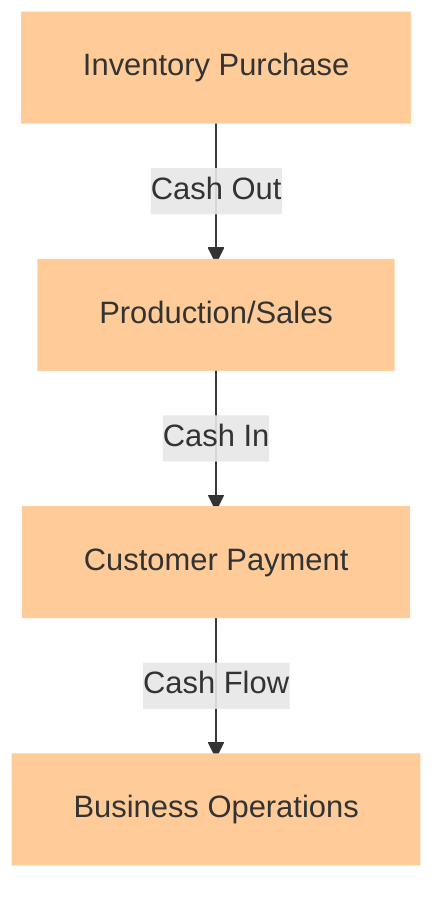

As engineers turn into solopreneurs or startup founders, they often find themselves overwhelmed by the financial aspects of running a business. One crucial concept that can make or break a company is cash flow. In this article, we'll delve into the world of cash flow management, exploring its importance, key components, and best practices for engineers to ensure their businesses stay afloat and thrive.

## Table of Contents
1. [Introduction to Cash Flow](#introduction-to-cash-flow)
2. [The Cash Flow Cycle](#the-cash-flow-cycle)
3. [Cash Flow Statement](#cash-flow-statement)
4. [Best Practices for Managing Cash Flow](#best-practices-for-managing-cash-flow)
5. [Cash Flow Forecasting](#cash-flow-forecasting)
6. [Visual Insights Gallery](#visual-insights-gallery)
7. [Summary and Conclusion](#summary-and-conclusion)
8. [FAQ](#faq)

## Introduction to Cash Flow
Cash flow refers to the movement of money into or out of a business. It's a critical indicator of a company's financial health and its ability to pay debts, invest in growth, and return value to shareholders. Effective cash flow management is essential for startups and solopreneurs, as it directly affects their ability to survive and expand.

## The Cash Flow Cycle
The cash flow cycle, also known as the operating cycle, outlines the stages through which cash flows in and out of a business. It typically involves the purchase of inventory, the sale of goods or services, and the collection of payments from customers. Understanding this cycle is vital for managing cash flow, as delays or inefficiencies at any stage can lead to cash flow problems.

## Cash Flow Statement
A cash flow statement is a financial report that details the inflows and outflows of cash over a specific period. It's divided into three main sections: operating activities, investing activities, and financing activities. By analyzing the cash flow statement, engineers can identify areas where cash is being drained and implement strategies to improve their cash position.

> **Note:** A positive cash flow indicates that a company is generating more cash than it is using, while a negative cash flow suggests the opposite.

## Best Practices for Managing Cash Flow
Several best practices can help engineers manage cash flow effectively:
- **Monitor Cash Flow Regularly:** Keep a close eye on cash inflows and outflows to anticipate and address potential cash flow issues.
- **Maintain a Cash Reserve:** Build an emergency fund to cover unexpected expenses or revenue shortfalls.
- **Optimize Accounts Receivable and Payable:** Implement efficient invoicing and payment systems to minimize delays in receiving cash from customers and making payments to suppliers.
- **Invest Wisely:** Make informed investment decisions that align with the company's growth strategy and cash flow situation.

## Cash Flow Forecasting
Cash flow forecasting involves predicting future cash inflows and outflows based on historical data, market trends, and business plans. This process helps engineers anticipate cash flow gaps and surpluses, enabling them to make proactive decisions about investments, funding, and resource allocation.

> **Tip:** Utilize cash flow forecasting tools and software to streamline the forecasting process and improve accuracy.

## Visual Insights Gallery
### Cash Flow Management Images

## Summary and Conclusion
Understanding and managing cash flow is crucial for the success of any business, especially for engineers turning into solopreneurs or startup founders. By grasping the concept of cash flow, analyzing cash flow statements, and implementing best practices, engineers can ensure their businesses maintain a healthy cash position, navigate financial challenges, and achieve long-term growth.

## FAQ
1. **What is cash flow, and why is it important?**
   - Cash flow refers to the movement of money into or out of a business. It's crucial for paying debts, investing in growth, and returning value to shareholders.
2. **How can I improve my company's cash flow?**
   - Implement efficient invoicing and payment systems, maintain a cash reserve, and make informed investment decisions.
3. **What tools can I use for cash flow forecasting?**
   - Utilize cash flow forecasting software and tools to streamline the forecasting process and improve accuracy.