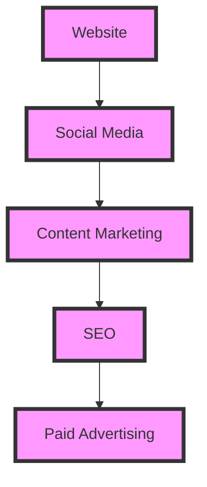
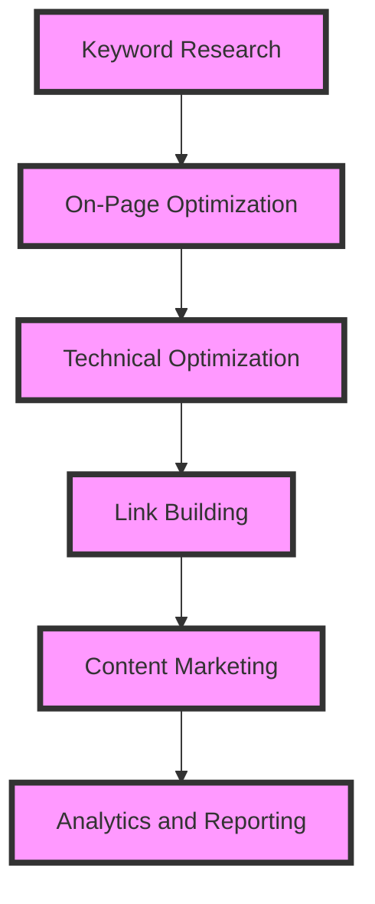

As engineers, we often focus on building and improving our products, but acquiring new customers is crucial for the growth and success of any business. In this article, we will delve into the world of customer acquisition, exploring the best practices and strategies that engineers can use to drive growth and revenue.

## Table of Contents
1. [Introduction to Customer Acquisition](#introduction-to-customer-acquisition)
2. [Understanding Your Target Audience](#understanding-your-target-audience)
3. [Building a Strong Online Presence](#building-a-strong-online-presence)
4. [Leveraging SEO for Growth](#leveraging-seo-for-growth)
5. [Paid Advertising and Its Role in Customer Acquisition](#paid-advertising-and-its-role-in-customer-acquisition)
6. [Measuring and Optimizing Customer Acquisition](#measuring-and-optimizing-customer-acquisition)

## Introduction to Customer Acquisition
Customer acquisition is the process of attracting and converting new customers to your product or service. It involves a range of activities, from marketing and advertising to sales and customer support. As engineers, we can play a critical role in customer acquisition by building and optimizing the systems and tools that drive growth.


## Understanding Your Target Audience
To acquire new customers, we need to understand who they are and what they want. This involves creating buyer personas, which are detailed profiles of our ideal customers. We can use data and analytics to inform our personas and ensure that they are accurate and up-to-date.
```markdown
| Persona | Description | Goals |
| --- | --- | --- |
| Tech-Savvy | Young professionals who are interested in technology | Stay up-to-date with the latest trends and innovations |
| Business Leader | Senior executives who are responsible for making strategic decisions | Drive growth and revenue for their organizations |
```
## Building a Strong Online Presence
A strong online presence is critical for customer acquisition. This includes having a professional website, engaging social media accounts, and a robust content marketing strategy. We can use tools like Mermaid.js to visualize our online presence and identify areas for improvement.

## Leveraging SEO for Growth
Search Engine Optimization (SEO) is a critical component of customer acquisition. By optimizing our website and content for search engines, we can increase our visibility and drive more traffic to our site. We can use tools like Google Analytics to track our SEO performance and identify areas for improvement.

## Paid Advertising and Its Role in Customer Acquisition
Paid advertising can be an effective way to drive traffic and acquire new customers. We can use platforms like Google Ads and Facebook Ads to reach our target audience and drive conversions. We can use tools like Mermaid.js to visualize our paid advertising strategy and identify areas for improvement.


## Measuring and Optimizing Customer Acquisition
To optimize our customer acquisition strategy, we need to measure our performance and identify areas for improvement. We can use metrics like customer acquisition cost (CAC) and return on investment (ROI) to evaluate our performance and make data-driven decisions.
> **Tip:** Use A/B testing to optimize your customer acquisition strategy and improve your ROI.

## Visual Insights Gallery


## Summary/Conclusion
Customer acquisition is a critical component of business growth and success. By understanding our target audience, building a strong online presence, leveraging SEO, using paid advertising, and measuring and optimizing our performance, we can drive growth and revenue for our organizations. As engineers, we can play a critical role in customer acquisition by building and optimizing the systems and tools that drive growth.

## FAQ
1. What is customer acquisition?
Customer acquisition is the process of attracting and converting new customers to your product or service.
2. How do I understand my target audience?
You can use data and analytics to inform your buyer personas and ensure that they are accurate and up-to-date.
3. What is the role of SEO in customer acquisition?
SEO is a critical component of customer acquisition, as it can increase your visibility and drive more traffic to your site.
4. How do I measure and optimize my customer acquisition strategy?
You can use metrics like CAC and ROI to evaluate your performance and make data-driven decisions.