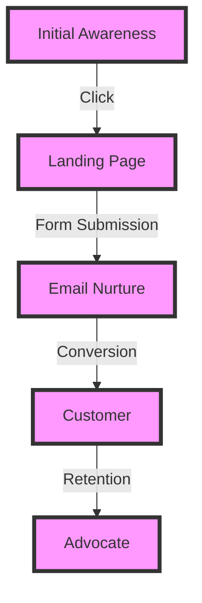
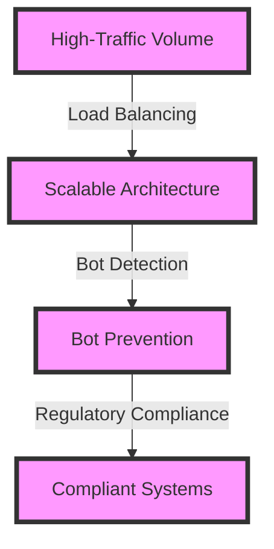

## Introduction to Advanced Customer Acquisition
In our previous article, we explored the fundamentals of customer acquisition, including understanding your target audience, building a strong online presence, and leveraging SEO for growth. In this article, we will delve deeper into advanced customer acquisition strategies, including edge-cases and deeper architecture.

## Architecting a Customer Acquisition Funnel
A customer acquisition funnel is a series of steps that a potential customer takes from initial awareness to conversion. As engineers, we can architect a customer acquisition funnel by identifying the key touchpoints and optimizing the user experience at each stage.

## Advanced SEO Strategies
Search Engine Optimization (SEO) is a critical component of customer acquisition. By optimizing our website and content for search engines, we can increase visibility, drive more traffic, and attract more customers. Some advanced SEO strategies include:
* **Technical SEO**: optimizing website architecture, page speed, and mobile responsiveness to improve search engine rankings.
* **Content Marketing**: creating high-quality, relevant, and valuable content to attract and engage with our target audience.
* **Link Building**: building high-quality backlinks from authoritative sources to increase website authority and rankings.

## Edge-Cases in Customer Acquisition
As engineers, we need to consider edge-cases in customer acquisition, including:
* **Handling High-Traffic Volumes**: designing systems that can handle high traffic volumes and large numbers of concurrent users.
* **Managing Bot Traffic**: detecting and preventing bot traffic to prevent skewing analytics and compromising system performance.
* **Complying with Regulations**: ensuring that our customer acquisition strategies comply with relevant regulations, such as GDPR and CCPA.

## Measuring and Optimizing Advanced Customer Acquisition Strategies
To measure and optimize advanced customer acquisition strategies, we need to use data and analytics to inform our decisions. Some key metrics include:
* **Conversion Rate**: the percentage of users who complete a desired action.
* **Customer Lifetime Value**: the total value of a customer over their lifetime.
* **Return on Ad Spend**: the revenue generated by an advertising campaign compared to its cost.

## Visual Insights Gallery
Here are some visual insights that illustrate advanced customer acquisition strategies:
* 
* 
* 