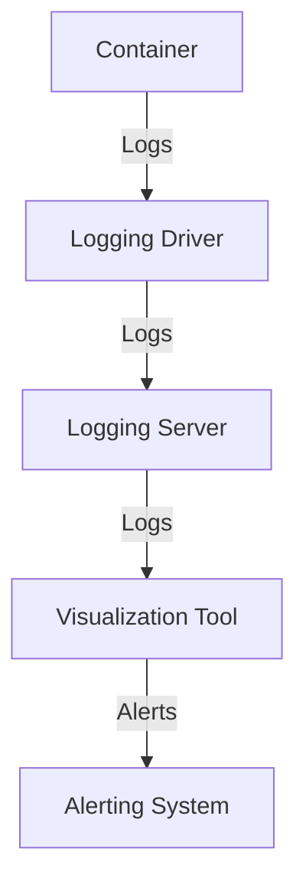

Docker has revolutionized the way we develop, deploy, and manage applications. However, as with any technology, optimizing Docker containers is crucial for achieving maximum performance, scalability, and reliability. In this article, we will delve into the world of Docker optimization, exploring best practices, strategies, and techniques for engineers to get the most out of their Dockerized applications.

## Table of Contents
1. [Introduction to Docker Optimization](#introduction-to-docker-optimization)
2. [Optimizing Docker Images](#optimizing-docker-images)
3. [Container Resource Management](#container-resource-management)
4. [Networking and Security](#networking-and-security)
5. [Monitoring and Logging](#monitoring-and-logging)
6. [Visual Insights Gallery](#visual-insights-gallery)
7. [Summary/Conclusion](#summary/conclusion)
8. [FAQ](#faq)

## Introduction to Docker Optimization

Docker optimization is a critical aspect of ensuring that containerized applications run efficiently, securely, and reliably. By optimizing Docker containers, engineers can improve application performance, reduce resource utilization, and enhance overall system scalability. In this section, we will explore the importance of Docker optimization and its impact on application development and deployment.

> **Note:** Docker optimization is not a one-time task; it's an ongoing process that requires continuous monitoring, analysis, and improvement.

## Optimizing Docker Images

Optimizing Docker images is a crucial step in achieving efficient containerization. Here are some best practices for optimizing Docker images:
* Use lightweight base images
* Minimize layer count
* Avoid unnecessary dependencies
* Leverage multi-stage builds
* Use Docker image compression

```dockerfile
# Example of a multi-stage Docker build
FROM python:3.9-slim as builder
WORKDIR /app
COPY requirements.txt .
RUN pip install -r requirements.txt
COPY . .

FROM python:3.9-slim
WORKDIR /app
COPY --from=builder /app .
CMD ["python", "app.py"]
```

## Container Resource Management

Effective container resource management is essential for ensuring that containers run efficiently and don't consume excessive resources. Here are some best practices for managing container resources:
* Use CPU and memory limits
* Configure container restart policies
* Implement resource monitoring and alerting
* Use orchestration tools like Kubernetes

```yml
# Example of a Kubernetes deployment with resource limits
apiVersion: apps/v1
kind: Deployment
metadata:
  name: example-deployment
spec:
  replicas: 3
  selector:
    matchLabels:
      app: example
  template:
    metadata:
      labels:
        app: example
    spec:
      containers:
      - name: example
        image: example/image
        resources:
          requests:
            cpu: 100m
            memory: 128Mi
          limits:
            cpu: 200m
            memory: 256Mi
```

## Networking and Security

Networking and security are critical aspects of Docker optimization. Here are some best practices for securing Docker containers:
* Use Docker networking
* Configure container ports and protocols
* Implement container security scanning
* Use secrets management tools


## Monitoring and Logging

Monitoring and logging are essential for ensuring that Docker containers run efficiently and reliably. Here are some best practices for monitoring and logging Docker containers:
* Use Docker logs
* Configure container monitoring tools
* Implement logging and alerting
* Use visualization tools like Grafana



## Visual Insights Gallery
### Docker Optimization Strategies

### Container Resource Management

### Networking and Security


## Summary/Conclusion
In conclusion, Docker optimization is a critical aspect of ensuring that containerized applications run efficiently, securely, and reliably. By following best practices, strategies, and techniques outlined in this article, engineers can optimize their Docker containers, improve application performance, and enhance overall system scalability.

## FAQ
1. What is Docker optimization?
Docker optimization is the process of improving the performance, security, and reliability of Docker containers.
2. Why is Docker optimization important?
Docker optimization is important because it ensures that containerized applications run efficiently, securely, and reliably.
3. What are some best practices for optimizing Docker images?
Some best practices for optimizing Docker images include using lightweight base images, minimizing layer count, avoiding unnecessary dependencies, leveraging multi-stage builds, and using Docker image compression.