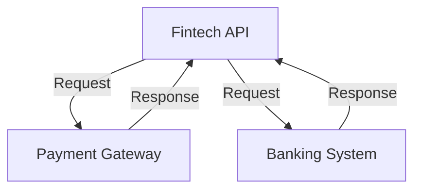
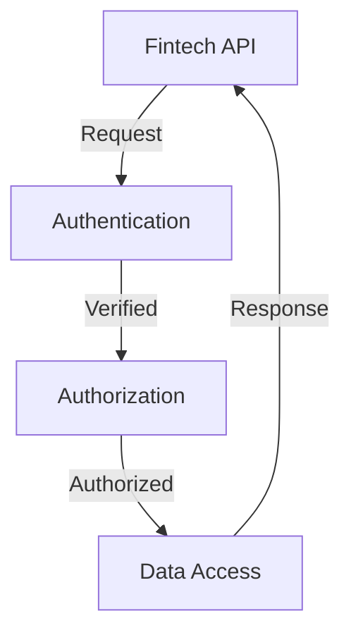

In the rapidly evolving world of fintech, APIs have become the backbone of innovation, enabling the integration of various financial services and products. As an engineer working in this field, it's crucial to understand the best practices for designing, implementing, and securing fintech APIs. In this article, we'll delve into the world of fintech APIs, exploring their importance, key considerations, and essential security measures.

## Table of Contents
1. [Introduction to Fintech APIs](#introduction-to-fintech-apis)
2. [Key Considerations for Fintech API Design](#key-considerations-for-fintech-api-design)
3. [Security Measures for Fintech APIs](#security-measures-for-fintech-apis)
4. [Compliance and Regulatory Requirements](#compliance-and-regulatory-requirements)
5. [Best Practices for Fintech API Implementation](#best-practices-for-fintech-api-implementation)

## Introduction to Fintech APIs

Fintech APIs are application programming interfaces that enable the integration of financial services and products. They facilitate communication between different systems, allowing for the exchange of data, execution of transactions, and provision of services. The use of fintech APIs has become widespread, with companies like Stripe, PayPal, and Square leading the way.

## Key Considerations for Fintech API Design
When designing a fintech API, there are several key considerations to keep in mind. These include:

* **Scalability**: The API should be able to handle a large volume of requests and scale accordingly.
* **Security**: The API should be designed with security in mind, incorporating measures such as encryption, authentication, and access control.
* **Usability**: The API should be easy to use and understand, with clear documentation and intuitive interfaces.
* **Compliance**: The API should comply with relevant regulatory requirements, such as PCI-DSS and GDPR.

> **Note:** A well-designed fintech API should prioritize scalability, security, usability, and compliance.

## Security Measures for Fintech APIs

Security is a critical aspect of fintech API design. Some essential security measures include:

* **Encryption**: Data should be encrypted both in transit and at rest.
* **Authentication**: API requests should be authenticated using secure methods, such as OAuth or JWT.
* **Access Control**: Access to sensitive data and functionality should be restricted using role-based access control.
* **Monitoring and Logging**: API activity should be monitored and logged to detect potential security threats.

## Compliance and Regulatory Requirements
Fintech APIs must comply with relevant regulatory requirements, such as:

* **PCI-DSS**: Payment Card Industry Data Security Standard
* **GDPR**: General Data Protection Regulation
* **PSD2**: Payment Services Directive 2

> **Warning:** Failure to comply with regulatory requirements can result in significant fines and reputational damage.

## Best Practices for Fintech API Implementation
To ensure successful implementation of a fintech API, follow these best practices:

* **Use secure protocols**: Use secure communication protocols, such as HTTPS.
* **Implement rate limiting**: Limit the number of requests to prevent abuse and denial-of-service attacks.
* **Use secure data storage**: Store sensitive data securely, using encryption and access controls.
* **Monitor and test**: Continuously monitor and test the API to detect potential security threats and issues.

| Best Practice | Description |
| --- | --- |
| Use secure protocols | Use HTTPS to encrypt data in transit |
| Implement rate limiting | Limit the number of requests to prevent abuse |
| Use secure data storage | Store sensitive data securely, using encryption and access controls |
| Monitor and test | Continuously monitor and test the API to detect potential security threats and issues |

## Visual Insights Gallery

## Summary and Conclusion
In conclusion, designing and implementing a secure and compliant fintech API requires careful consideration of several key factors, including scalability, security, usability, and compliance. By following best practices and prioritizing security, engineers can create robust and reliable fintech APIs that meet the needs of users and regulators alike.

## FAQ
Q: What is a fintech API?
A: A fintech API is an application programming interface that enables the integration of financial services and products.
Q: What are some key considerations for fintech API design?
A: Key considerations include scalability, security, usability, and compliance.
Q: What are some essential security measures for fintech APIs?
A: Essential security measures include encryption, authentication, access control, and monitoring and logging.