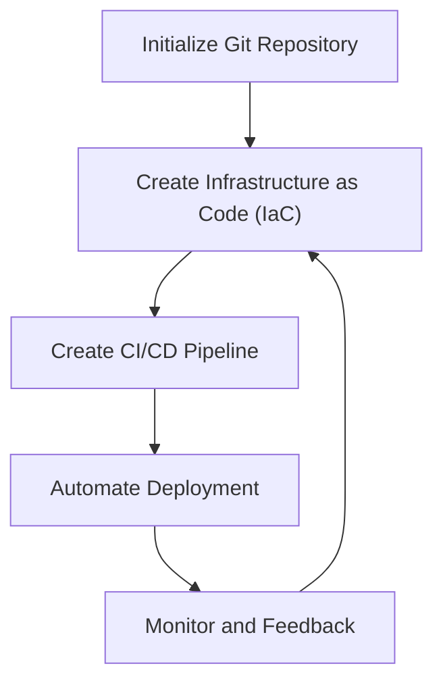
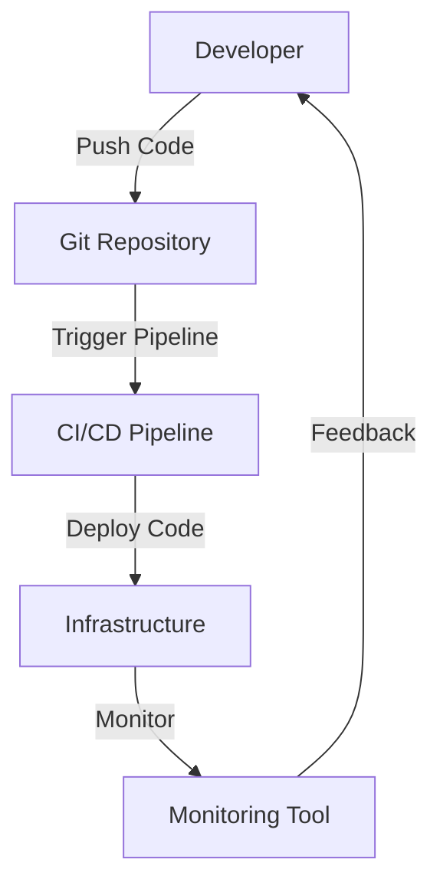

The GitOps workflow has revolutionized the way engineers manage and deploy infrastructure and applications. By leveraging Git as a single source of truth, teams can achieve greater efficiency, reliability, and scalability in their DevOps practices. In this article, we will delve into the world of GitOps, exploring its core principles, benefits, and best practices for implementation.

## Table of Contents
1. [Introduction to GitOps](#introduction-to-gitops)
2. [Key Principles of GitOps](#key-principles-of-gitops)
3. [Benefits of GitOps](#benefits-of-gitops)
4. [GitOps Workflow](#gitops-workflow)
5. [Best Practices for Implementation](#best-practices-for-implementation)
6. [Visual Insights Gallery](#visual-insights-gallery)
7. [Summary and Conclusion](#summary-and-conclusion)
8. [FAQ](#faq)

## Introduction to GitOps
GitOps is a set of practices that combines Git, infrastructure as code (IaC), and continuous integration/continuous deployment (CI/CD) to manage and deploy infrastructure and applications. The core idea behind GitOps is to use Git as the single source of truth for the entire system, including infrastructure, applications, and configurations.

> **Note:** GitOps is not a tool or a platform, but rather a set of practices and principles that can be applied to any system or organization.

## Key Principles of GitOps
The key principles of GitOps include:
* **Declarative configuration**: All configurations and infrastructure are defined in a declarative manner, using tools like Terraform or AWS CloudFormation.
* **Version control**: All configurations and code are stored in a version control system, such as Git.
* **Automated deployment**: Changes to the system are automatically deployed using CI/CD pipelines.
* **Monitoring and feedback**: The system is continuously monitored, and feedback is used to improve and refine the system.

## Benefits of GitOps
The benefits of GitOps include:
* **Improved collaboration**: GitOps enables teams to collaborate more effectively, using Git as a single source of truth.
* **Increased efficiency**: GitOps automates many manual tasks, freeing up engineers to focus on higher-level tasks.
* **Enhanced reliability**: GitOps reduces the risk of human error, using automated deployment and monitoring to ensure consistency and reliability.

## GitOps Workflow
The GitOps workflow typically involves the following steps:

This workflow can be represented using the following Mermaid.js diagram:

## Best Practices for Implementation
To implement GitOps effectively, follow these best practices:
| Best Practice | Description |
| --- | --- |
| Use a version control system | Use Git or another version control system to store all configurations and code. |
| Automate deployment | Use CI/CD pipelines to automate deployment of changes. |
| Monitor and feedback | Continuously monitor the system and use feedback to improve and refine the system. |
| Use infrastructure as code | Use tools like Terraform or AWS CloudFormation to define infrastructure in a declarative manner. |

> **Tip:** Start small and gradually scale up your GitOps implementation, using a phased approach to minimize disruption and risk.

## Visual Insights Gallery
Here are some visual insights into the GitOps workflow:

## Summary and Conclusion
In conclusion, GitOps is a powerful set of practices that can help engineers manage and deploy infrastructure and applications more efficiently, reliably, and scalably. By following the key principles and best practices outlined in this article, teams can unlock the full potential of GitOps and achieve greater success in their DevOps initiatives.

## FAQ
Q: What is GitOps?
A: GitOps is a set of practices that combines Git, infrastructure as code (IaC), and continuous integration/continuous deployment (CI/CD) to manage and deploy infrastructure and applications.
Q: What are the benefits of GitOps?
A: The benefits of GitOps include improved collaboration, increased efficiency, and enhanced reliability.
Q: How do I implement GitOps in my organization?
A: To implement GitOps, start by using a version control system, automating deployment, and monitoring and feedback. Use infrastructure as code tools like Terraform or AWS CloudFormation to define infrastructure in a declarative manner.