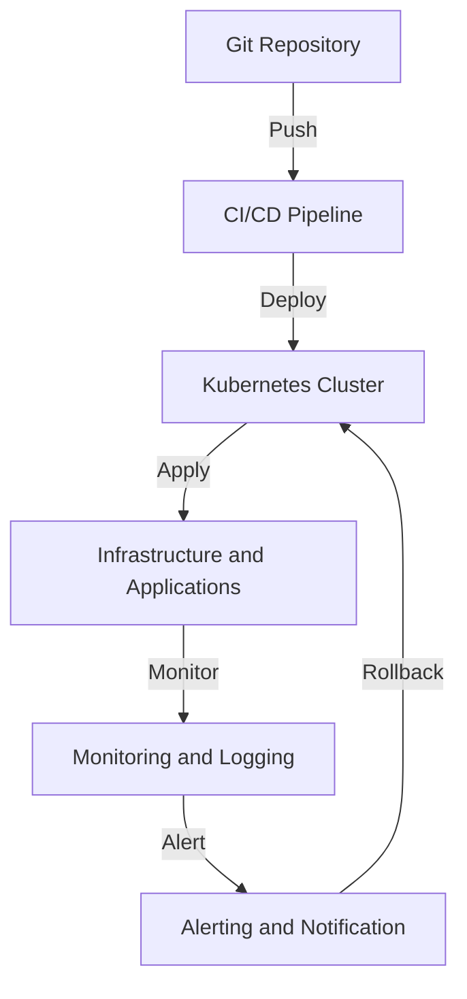

## Part 2: Advanced GitOps Workflow - Edge Cases and Deep Dive Architecture
GitOps has become the de facto standard for managing and deploying infrastructure and applications. However, as with any complex system, there are edge cases and advanced scenarios that require careful consideration. In this article, we will delve into the advanced aspects of GitOps workflow, exploring edge cases, deeper architecture, and best practices for implementation.

### Advanced GitOps Architecture
The advanced GitOps architecture involves a deeper understanding of the underlying components and how they interact with each other. This includes:
* **Multi-environment management**: Managing multiple environments, such as dev, staging, and prod, with separate Git repositories or branches.
* **Multi-cluster management**: Managing multiple Kubernetes clusters, each with its own set of configurations and applications.
* **Service meshes**: Implementing service meshes, such as Istio or Linkerd, to manage traffic and security between microservices.

### Edge Cases in GitOps
There are several edge cases in GitOps that require careful consideration, including:
* **Conflicting configurations**: Handling conflicting configurations between different environments or clusters.
* **Rollback strategies**: Implementing rollback strategies in case of deployment failures or errors.
* **Security and compliance**: Ensuring security and compliance in GitOps workflows, including secrets management and auditing.

### Deep Dive into GitOps Tools
There are several tools available for implementing GitOps, including:
* **Terraform**: A popular infrastructure as code (IaC) tool for managing infrastructure configurations.
* **Kubernetes**: A container orchestration platform for managing containerized applications.
* **Flux**: A GitOps tool for managing Kubernetes clusters and applications.

### Best Practices for Advanced GitOps Implementation
There are several best practices for implementing advanced GitOps workflows, including:
* **Use declarative configurations**: Use declarative configurations for infrastructure and applications to ensure consistency and reproducibility.
* **Implement continuous monitoring and logging**: Implement continuous monitoring and logging to detect errors and issues.
* **Use service meshes**: Use service meshes to manage traffic and security between microservices.

## Visual Insights Gallery
The following images provide a visual representation of the advanced GitOps concepts:
* 
* 
* 

## Summary and Conclusion
In this article, we explored the advanced aspects of GitOps workflow, including edge cases, deeper architecture, and best practices for implementation. By understanding these concepts, engineers can design and implement more robust and scalable GitOps workflows that meet the needs of their organizations.