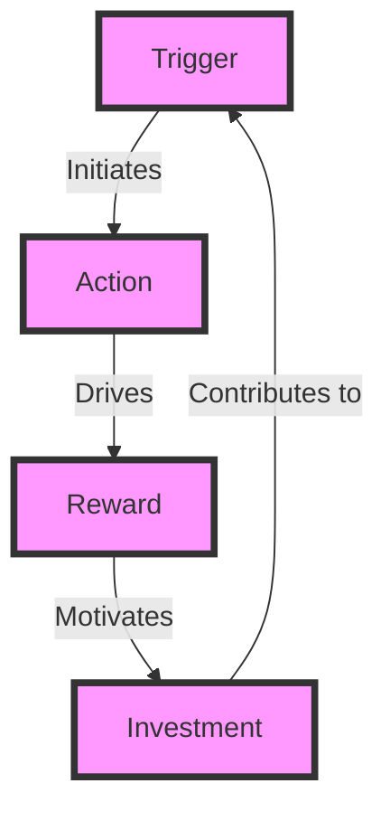
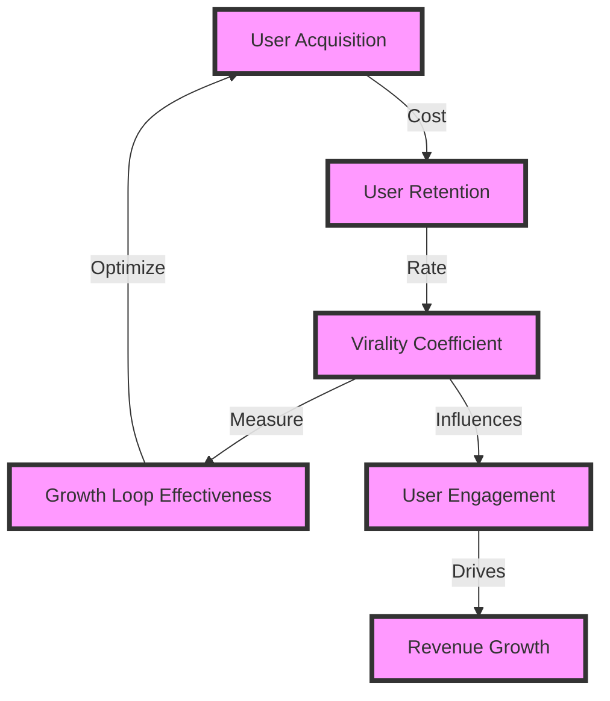

Growth loops are a crucial aspect of any successful business, particularly in the SaaS and B2B industries. They represent a self-reinforcing cycle that drives user engagement, retention, and ultimately, revenue growth. As an engineer, understanding and implementing effective growth loops can make all the difference in the success of your product. In this article, we will delve into the world of growth loops, exploring their fundamentals, best practices, and providing actionable advice for engineers.

## Introduction to Growth Loops
A growth loop is a cyclical process where a product or service generates user engagement, which in turn drives more users to the product, creating a self-sustaining cycle. This cycle can be fueled by various factors, including word-of-mouth, virality, or even paid advertising. 

## Key Components of a Growth Loop
To create an effective growth loop, several key components must be in place:
- **Trigger**: An event or action that initiates the growth loop.
- **Action**: The user's response to the trigger, which drives the loop forward.
- **Reward**: The benefit or value that the user receives from taking the action.
- **Investment**: The user's contribution to the growth loop, which can be in the form of data, referrals, or other engagement metrics.

## Designing a Growth Loop Architecture
When designing a growth loop, it's essential to consider the overall architecture and how each component interacts with the others. The following Mermaid.js diagram illustrates a basic growth loop architecture:

## Implementing Growth Loops in SaaS Products
In SaaS products, growth loops can be particularly effective in driving user engagement and retention. Some best practices for implementing growth loops in SaaS products include:
- **Personalization**: Tailor the user experience to individual users' needs and preferences.
- **Gamification**: Use game design elements to encourage user engagement and motivation.
- **Social Proof**: Leverage user testimonials, reviews, and ratings to build trust and credibility.

## Measuring Growth Loop Effectiveness
To determine the effectiveness of a growth loop, it's crucial to track key metrics, such as:
- **User acquisition cost**: The cost of acquiring new users.
- **User retention rate**: The percentage of users who remain active over time.
- **Virality coefficient**: A measure of how many new users each existing user brings to the product.

The following Mermaid.js diagram illustrates a more complex growth loop with multiple nodes and edges:

## Best Practices for Engineers
As an engineer, there are several best practices to keep in mind when designing and implementing growth loops:
> **Note:** Focus on creating a seamless user experience that encourages engagement and retention.
> **Warning:** Avoid over-optimizing for short-term gains, as this can lead to long-term negative consequences.
> **Tip:** Continuously monitor and analyze key metrics to identify areas for improvement.

## Common Challenges and Solutions
When implementing growth loops, engineers may encounter several challenges, including:
| Challenge | Solution |
| --- | --- |
| Low user engagement | Implement gamification elements or personalized content |
| High user acquisition cost | Optimize user acquisition channels or improve user retention rates |
| Poor user retention | Enhance user experience or offer incentives for continued engagement |

## Visual Insights Gallery
This gallery showcases various visual elements that can be used to illustrate growth loop concepts:

## Summary and Conclusion
In conclusion, growth loops are a powerful tool for driving user engagement, retention, and revenue growth in SaaS and B2B products. By understanding the key components of a growth loop and implementing best practices, engineers can create effective growth loops that propel their products to success. Remember to continuously monitor and analyze key metrics to identify areas for improvement and optimize your growth loop for maximum impact.

## FAQ
Q: What is a growth loop?
A: A growth loop is a self-reinforcing cycle that drives user engagement, retention, and revenue growth.
Q: What are the key components of a growth loop?
A: The key components of a growth loop include trigger, action, reward, and investment.
Q: How can I measure the effectiveness of a growth loop?
A: You can measure the effectiveness of a growth loop by tracking key metrics, such as user acquisition cost, user retention rate, and virality coefficient.